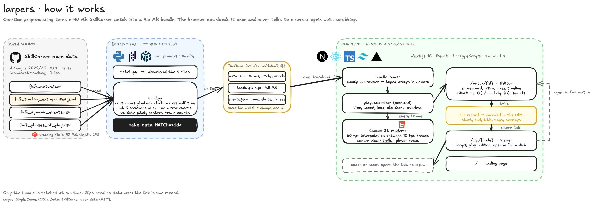

❯ LETS GET WORKING ON THIS: also what tech stack should i use:
  # PRD: Tracking Data Clipper (US Soccer x GSU ColorStack Tech League)

  Sep 30, 2026 · @amani bobo

  ## Summary

  A web app that plays one match of SkillCorner tracking data on a 2D pitch,
  lets the user scrub it like a YouTube video, and turns any 0-10 second window
  into a clip that other people can open from a link.

  The bet is that the required features are table stakes and the score is
  decided by three things:

  - **Swap-ability.** Any SkillCorner match loads by changing one match ID,
  with no code changes. This is the literal question under "Technical
  feasibility."
  - **Analyst workflow.** Clips are tagged, titled, annotated and grouped into
  playlists, the way video analysts already work. This is the "sit in the shoes
  of a video analyst" question under "Innovation."
  - **Zero learning curve.** Controls copy YouTube exactly: space to play,
  arrow keys to step, drag to scrub. This is the "limited computer experience
  beyond YouTube" question under "Presentation clarity."

  Working name: **Touchline**. Rename freely.

  ## The brief and how it is scored

  US Soccer wants tracking data to be clipped and shared the way video analysts
  clip and tag video. Two features are required: a scrub slider over the full
  match, and clipping of any 0-10 second sequence that other users can view.

  Each category is scored 1-5. Every feature in this PRD should earn points in
  at least one row.

  | Category | What the judges ask | How this PRD answers |
  | --- | --- | --- |
  | Technical feasibility | Can the match be swapped? Does the stack fit the
  problem? | Match ID is the only input. A preprocessing script converts any
  SkillCorner match to one compact format. Static front end, thin API, one
  Docker command. |
  | Innovation | Did you think like a video analyst beyond the brief? | Tags,
  playlists, drawing on clips, event markers on the timeline, and overlays only
  tracking data can show (off-ball runs, camera view, team shape). |
  | Presentation clarity | Can a YouTube-only user pick it up? | YouTube
  keyboard shortcuts and layout, a 3-step clip flow, a first-run tour, and a
  tutorial video under 3 minutes. |

  Submission needs three things: a tutorial video for first-time users, a
  public repo without the dataset, and a README covering description, stack,
  architecture and run instructions (or a live link).

  ## Users and what they need

  Three groups inside US Soccer use the output, and only one of them makes
  clips. The rest only open them
  ──── (254 lines hidden) ─────────────────────────────────────────────────────
  ng | Ball jumps or vanishes in clips | Interpolate short gaps, fade the ball
  when it is not detected, never hide the problem by faking long stretches |
  | Off-camera players look wrong | Extrapolated players drift | Show them
  faded by default and explain it with the camera overlay. It becomes a
  feature, not a bug. |
  | GIF export is slow or huge | A 10 second GIF takes long to encode or
  exceeds 10 MB | Encode in a web worker at 10 fps and reduced size, offer MP4
  as the default download |
  | Free hosting sleeps | First load takes 30 seconds for a judge | Keep the
  app warm before judging, and make the URL-encoded clip links work without the
  database |
  | Git LFS download fails | The fetch script gets a pointer file instead of
  data | Detect the pointer, print a clear message with the manual download
  steps |
  | Scope creep | Six half-finished overlays | Finish A1 to A4 fully before
  starting A5 |

  ### Open questions

  - [ ] What is the submission deadline, and is this solo or a team? This
  decides how far down the feature list to plan.
  - [ ] Is a live hosted link expected, or is Docker enough? Plan for both
  until confirmed.
  - [ ] Which match folders contain all four files? `matches.json` lists 20
  matches and the README says 10.
  - [ ] Is tracking quality good in match 2006229, especially around the two
  goals? Check in the data spike.
  - [ ] Should saved clips be visible to everyone with the match link, or only
  to people with the clip link? Default proposed: everyone, no accounts.
  - [ ] Does the hosted demo need the data files on the server? If so, confirm
  the MIT license and credit note cover that. The repo itself still excludes
  them.
  - [ ] Is the plain-English clip search (B4) worth the demo risk? Decide after
  A1 to A7 are done.

  ## Sources

  - [SkillCorner open data repository and
  README](https://github.com/SkillCorner/opendata), opened 30 September 2026
  - [SkillCorner Dynamic Events CSV Specifications, 2025/02/16](https://2656030
  1.fs1.hubspotusercontent-eu1.net/hubfs/26560301/Guides/Dynamic%20Events/20250
  216%20-%20Dynamic%20Events%20CSV%20Specifications.pdf)
  - Direct inspection of `matches.json`, three `_match.json` files, the phases
  file header and the tracking file's LFS pointer for match 2017461. Tracking
  frame contents and the bundle size are taken from the README and arithmetic,
  not from a full download.
  --

  i would like to use nextjs at the end to deploy this to a live site, also
  make the ui look clean and smooth, simple colors for now, us good design
  principles

⏺ I'll set up the project from scratch: check the environment, pull one
  SkillCorner match, build the preprocessing pipeline, then the Next.js app with
  playback, scrubbing and clips. First, tooling and the dataset layout.

  Ran 3 shell commands (ctrl+o to expand)

⏺ Both matches contain all four files, with the tracking file stored as a
  133-byte LFS pointer. I'll now download the raw data for match 2006229 via the
  LFS media endpoint while setting up the project directory in parallel.
  · summary

  Ran 1 shell command (ctrl+o to expand)

⏺ The full 90 MB tracking file is downloaded. Now the data spike: inspect the
  match file, a mid-match tracking frame, and the CSV headers.

  Ran 2 shell commands (ctrl+o to expand)

⏺ About 25% of in-period frames lack player data, so I'll need a "no tracking"
  state in the app. Next I'll measure gap lengths, verify the coordinate-flip
  rule, scaffold the Next.js app, and pull the second match for the swap test.
  · summary

  Ran 1 shell command (ctrl+o to expand)

⏺ The mirroring rule is confirmed: when attacking side is right-to-left, negate
  both x and y. Now scaffolding the Next.js app and fetching the swap-test match
  in parallel.

  Ran 2 shell commands (ctrl+o to expand)

⏺ Match 2017461 is downloading in the background. Now I'll set up the repo root
  (git at top level, gitignore, Makefile) and write the Python pipeline that
  turns a raw match into a compact bundle.

  Ran 1 shell command (ctrl+o to expand)

⏺ Background command "Download swap-test match 2017461 in background" completed
(exit code 0)

⏺ Write(~/touchline/pipeline/fetch.py)
  ⎿  Wrote 87 lines to ../pipeline/fetch.py
       1 """Download the four SkillCorner open-data files for one match.
       2
       4
       5 The tracking file lives in Git LFS, so it is fetched through Git
         Hub's media
         xt file), we
       7 stop and print the manual steps rather than silently building an
          empty bundle.
       9
      10 from __future__ import annotations
     … +88 lines (ctrl+o to expand)

⏺ Now the bundle builder. I'll split the reusable pieces (clock mapping,
  coordinate flip, binary container) into a module so they can be tested.

⏺ Write(~/touchline/pipeline/bundle.py)
  ⎿  Wrote 161 lines to ../pipeline/bundle.py
       1 """Shared pieces of the Touchline bundle format.
       2
       4
       5   meta.json      teams, players (one slot each), pitch size, per
         iods, gaps
         ys (gzipped)
       7   events.json    dynamic events + phases of play, keyed by playb
         ack index
       9 Playback index vs frame
      10 -----------------------
     … +180 lines (ctrl+o to expand)

⏺ Write(~/touchline/pipeline/build.py)
  ⎿  Wrote 441 lines to ../pipeline/build.py
      1 """Build a Touchline bundle from the four raw SkillCorner files.
      2
      3 Usage: python build.py <match_id> --raw <dir with raw files> --ou
        t <bundle dir>
      4
        s, period
      6 frames and attacking directions are all read from the match file.
      7 """
      8
      9 from __future__ import annotations
     … +499 lines (ctrl+o to expand)

  Ran 1 shell command (ctrl+o to expand)

⏺ Tests pass, but the build failed due to a one-frame mismatch: the match file
  expects period 2 to end at frame 59270, while the tracking file stops at
  59269. I'll update the builder to tolerate small gaps like this instead of
  failing. · summary

⏺ Bash(python3 - <<'EOF'
      import re,pathlib…)
  ⎿  Updated ~/touchline/pipeline/build.py (+11 -3)
      24      SENTINEL,
      25      build_periods,
      26      frame_to_index,
      27 +    index_to_frame,                                            
      28      periods_to_json,
      29      read_container,
      30      total_frames,
     ...
      170      if unknown_players:
      171          log(f"  warning: {len(unknown_players)} player ids in 
           tracking not in roster: {sorted(unknown_players)[:5]}")
      172  
      172 -    missing = int((frame[:, 0] < 0).sum())                    
      173 -    if missing:                                               
      174 -        raise SystemExit(f"{missing} playback frames had no tr
          -acking line; period frames are not contiguous")               
      173 +    # Some match files declare an end_frame one past the last 
          +tracking line.                                                
      174 +    # Fill the frame number arithmetically and treat those fra
          +mes as gaps; only                                             
      175 +    # fail if a meaningful share of the match is missing.     
      176 +    missing_idx = np.flatnonzero(frame[:, 0] < 0)             
      177 +    if len(missing_idx) > 0.01 * n:                           
      178 +        raise SystemExit(f"{len(missing_idx)} playback frames 
          +had no tracking line; period frames are not contiguous")      
      179 +    for idx in missing_idx:                                   
      180 +        frame[idx, 0] = index_to_frame(periods, int(idx))     
      181 +    if len(missing_idx):                                      
      182 +        log(f"  note: {len(missing_idx)} in-period frame(s) ab
          +sent from tracking file, treated as gaps")                    
      183  
      184      # Ball: interpolate short gaps while players are on screen
           .
      185      interp = interpolate_ball(ball, has_players)
  ⎿  (timeout 10m)

❯ can we also add a landing page on this before this part so the user can have
  like a nice intro, with jus tlike the titile, quick description, links to me
  and my 4 teammates github and then under that our video , which is a
  tuturioal of how to use it, also a button to enter the site

⏺ Bundle built successfully (12.8 MB → 4.5 MB gzip, 4,949 events, 445 phases),
  and I'll add a landing page at the root route with title, description, GitHub
  links, tutorial video, and an "Open the app" button, all driven by a single
  config file. Next I'll update the pipeline to also generate a bundle index for
  the match picker, then build the swap-test match. · summary

⏺ Bash(python3 - <<'EOF'
      import pathlib…)
  ⎿  Updated ~/touchline/pipeline/build.py (+22 -0)
      351      return problems
      352  
      353  
      354 +# ------------------------------------------------------------
          +--------------- index                                         
      355 +                                                              
      356 +                                                              
      357 +def write_index(data_dir: Path) -> None:                      
      358 +    """List every bundle in the data folder so the app can off
          +er a match picker."""                                         
      359 +    matches = []                                              
      360 +    for meta_path in sorted(data_dir.glob("*/meta.json")):    
      361 +        m = json.loads(meta_path.read_text())                 
      362 +        matches.append(                                       
      363 +            {                                                 
      364 +                "match_id": m["match_id"],                    
      365 +                "date": m.get("date"),                        
      366 +                "competition": m.get("competition"),          
      367 +                "home": {"name": m["home"]["name"], "short_nam
          +e": m["home"]["short_name"], "score": m["home"]["score"], "col
          +or": m["home"]["color"]},                                     
      368 +                "away": {"name": m["away"]["name"], "short_nam
          +e": m["away"]["short_name"], "score": m["away"]["score"], "col
          +or": m["away"]["color"]},                                     
      369 +            }                                                 
      370 +        )                                                     
      371 +    (data_dir / "index.json").write_text(json.dumps({"matches"
          +: matches}, separators=(",", ":")))                           
      372 +                                                              
      373 +                                                              
      374  # ------------------------------------------------------------
           --------------- main
      375  
      376  
     ...
      453      (out / "meta.json").write_text(json.dumps(meta, separators
           =(",", ":")))
      454      (out / "events.json").write_text(json.dumps({"events": eve
           nts, "phases": phases}, separators=(",", ":")))
      455  
      456 +    write_index(out.parent)                                   
      457 +                                                              
      458      gz_size = (out / "tracking.bin.gz").stat().st_size
      459      st = extra["stats"]
      460      log("")
  ⎿  (timeout 10m)

⏺ Both matches build with the same command and no code changes, which proves the
  swap. Now the web app. Let me look at the scaffold and install the one
  dependency I'll use.

⏺ Bash(cd /Users/amanibobo/touchline/web && cat src/app/layout.tsx
      src/app/globals.css && ls src/app && npm i zustand 2>&1 | tail -2 && cat
      tsconfig.json | head -30 &&…)
  ⎿  Updated package-lock.json (+33 -3)
      10        "dependencies": {
      11          "next": "16.3.8",
      12          "react": "19.2.8",
      13 -        "react-dom": "19.2.8"                                  
      13 +        "react-dom": "19.2.8",                                 
      14 +        "zustand": "^5.0.15"                                   
      15        },
      16        "devDependencies": {
      17          "@tailwindcss/postcss": "^4",
     ...
      1651        "version": "19.3.0",
      1652        "resolved": "https://registry.npmjs.org/@types/react/-/
            react-19.3.0.tgz",
      1653        "integrity": "sha512-N0rFCuH9YoxG9/m61l9MfpJKfmLOVU0em7
            ipIz6TRgSSkvReLB9vL85GB+yr8Bs5leqpvg96JSwF4ZS1s4viQg==",
      1653 -      "dev": true,                                           
      1654 +      "devOptional": true,                                   
      1655        "license": "MIT",
      1656        "dependencies": {
      1657          "csstype": "^3.2.2"
     ...
      2805        "version": "3.2.3",
      2806        "resolved": "https://registry.npmjs.org/csstype/-/cssty
            pe-3.2.3.tgz",
      2807        "integrity": "sha512-z1HGKcYy2xA8AGQfwrn0PAy+PB7X/GSj3U
            VJW9qKyn43xWa+gl5nXmU4qqLMRzWVLFC8KusUX8T/0kCiOYpAIQ==",
      2807 -      "dev": true,                                           
      2808 +      "devOptional": true,                                   
      2809        "license": "MIT"
      2810      },
      2811      "node_modules/damerau-levenshtein": {
     ...
      6777        "peerDependencies": {
      6778          "zod": "^3.25.0 || ^4.0.0"
      6779        }
      6780 +    },                                                       
      6781 +    "node_modules/zustand": {                                
      6782 +      "version": "5.0.15",                                   
      6783 +      "resolved": "https://registry.npmjs.org/zustand/-/zusta
           +nd-5.0.15.tgz",                                              
      6784 +      "integrity": "sha512-MpSEjRiBkA9crSYeOUH32rJC7SVqAbm0Fq
           +cqge/bUi2PPoLcBWKOsG+C8mevmpr8TwXHBVkChbbJiyvkE+i/3A==",     
      6785 +      "license": "MIT",                                      
      6786 +      "engines": {                                           
      6787 +        "node": ">=12.20.0"                                  
      6788 +      },                                                     
      6789 +      "peerDependencies": {                                  
      6790 +        "@types/react": ">=18.0.0",                          
      6791 +        "immer": ">=9.0.6",                                  
     … 20 more lines (ctrl+o to expand)
  ⎿  Updated package.json (+2 -1)
      11    "dependencies": {
      12      "next": "16.3.8",
      13      "react": "19.2.8",
      14 -    "react-dom": "19.2.8"                                      
      14 +    "react-dom": "19.2.8",                                     
      15 +    "zustand": "^5.0.15"                                       
      16    },
      17    "devDependencies": {
      18      "@tailwindcss/postcss": "^4",

⏺ Now I'll write the web app core: types, bundle loader (with gzip decompression
  in the browser), clock and clip helpers, and the playback store. These are
  independent so I'll write them together.

⏺ Write(src/lib/types.ts)
  ⎿  Wrote 141 lines to src/lib/types.ts
       1 export type TeamSide = "home" | "away";
       2
       3 export interface TeamMeta {
       4   id: number;
       5   name: string;
       6   short_name: string;
       7   acronym: string;
       8   color: string;
       9   number_color: string;
      10   score: number | null;
     … +136 lines (ctrl+o to expand)

⏺ Write(src/lib/bundle.ts)
  ⎿  Wrote 116 lines to src/lib/bundle.ts
       1 import type { MatchData, MatchEvent, MatchIndexEntry, MatchMeta,
          Phase } from "./types";
       3 /** Where bundles live. Local dev serves them from web/public/da
         ta. */
       4 export const DATA_BASE = process.env.NEXT_PUBLIC_DATA_BASE ?? "/
       5
       6 interface Section {
       7   name: string;
       9   shape: number[];
      10   offset: number;
     … +125 lines (ctrl+o to expand)

⏺ Write(src/lib/clock.ts)  ⎿  Wrote 54 lines to src/lib/clock.ts
       1 import type { MatchMeta, PeriodMeta } from "./types";
       3 export function periodAt(meta: MatchMeta, index: number): Period
         Meta {
         ndex)));
       5   for (const p of meta.periods) if (i >= p.start_index && i <= p
       6   return meta.periods[meta.periods.length - 1];
       7 }
       9 /** Match-clock seconds (45:00 at the start of the second half)
         for a playback index. */
         mber {
     … +55 lines (ctrl+o to expand)

⏺ Write(src/lib/clip.ts)
  ⎿  Wrote 151 lines to src/lib/clip.ts
       1 import type { MatchMeta } from "./types";
       2
       3 export const CLIP_MAX_SECONDS = 10;
       4
       5 export interface Drawing {
       6   kind: "arrow" | "line" | "zone" | "free";
       7   color: string;
       8   /** points in pitch metres */
       9   points: [number, number][];
      10 }
     … +157 lines (ctrl+o to expand)

⏺ Write(src/store/playback.ts)
  ⎿  Wrote 151 lines to src/store/playback.ts
       1 "use client";
       2
       3 import { create } from "zustand";
       4 import type { MatchData } from "@/lib/types";
       5 import { clampIndex } from "@/lib/clock";
       6 import { type Clip, loadClips, saveClips } from "@/lib/clip";
       7
       8 export type Speed = 0.5 | 1 | 2;
       9
      10 export interface Overlays {
     … +147 lines (ctrl+o to expand)

⏺ Write(src/lib/render.ts)
  ⎿  Wrote 339 lines to src/lib/render.ts
       1 import { SENTINEL, type MatchData } from "./types";
       2
       3 export interface RenderOptions {
       4   cameraOverlay: boolean;
       5   trails: boolean;
       7   selectedSlot: number | null;
       8   /** slot -> highlight color for any extra emphasis (e.g. event
          player) */
       9   highlight?: Map<number, string>;
      10 }
     … +365 lines (ctrl+o to expand)

⏺ Renderer done. Next I'm writing the UI pieces at once: the site config for the
  landing page, global styles, the animation and keyboard hooks, and the pitch
  canvas component.

⏺ Write(src/config/site.ts)
  ⎿  Wrote 32 lines to src/config/site.ts
       1 /**
         les, video link.
       3  */
       5   name: "Touchline",
       6   tagline: "Clip tracking data like video.",
       8     "Touchline plays a full match of SkillCorner tracking data o
         n a 2D pitch. Scrub it like YouTube, cut any moment into a 10-se
         Soccer x GSU ColorStack Tech League.",
       9   /** Full URL of the deployed site. Used for share links and me
      10   url: "https://touchline.vercel.app",
     … +31 lines (ctrl+o to expand)

⏺ Write(src/app/globals.css)
  ⎿  Added 109 lines, removed 14 lines
        1  @import "tailwindcss";
        2  
        3  :root {
        4 -  --background: #ffffff;                                      
        5 -  --foreground: #171717;                                      
        4 +  --bg: #f7f7f8;                                              
        5 +  --surface: #ffffff;                                         
        6 +  --surface-2: #f1f1f3;                                       
        7 +  --border: #e4e4e7;                                          
        8 +  --border-strong: #d4d4d8;                                   
        9 +  --text: #18181b;                                            
       10 +  --muted: #71717a;                                           
       11 +  --faint: #a1a1aa;                                           
       12 +  --accent: #2563eb;                                          
       13 +  --accent-hover: #1d4ed8;                                    
       14 +  --accent-soft: #dbeafe;                                     
       15 +  --danger: #dc2626;                                          
       16 +  --danger-soft: #fee2e2;                                     
       17 +  --ok: #16a34a;                                              
       18 +  --pitch: #5d9a6b;                                           
       19 +  --radius: 10px;                                             
       20  }
       21  
       22  @theme inline {
        9 -  --color-background: var(--background);                      
       10 -  --color-foreground: var(--foreground);                      
       11 -  --font-sans: var(--font-geist-sans);                        
       12 -  --font-mono: var(--font-geist-mono);                        
       23 +  --color-bg: var(--bg);                                      
       24 +  --color-surface: var(--surface);                            
       25 +  --color-surface-2: var(--surface-2);                        
       26 +  --color-border: var(--border);                              
       27 +  --color-border-strong: var(--border-strong);                
       28 +  --color-text: var(--text);                                  
       29 +  --color-muted: var(--muted);                                
       30 +  --color-faint: var(--faint);                                
       31 +  --color-accent: var(--accent);                              
       32 +  --color-accent-hover: var(--accent-hover);                  
       33 +  --color-accent-soft: var(--accent-soft);                    
       34 +  --color-danger: var(--danger);                              
       35 +  --color-danger-soft: var(--danger-soft);                    
       36 +  --color-ok: var(--ok);                                      
       37 +  --color-pitch: var(--pitch);                                
       38 +  --font-sans: var(--font-geist-sans), ui-sans-serif, system-u
          +i, sans-serif;                                                
       39 +  --font-mono: var(--font-geist-mono), ui-monospace, monospace
          +;                                                             
       40 +  --radius-card: var(--radius);                               
       41  }
       42  
       15 -@media (prefers-color-scheme: dark) {                         
       16 -  :root {                                                     
       17 -    --background: #0a0a0a;                                    
       18 -    --foreground: #ededed;                                    
       19 -  }                                                           
       43 +html {                                                        
       44 +  color-scheme: light;                                        
       45  }
       46  
       47  body {
       23 -  background: var(--background);                              
       24 -  color: var(--foreground);                                   
       25 -  font-family: Arial, Helvetica, sans-serif;                  
       48 +  background: var(--bg);                                      
       49 +  color: var(--text);                                         
       50 +  font-family: var(--font-sans);                              
       51 +  -webkit-font-smoothing: antialiased;                        
       52  }
       53 +                                                              
       54 +/* Base button and input styling shared across the app. */    
       55 +.btn {                                                        
       56 +  @apply inline-flex items-center justify-center gap-1.5 round
          +ed-lg border border-border bg-surface px-3 py-1.5 text-sm font
          +-medium text-text transition-colors select-none;              
       57 +}                                                             
       58 +.btn:hover:not(:disabled) {                                   
       59 +  @apply border-border-strong bg-surface-2;                   
       60 +}                                                             
       61 +.btn:disabled {                                               
       62 +  @apply cursor-not-allowed opacity-50;                       
       63 +}                                                             
       64 +.btn:focus-visible {                                          
       65 +  @apply outline-2 outline-offset-2 outline-accent;           
       66 +}                                                             
       67 +.btn-primary {                                                
       68 +  @apply border-accent bg-accent text-white;                  
       69 +}                                                             
       70 +.btn-primary:hover:not(:disabled) {                           
       71 +  @apply border-accent-hover bg-accent-hover;                 
       72 +}                                                             
       73 +.btn-ghost {                                                  
       74 +  @apply border-transparent bg-transparent;                   
       75 +}                                                             
       76 +.btn-ghost:hover:not(:disabled) {                             
       77 +  @apply border-transparent bg-surface-2;                     
       78 +}                                                             
       79 +.btn-icon {                                                   
       80 +  @apply h-9 w-9 px-0;                                        
       81 +}                                                             
       82 +.btn-sm {                                                     
       83 +  @apply px-2 py-1 text-xs;                                   
       84 +}                                                             
       85 +.btn-on {                                                     
       86 +  @apply border-accent bg-accent-soft text-accent;            
       87 +}                                                             
       88 +                                                              
       89 +.input {                                                      
       90 +  @apply w-full rounded-lg border border-border bg-surface px-
          +3 py-1.5 text-sm text-text placeholder:text-faint;            
       91 +}                                                             
       92 +.input:focus {                                                
       93 +  @apply border-accent outline-none ring-2 ring-accent/20;    
       94 +}                                                             
       95 +                                                              
       96 +.kbd {                                                        
       97 +  @apply inline-block min-w-5 rounded border border-border-str
          +ong bg-surface-2 px-1.5 py-0.5 text-center font-mono text-[11p
          +x] leading-none text-muted;                                   
       98 +}                                                             
       99 +                                                              
      100 +.card {                                                       
      101 +  @apply rounded-[var(--radius)] border border-border bg-surfa
          +ce;                                                           
      102 +}                                                             
      103 +                                                              
      104 +/* Timeline hatch for stretches without tracking. */          
      105 +.hatch {                                                      
      106 +  background-image: repeating-linear-gradient(135deg, rgba(0, 
          +0, 0, 0.12) 0 3px, transparent 3px 7px);                      
      107 +}                                                             
      108 +                                                              
      109 +@keyframes fade-up {                                          
      110 +  from {                                                      
      111 +    opacity: 0;                                               
      112 +    transform: translateY(6px);                               
      113 +  }                                                           
      114 +  to {                                                        
      115 +    opacity: 1;                                               
      116 +    transform: translateY(0);                                 
      117 +  }                                                           
      118 +}                                                             
      119 +.fade-up {                                                    
      120 +  animation: fade-up 0.25s ease-out both;                     
      121 +}                                                             

⏺ Write(src/hooks/usePlaybackLoop.ts)
  ⎿  Wrote 22 lines to src/hooks/usePlaybackLoop.ts
       1 "use client";
       2
       3 import { useEffect } from "react";
       4 import { usePlayback } from "@/store/playback";
       5
         ount once per page. */
       7 export function usePlaybackLoop() {
       8   const playing = usePlayback((s) => s.playing);
       9   useEffect(() => {
      10     if (!playing) return;
     … +14 lines (ctrl+o to expand)

⏺ Write(src/hooks/useKeyboard.ts)
  ⎿  Wrote 87 lines to src/hooks/useKeyboard.ts
       1 "use client";
       2
       3 import { useEffect } from "react";
       4 import { usePlayback } from "@/store/playback";
       5 import { secondsToFrames } from "@/lib/clock";
       6
       7 export interface KeyHandlers {
       8   onClipStart?: () => void;
       9   onClipEnd?: () => void;
      10   onNextChance?: () => void;
     … +78 lines (ctrl+o to expand)

⏺ Write(src/components/PitchCanvas.tsx)
  ⎿  Wrote 98 lines to src/components/PitchCanvas.tsx
       1 "use client";
       2
       3 import { useEffect, useRef, useState } from "react";
       4 import { usePlayback } from "@/store/playback";
       5 import { drawScene, fitTransform, slotAt, toMetres } from "@/lib
       6
       7 interface Props {
       8   /** allow clicking a player to focus him */
       9   interactive?: boolean;
      10   className?: string;
     … +98 lines (ctrl+o to expand)

⏺ Write(src/components/Scrubber.tsx)
  ⎿  Wrote 205 lines to src/components/Scrubber.tsx
       1 "use client";
       2
       3 import { useCallback, useEffect, useMemo, useRef, useState } fro
         m "react";
       4 import { usePlayback } from "@/store/playback";
       6 import type { Clip } from "@/lib/clip";
       7
       8 const PHASE_COLORS: Record<string, string> = {
       9   build_up: "#93c5fd",
      10   create: "#fcd34d",
     … +222 lines (ctrl+o to expand)

⏺ Scrubber done. Now the remaining editor pieces: transport controls, clip
  panel, keyboard help dialog, and small shared icons. These four are
  independent so I'm writing them together.

⏺ Write(src/components/icons.tsx)
  ⎿  Wrote 83 lines to src/components/icons.tsx
       1 import type { SVGProps } from "react";
       2
       3 const base = (p: SVGProps<SVGSVGElement>) => ({
       4   width: 18,
       5   height: 18,
       6   viewBox: "0 0 24 24",
       7   fill: "none",
       8   stroke: "currentColor",
       9   strokeWidth: 2,
      10   strokeLinecap: "round" as const,
     … +85 lines (ctrl+o to expand)

⏺ Write(src/components/Controls.tsx)
  ⎿  Wrote 71 lines to src/components/Controls.tsx
       1 "use client";
       2
       3 import { usePlayback, type Speed } from "@/store/playback";
         lock";
       5 import { PauseIcon, PlayIcon, ScissorsIcon, SkipBackIcon, SkipFo
         rwardIcon } from "./icons";
       6
       8   onClipStart: () => void;
       9   onClipEnd: () => void;
      10   onClipLast10: () => void;
     … +78 lines (ctrl+o to expand)

⏺ Write(src/components/ClipPanel.tsx)
  ⎿  Wrote 193 lines to src/components/ClipPanel.tsx
       1 "use client";
       2
       3 import { useEffect, useMemo, useState } from "react";
       5 import { formatIndexClock } from "@/lib/clock";
       6 import { CLIP_MAX_SECONDS, type Clip, clipLength, clipPath, clip
         Problem, newClipId } from "@/lib/clip";
       7 import { ExternalIcon, LinkIcon, PlayIcon, TrashIcon } from "./i
       8
       9 interface Props {
      10   onPlayClip: (c: Clip) => void;
     … +226 lines (ctrl+o to expand)

⏺ Write(src/components/ShortcutsHelp.tsx)
  ⎿  Wrote 47 lines to src/components/ShortcutsHelp.tsx
       1 "use client";
       2
       3 const ROWS: [string[], string][] = [
       4   [["Space", "K"], "Play or pause"],
       5   [["←", "→"], "Back or forward 5 seconds"],
       6   [["J", "L"], "Back or forward 10 seconds"],
       7   [[",", "."], "Back or forward one frame"],
       8   [["I", "O"], "Set clip start / end"],
       9   [["Shift", "←/→"], "Previous or next chance"],
      10   [["Home", "End"], "Start or end of match"],
     … +46 lines (ctrl+o to expand)

⏺ Write(src/components/Editor.tsx)
  ⎿  Wrote 279 lines to src/components/Editor.tsx
       1 "use client";
       2
       3 import Link from "next/link";
       4 import { useCallback, useEffect, useMemo, useState } from "react
         ";
       6 import { loadMatch } from "@/lib/bundle";
       7 import { secondsToFrames, formatIndexClock } from "@/lib/clock";
       8 import { clipMaxFrames, type Clip } from "@/lib/clip";
       9 import { usePlaybackLoop } from "@/hooks/usePlaybackLoop";
      10 import { useKeyboard } from "@/hooks/useKeyboard";
     … +325 lines (ctrl+o to expand)

⏺ Write(src/app/match/[id]/page.tsx)
  ⎿  Wrote 19 lines to src/app/match/[id]/page.tsx
       1 import type { Metadata } from "next";
       2 import { Editor } from "@/components/Editor";
       3
       4 interface Props {
       5   params: Promise<{ id: string }>;
       7 }
       8
       9 export async function generateMetadata({ params }: Props): Promi
         se<Metadata> {
      10   const { id } = await params;
     … +12 lines (ctrl+o to expand)

⏺ The editor route is wired up. Writing the last four pages now: the clip viewer
  component, its route, the landing page, and the root layout metadata.

⏺ Write(src/components/ClipViewer.tsx)
  ⎿  Wrote 133 lines to src/components/ClipViewer.tsx
       1 "use client";
       2
       3 import Link from "next/link";
       4 import { useEffect, useState } from "react";
       5 import { usePlayback } from "@/store/playback";
       7 import { formatIndexClock, clipLength as _unused } from "@/lib/c
         lock";
       8 import { clipLength, type Clip } from "@/lib/clip";
       9 import { usePlaybackLoop } from "@/hooks/usePlaybackLoop";
      10 import { PitchCanvas } from "./PitchCanvas";
     … +146 lines (ctrl+o to expand)

⏺ Bash(python3 - <<'EOF'
      import pathlib…)
  ⎿  Updated src/components/ClipViewer.tsx (+1 -3)
       4  import { useEffect, useState } from "react";
       5  import { usePlayback } from "@/store/playback";
       6  import { loadMatch } from "@/lib/bundle";
       7 -import { formatIndexClock, clipLength as _unused } from "@/lib/
         -clock";                                                        
       7 +import { formatIndexClock } from "@/lib/clock";                
       8  import { clipLength, type Clip } from "@/lib/clip";
       9  import { usePlaybackLoop } from "@/hooks/usePlaybackLoop";
      10  import { PitchCanvas } from "./PitchCanvas";
      11  import { ExternalIcon, LinkIcon, PauseIcon, PlayIcon } from "./
          icons";
      12  import { site } from "@/config/site";
      13  
      14 -void _unused;                                                  
      15 -                                                               
      14  export function ClipViewer({ clip }: { clip: Clip }) {
      15    const match = usePlayback((s) => s.match);
      16    const setMatch = usePlayback((s) => s.setMatch);

⏺ Write(src/app/clip/[code]/page.tsx)
  ⎿  Wrote 33 lines to src/app/clip/[code]/page.tsx
       1 import type { Metadata } from "next";
       2 import Link from "next/link";
       3 import { decodeClip } from "@/lib/clip";
       4 import { ClipViewer } from "@/components/ClipViewer";
       5
       7   params: Promise<{ code: string }>;
       8 }
       9
      10 export async function generateMetadata({ params }: Props): Promi
         se<Metadata> {
     … +30 lines (ctrl+o to expand)  ⎿  Loaded CLAUDE.md
  ⎿  Loaded AGENTS.md

  Listed 1 directory (ctrl+o to expand)

⏺ Route conventions match what I wrote. Now the landing page and root layout.

⏺ Write(src/app/page.tsx)
  ⎿  Added 164 lines, removed 61 lines
        1 -import Image from "next/image";                               
        1 +import Link from "next/link";                                 
        2 +import { site, youtubeEmbedUrl } from "@/config/site";        
        3 +import { loadMatchIndexServer } from "@/lib/matches-server";  
        4 +import { ArrowRightIcon, GithubIcon } from "@/components/icons
          +";                                                            
        5  
        3 -export default function Home() {                              
        6 +export default async function Landing() {                     
        7 +  const matches = await loadMatchIndexServer();               
        8 +  const video = youtubeEmbedUrl(site.tutorialVideo);          
        9 +  const team = site.team.filter((t) => t.name);               
       10 +                                                              
       11    return (
        5 -    <div className="flex flex-col flex-1 items-center justify-
          -center bg-zinc-50 font-sans dark:bg-black">                   
        6 -      <main className="flex flex-1 w-full max-w-3xl flex-col i
          -tems-center justify-between py-32 px-16 bg-white dark:bg-black
          - sm:items-start">                                             
        7 -        <Image                                                
        8 -          className="dark:invert h-5 w-[100px]"               
        9 -          src="/next.svg"                                     
       10 -          alt="Next.js logo"                                  
       11 -          width={100}                                         
       12 -          height={20}                                         
       13 -          priority                                            
       14 -        />                                                    
       15 -        <div className="flex flex-col items-center gap-6 text-
          -center sm:items-start sm:text-left">                          
       16 -          <h1 className="max-w-xs text-3xl font-semibold leadi
          -ng-10 tracking-tight text-black dark:text-zinc-50">           
       17 -            To get started, edit the{" "}                     
       18 -            <code className="rounded bg-black/[.06] px-1.5 py-
          -0.5 font-mono text-[0.9em] dark:bg-white/[.08]">              
       19 -              page.tsx                                        
       20 -            </code>{" "}                                      
       21 -            file.                                             
       22 -          </h1>                                               
       23 -          <p className="max-w-md text-lg leading-8 text-zinc-6
          -00 dark:text-zinc-400">                                       
       24 -            Looking for a starting point or more instructions?
          - Head over to{" "}                                            
       25 -            <a                                                
       26 -              href="https://vercel.com/templates?framework=nex
          -t.js&utm_source=create-next-app&utm_medium=appdir-template-tw&
          -utm_campaign=create-next-app"                                 
       27 -              className="font-medium text-zinc-950 dark:text-z
          -inc-50"                                                       
       28 -            >                                                 
       29 -              Templates                                       
       30 -            </a>{" "}                                         
       31 -            or the{" "}                                       
       32 -            <a                                                
       33 -              href="https://nextjs.org/learn?utm_source=create
          --next-app&utm_medium=appdir-template-tw&utm_campaign=create-ne
          -xt-app"                                                       
       34 -              className="font-medium text-zinc-950 dark:text-z
          -inc-50"                                                       
       35 -            >                                                 
       36 -              Learning                                        
       37 -            </a>{" "}                                         
       38 -            center.                                           
       39 -          </p>                                                
       40 -        </div>                                                
       41 -        <div className="flex flex-col gap-4 text-base font-med
          -ium sm:flex-row">                                             
       42 -          <a                                                  
       43 -            className="flex h-12 w-full items-center justify-c
          -enter gap-2 rounded-full bg-foreground px-5 text-background tr
          -ansition-colors hover:bg-[#383838] dark:hover:bg-[#ccc] md:w-[
          -158px]"                                                       
       44 -            href="https://vercel.com/new?utm_source=create-nex
          -t-app&utm_medium=appdir-template-tw&utm_campaign=create-next-a
          -pp"                                                           
       45 -            target="_blank"                                   
       46 -            rel="noopener noreferrer"                         
       47 -          >                                                   
       48 -            <Image                                            
       49 -              className="dark:invert h-[14px] w-4"            
       50 -              src="/vercel.svg"                               
       51 -              alt="Vercel logomark"                           
       52 -              width={16}                                      
       53 -              height={14}                                     
       54 -            />                                                
       55 -            Deploy Now                                        
       12 +    <div className="min-h-screen">                            
       13 +      <header className="mx-auto flex w-full max-w-5xl items-c
          +enter justify-between px-6 py-5">                             
       14 +        <div className="text-sm font-semibold tracking-tight">
          +{site.name}</div>                                             
       15 +        <nav className="flex items-center gap-4 text-sm text-m
          +uted">                                                        
       16 +          <a href="#tutorial" className="hover:text-text">    
       17 +            Tutorial                                          
       18            </a>
       57 -          <a                                                  
       58 -            className="flex h-12 w-full items-center justify-c
          -enter rounded-full border border-solid border-black/[.08] px-5
          - transition-colors hover:border-transparent hover:bg-black/[.0
          -4] dark:border-white/[.145] dark:hover:bg-[#1a1a1a] md:w-[158p
          -x]"                                                           
       59 -            href="https://nextjs.org/docs?utm_source=create-ne
          -xt-app&utm_medium=appdir-template-tw&utm_campaign=create-next-
          -app"                                                          
       60 -            target="_blank"                                   
       61 -            rel="noopener noreferrer"                         
       62 -          >                                                   
       63 -            Documentation                                     
       19 +          <a href="#team" className="hover:text-text">        
       20 +            Team                                              
       21            </a>
       65 -        </div>                                                
       22 +          <a href={site.repo} target="_blank" rel="noreferrer"
          + className="inline-flex items-center gap-1.5 hover:text-text">
       23 +            <GithubIcon width={16} height={16} /> Code        
       24 +          </a>                                                
       25 +        </nav>                                                
       26 +      </header>                                               
       27 +                                                              
       28 +      <main className="mx-auto w-full max-w-5xl px-6">        
       29 +        {/* hero */}                                          
       30 +        <section className="fade-up pt-16 pb-14 text-center"> 
       31 +          <div className="inline-flex items-center gap-2 round
          +ed-full border border-border bg-surface px-3 py-1 text-xs text
          +-muted">                                                      
       32 +            US Soccer x GSU ColorStack Tech League            
       33 +          </div>                                              
       34 +          <h1 className="mx-auto mt-6 max-w-3xl text-5xl font-
          +semibold tracking-tight text-balance sm:text-6xl">{site.taglin
          +e}</h1>                                                       
       35 +          <p className="mx-auto mt-5 max-w-2xl text-lg text-mu
          +ted text-pretty">{site.description}</p>                       
       36 +          <div className="mt-8 flex flex-wrap items-center jus
          +tify-center gap-3">                                           
       37 +            <Link href={`/match/${site.defaultMatch}`} classNa
          +me="btn btn-primary px-5 py-2.5 text-base">                   
       38 +              Open the app <ArrowRightIcon />                 
       39 +            </Link>                                           
       40 +            {video && (                                       
       41 +              <a href="#tutorial" className="btn px-5 py-2.5 t
          +ext-base">                                                    
       42 +                Watch the tutorial                            
       43 +              </a>                                            
       44 +            )}                                                
       45 +          </div>                                              
       46 +        </section>                                            
       47 +                                                              
       48 +        {/* how it works */}                                  
       49 +        <section className="grid gap-4 sm:grid-cols-3">       
       50 +          {[                                                  
       51 +            ["Scrub", "Play the whole match on a 2D pitch. Dra
          +g the bar, jump to the next chance, step frame by frame. Same 
          +keys as YouTube."],                                           
       52 +            ["Clip", "Press Start and End around any moment up
          + to 10 seconds. Give it a title and tags, the way video analys
          +ts already work."],                                           
       53 +            ["Share", "Every clip has its own link. A coach op
          +ens it and it plays, looping, with nothing to learn. See all 2
          +2 players, not just what the camera followed."],              
       54 +          ].map(([title, body], i) => (                       
       55 +            <div key={title} className="card p-5">            
       56 +              <div className="flex items-center gap-2">       
       57 +                <span className="flex h-6 w-6 items-center jus
          +tify-center rounded-full bg-accent-soft font-mono text-xs font
          +-semibold text-accent">{i + 1}</span>                         
       58 +                <h2 className="font-semibold">{title}</h2>    
       59 +              </div>                                          
       60 +              <p className="mt-2 text-sm text-muted">{body}</p
          +>                                                             
       61 +            </div>                                            
       62 +          ))}                                                 
       63 +        </section>                                            
       64 +                                                              
       65 +        {/* matches */}                                       
       66 +        {matches.length > 0 && (                              
       67 +          <section className="mt-14">                         
       68 +            <h2 className="text-sm font-semibold text-muted">M
          +atches loaded</h2>                                            
       69 +            <div className="mt-3 grid gap-3 sm:grid-cols-2">  
       70 +              {matches.map((m) => (                           
       71 +                <Link key={m.match_id} href={`/match/${m.match
          +_id}`} className="card flex items-center gap-4 p-4 transition-
          +colors hover:border-border-strong hover:bg-surface-2">        
       72 +                  <div className="flex items-center gap-1.5"> 
       73 +                    <span className="h-4 w-4 rounded-full bord
          +er border-black/15" style={{ background: m.home.color }} />   
       74 +                    <span className="h-4 w-4 rounded-full bord
          +er border-black/15" style={{ background: m.away.color }} />   
       75 +                  </div>                                      
       76 +                  <div className="min-w-0 flex-1">            
       77 +                    <div className="truncate text-sm font-medi
          +um">                                                          
       78 +                      {m.home.short_name} <span className="fon
          +t-mono">{m.home.score} - {m.away.score}</span> {m.away.short_n
          +ame}                                                          
       79 +                    </div>                                    
       80 +                    <div className="text-xs text-muted">      
       81 +                      {m.competition} · {m.date ? new Date(m.d
          +ate).toLocaleDateString(undefined, { day: "numeric", month: "s
          +hort", year: "numeric" }) : ""}                               
       82 +                    </div>                                    
       83 +                  </div>                                      
       84 +                  <ArrowRightIcon className="text-faint" />   
       85 +                </Link>                                       
       86 +              ))}                                             
       87 +            </div>                                            
       88 +          </section>                                          
       89 +        )}                                                    
       90 +                                                              
       91 +        {/* tutorial */}                                      
       92 +        <section id="tutorial" className="mt-14 scroll-mt-8"> 
       93 +          <h2 className="text-2xl font-semibold tracking-tight
          +">How to use it</h2>                                          
       94 +          <p className="mt-1 text-sm text-muted">A short walkt
          +hrough for first-time users.</p>                              
       95 +          <div className="card mt-4 overflow-hidden">         
       96 +            {video ? (                                        
       97 +              <iframe                                         
       98 +                src={video}                                   
       99 +                title="Touchline tutorial"                    
      100 +                className="aspect-video w-full"               
      101 +                allow="accelerometer; autoplay; clipboard-writ
          +e; encrypted-media; gyroscope; picture-in-picture"            
      102 +                allowFullScreen                               
      103 +              />                                              
      104 +            ) : (                                             
      105 +              <div className="flex aspect-video w-full items-c
          +enter justify-center bg-surface-2 text-sm text-muted">Tutorial
          + video coming soon</div>                                      
      106 +            )}                                                
      107 +          </div>                                              
      108 +        </section>                                            
      109 +                                                              
      110 +        {/* team */}                                          
      111 +        <section id="team" className="mt-14 scroll-mt-8">     
      112 +          <h2 className="text-2xl font-semibold tracking-tight
          +">The team</h2>                                               
      113 +          <div className="mt-4 grid gap-3 sm:grid-cols-3 lg:gr
          +id-cols-5">                                                   
      114 +            {team.map((t) => {                                
      115 +              const href = t.github ? `https://github.com/${t.
          +github}` : undefined;                                         
      116 +              const Inner = (                                 
      117 +                <>                                            
      118 +                  <div className="flex h-10 w-10 items-center 
          +justify-center rounded-full bg-surface-2 text-sm font-semibold
          + text-muted">{initials(t.name)}</div>                         
      119 +                  <div className="mt-3 text-sm font-medium">{t
          +.name}</div>                                                  
      120 +                  {t.role && <div className="text-xs text-mute
          +d">{t.role}</div>}                                            
      121 +                  <div className="mt-2 inline-flex items-cente
          +r gap-1 text-xs text-muted">                                  
      122 +                    <GithubIcon width={14} height={14} /> {t.g
          +ithub ? `@${t.github}` : "GitHub"}                            
      123 +                  </div>                                      
      124 +                </>                                           
      125 +              );                                              
      126 +              return href ? (                                 
      127 +                <a key={t.name} href={href} target="_blank" re
          +l="noreferrer" className="card p-4 transition-colors hover:bor
          +der-border-strong hover:bg-surface-2">                        
      128 +                  {Inner}                                     
      129 +                </a>                                          
      130 +              ) : (                                           
      131 +                <div key={t.name} className="card p-4">       
      132 +                  {Inner}                                     
      133 +                </div>                                        
      134 +              );                                              
      135 +            })}                                               
      136 +          </div>                                              
      137 +        </section>                                            
      138 +                                                              
      139 +        <section className="mt-16 mb-10 text-center">         
      140 +          <Link href={`/match/${site.defaultMatch}`} className
          +="btn btn-primary px-5 py-2.5 text-base">                     
      141 +            Open the app <ArrowRightIcon />                   
      142 +          </Link>                                             
      143 +        </section>                                            
      144        </main>
      145 +                                                              
      146 +      <footer className="border-t border-border">             
      147 +        <div className="mx-auto flex w-full max-w-5xl flex-wra
          +p items-center justify-between gap-2 px-6 py-5 text-xs text-mu
          +ted">                                                         
      148 +          <span>                                              
      149 +            Tracking data by{" "}                             
      150 +            <a href={site.dataCredit.url} target="_blank" rel=
          +"noreferrer" className="underline hover:text-text">           
      151 +              {site.dataCredit.name}                          
      152 +            </a>                                              
      153 +            , MIT licensed.                                   
      154 +          </span>                                             
      155 +          <span>                                              
      156 +            {site.name} · {new Date().getFullYear()}          
      157 +          </span>                                             
      158 +        </div>                                                
      159 +      </footer>                                               
      160      </div>
      161    );
      162  }
      163 +                                                              
      164 +function initials(name: string): string {                     
      165 +  return name                                                 
      166 +    .split(/\s+/)                                             
      167 +    .map((p) => p[0])                                         
      168 +    .filter(Boolean)                                          
      169 +    .slice(0, 2)                                              
      170 +    .join("")                                                 
      171 +    .toUpperCase();                                           
      172 +}                                                             

⏺ Write(src/lib/matches-server.ts)
  ⎿  Wrote 22 lines to src/lib/matches-server.ts
       1 import { readFile } from "node:fs/promises";
       2 import path from "node:path";
       4
       5 /**
       6  * Server-side match index. Reads web/public/data/index.json whe
       7  * served locally, or fetches it when NEXT_PUBLIC_DATA_BASE poin
         ts elsewhere.
       8  */
         Entry[]> {
      10   const base = process.env.NEXT_PUBLIC_DATA_BASE;
     … +19 lines (ctrl+o to expand)

⏺ Bash(python3 - <<'EOF'
      import pathlib…)
  ⎿  Updated src/app/layout.tsx (+2 -2)
      13  });
      14  
      15  export const metadata: Metadata = {
      16 -  title: "Create Next App",                                    
      17 -  description: "Generated by create next app",                 
      16 +  title: "Touchline",                                          
      17 +  description: "Clip tracking data like video. Scrub a full mat
         +ch of SkillCorner tracking data, cut 10-second clips, and share
         + them with one link.",                                         
      18  };
      19  
      20  export default function RootLayout({ children }: LayoutProps<"/
          ">) {
  ⎿  (timeout 3m)

  Ran 1 shell command (ctrl+o to expand)

❯ can we make the landing page look similar to this also lets start comiiting
  the stuff in a new branch for our repo :
  https://github.com/amanibobo/us-soccer

⏺ I'll apply the dark, narrow letter-style layout to the landing page and commit
  it to a new branch on the us-soccer repo—first fixing the lint errors and
  checking the remote state. · summary

  Ran 1 shell command (ctrl+o to expand)

⏺ Bash(cd /Users/amanibobo/touchline/web && python3 - <<'EOF'
      import pathlib…)
  ⎿  Updated src/components/ClipPanel.tsx (+8 -8)
      1  "use client";
      2  
      3 -import { useEffect, useMemo, useState } from "react";           
      3 +import { useMemo, useState } from "react";                      
      4  import { usePlayback } from "@/store/playback";
      5  import { formatIndexClock } from "@/lib/clock";
      6  import { CLIP_MAX_SECONDS, type Clip, clipLength, clipPath, clip
         Problem, newClipId } from "@/lib/clip";
     ...
      26  
      27    const [title, setTitle] = useState("");
      28    const [tags, setTags] = useState("");
      29 -  const [author, setAuthor] = useState("");                    
      30 -  const [filter, setFilter] = useState("");                    
      31 -                                                               
      32 -  useEffect(() => {                                            
      29 +  const [author, setAuthor] = useState(() => {                 
      30      try {
      34 -      setAuthor(localStorage.getItem(AUTHOR_KEY) ?? "");       
      35 -    } catch {}                                                 
      36 -  }, []);                                                      
      31 +      return localStorage.getItem(AUTHOR_KEY) ?? "";           
      32 +    } catch {                                                  
      33 +      return "";                                               
      34 +    }                                                          
      35 +  });                                                          
      36 +  const [filter, setFilter] = useState("");                    
      37  
      38    const meta = match?.meta;
      39    const problem = meta ? clipProblem(meta, draftStart, draftEnd
          ) : null;
  ⎿  Updated src/components/Editor.tsx (+0 -1)
      43    useEffect(() => {
      44      let cancelled = false;
      45      setMatch(null);
      46 -    setError(null);                                            
      46      loadMatch(matchId, (loaded, total, label) => !cancelled && 
          setProgress({ loaded, total, label }))
      47        .then((m) => {
      48          if (cancelled) return;
  ⎿  Updated src/components/Scrubber.tsx (+4 -4)
      78      };
      79    }, [drag, indexFromEvent, n]);
      80  
      81 -  const begin = (mode: DragMode) => (e: React.PointerEvent) => 
         -{                                                              
      81 +  const begin = (mode: DragMode, e: React.PointerEvent) => {   
      82      e.preventDefault();
      83      e.stopPropagation();
      84      const s = usePlayback.getState();
     ...
      107        <div
      108          ref={trackRef}
      109          className="group relative h-10 cursor-pointer"
      110 -        onPointerDown={begin("seek")}                         
      110 +        onPointerDown={(e) => begin("seek", e)}               
      111          onPointerMove={(e) => setHover(indexFromEvent(e.client
           X))}
      112          onPointerLeave={() => setHover(null)}
      113        >
     ...
      166              <div
      167                className="absolute top-3 h-5 w-3 -translate-x-1
           /2 cursor-ew-resize rounded-sm border border-white bg-amber-50
           0 shadow"
      168                style={{ left: pct(draftStart) }}
      169 -              onPointerDown={begin("start")}                  
      169 +              onPointerDown={(e) => begin("start", e)}        
      170                title="Drag to move the clip start"
      171              />
      172              <div
      173                className="absolute top-3 h-5 w-3 -translate-x-1
           /2 cursor-ew-resize rounded-sm border border-white bg-amber-50
           0 shadow"
      174                style={{ left: pct(draftEnd) }}
      175 -              onPointerDown={begin("end")}                    
      175 +              onPointerDown={(e) => begin("end", e)}          
      176                title="Drag to move the clip end"
      177              />
      178            </>
  ⎿  (timeout 3m)

⏺ Lint and typecheck passed. Now I'll connect the repo to GitHub on a new
  branch, start the dev server to confirm the app runs, and add a preview frame
  to the pipeline output for the landing hero. · summary

⏺ Bash(cd /Users/amanibobo/touchline && git remote add origin
      https://github.com/amanibobo/us-soccer.git && git fetch -q origin && git
      checkout -q -b touchline origin/…)
  ⎿  Created ~/touchline/PRD Tracking Data Clipper (US Soccer x GSU
     ColorStack Tech League).md (+308 -0)
        1 +# PRD: Tracking Data Clipper (US Soccer x GSU ColorStack Tech 
          +League)                                                       
        2 +                                                              
        3 +Sep 30, 2026 · @amani bobo                                    
        4 +                                                              
        5 +## Summary                                                    
        6 +                                                              
        7 +A web app that plays one match of SkillCorner tracking data on
          + a 2D pitch, lets the user scrub it like a YouTube video, and 
          +turns any 0-10 second window into a clip that other people can
          + open from a link.                                            
        8 +                                                              
        9 +The bet is that the required features are table stakes and the
          + score is decided by three things:                            
       10 +                                                              
       11 +- **Swap-ability.** Any SkillCorner match loads by changing on
          +e match ID, with no code changes. This is the literal question
          + under "Technical feasibility."                               
       12 +- **Analyst workflow.** Clips are tagged, titled, annotated an
          +d grouped into playlists, the way video analysts already work.
          + This is the "sit in the shoes of a video analyst" question un
          +der "Innovation."                                             
       13 +- **Zero learning curve.** Controls copy YouTube exactly: spac
          +e to play, arrow keys to step, drag to scrub. This is the "lim
          +ited computer experience beyond YouTube" question under "Prese
          +ntation clarity."                                             
       14 +                                                              
       15 +Working name: **Touchline**. Rename freely.                   
       16 +                                                              
       17 +## The brief and how it is scored                             
       18 +                                                              
       19 +US Soccer wants tracking data to be clipped and shared the way
          + video analysts clip and tag video. Two features are required:
          + a scrub slider over the full match, and clipping of any 0-10 
          +second sequence that other users can view.                    
       20 +                                                              
       21 +Each category is scored 1-5. Every feature in this PRD should 
          +earn points in at least one row.                              
       22 +                                                              
       23 +| Category | What the judges ask | How this PRD answers |     
       24 +| --- | --- | --- |                                           
       25 +| Technical feasibility | Can the match be swapped? Does the s
          +tack fit the problem? | Match ID is the only input. A preproce
          +ssing script converts any SkillCorner match to one compact for
          +mat. Static front end, thin API, one Docker command. |        
       26 +| Innovation | Did you think like a video analyst beyond the b
          +rief? | Tags, playlists, drawing on clips, event markers on th
          +e timeline, and overlays only tracking data can show (off-ball
          + runs, camera view, team shape). |                            
       27 +| Presentation clarity | Can a YouTube-only user pick it up? |
          + YouTube keyboard shortcuts and layout, a 3-step clip flow, a 
          +first-run tour, and a tutorial video under 3 minutes. |       
       28 +                                                              
       29 +Submission needs three things: a tutorial video for first-time
          + users, a public repo without the dataset, and a README coveri
          +ng description, stack, architecture and run instructions (or a
          + live link).                                                  
       30 +                                                              
       31 +## Users and what they need                                   
       32 +                                                              
       33 +Three groups inside US Soccer use the output, and only one of 
          +them makes clips. The rest only open them, so the viewing side
          + has to work with no instructions at all.                     
       34 +                                                              
       35 +| User | Role in the tool | What they need |                  
       36 +| --- | --- | --- |                                           
       37 +| Performance or video analyst | Makes clips | Find a moment f
          +ast, trim it precisely, label it, send it. Same habits as vide
          +o tagging software. |                                         
       38 +| Coach | Opens clips | One link, plays immediately, loops, sh
          +ows what the analyst wants them to notice. No login, no setup.
          + |                                                            
       39 +| Talent ID scout | Opens and filters clips | Follow one playe
          +r through a sequence. See what he does off the ball, which vid
          +eo often cuts out of frame. |                                 
       40 +                                                              
     … 268 more lines (ctrl+o to expand)
  ⎿  Created ~/touchline/README.md (+2 -0)
      1 +# us-soccer                                                     
      2 +for buiildnight @ gsu                                           

  Ran 1 shell command (ctrl+o to expand)

⏺ Bash(cd /Users/amanibobo/touchline && python3 - <<'EOF'
      import pathlib…)
  ⎿  Updated ~/touchline/pipeline/build.py (+42 -0)
      351      return problems
      352  
      353  
      354 +# ------------------------------------------------------------
          +--------------- preview                                       
      355 +                                                              
      356 +                                                              
      357 +def build_preview(arrays: dict[str, np.ndarray], meta: dict, g
          +oals: list[dict], shots: list[dict]) -> dict:                 
      358 +    """One self-contained frame (just before the first goal, e
          +lse first shot,                                               
      359 +    else mid-match) so a landing page can draw a real moment w
          +ithout loading                                                
      360 +    the whole bundle."""                                      
      361 +    pos, flags, ball = arrays["pos"], arrays["flags"], arrays[
          +"ball"]                                                       
      362 +    n = pos.shape[0]                                          
      363 +    candidates = [g["i"] - 12 for g in goals] + [s["i"] - 12 f
          +or s in shots] + [n // 2]                                     
      364 +    idx = next((i for i in candidates if 0 <= i < n and (flags
          +[i] & 1).any() and ball[i, 0] != SENTINEL), 0)                
      365 +    players = []                                              
      366 +    for p in meta["players"]:                                 
      367 +        s = p["slot"]                                         
      368 +        if not flags[idx, s] & 1:                             
      369 +            continue                                          
      370 +        players.append(                                       
      371 +            {                                                 
      372 +                "team": p["team"],                            
      373 +                "number": p["number"],                        
      374 +                "x": round(float(pos[idx, s, 0]) / CM, 2),    
      375 +                "y": round(float(pos[idx, s, 1]) / CM, 2),    
      376 +                "detected": bool(flags[idx, s] & 2),          
      377 +            }                                                 
      378 +        )                                                     
      379 +    b = None                                                  
      380 +    if ball[idx, 0] != SENTINEL:                              
      381 +        b = {"x": round(float(ball[idx, 0]) / CM, 2), "y": rou
          +nd(float(ball[idx, 1]) / CM, 2)}                              
      382 +    period = next(p for p in meta["periods"] if p["start_index
          +"] <= idx <= p["end_index"])                                  
      383 +    secs = period["clock_offset_s"] + (idx - period["start_ind
          +ex"]) / meta["fps"]                                           
      384 +    return {                                                  
      385 +        "index": int(idx),                                    
      386 +        "clock": f"{int(secs // 60)}:{int(secs % 60):02d}",   
      387 +        "pitch": meta["pitch"],                               
      388 +        "home": {"color": meta["home"]["color"], "number_color
          +": meta["home"]["number_color"], "short_name": meta["home"]["s
          +hort_name"], "score": meta["home"]["score"]},                 
      389 +        "away": {"color": meta["away"]["color"], "number_color
          +": meta["away"]["number_color"], "short_name": meta["away"]["s
          +hort_name"], "score": meta["away"]["score"]},                 
      390 +        "players": players,                                   
     … 14 more lines (ctrl+o to expand)
  ⎿  (timeout 5m)

⏺ Write(src/components/HeroPreview.tsx)
  ⎿  Wrote 139 lines to src/components/HeroPreview.tsx
       1 "use client";
       2
       3 import { useEffect, useRef } from "react";
       4 import { drawPitch, fitTransform, toPx } from "@/lib/render";
       5 import { PlayIcon } from "./icons";
       6
       7 export interface PreviewFrame {
       8   index: number;
       9   clock: string;
      10   pitch: { length: number; width: number };
     … +156 lines (ctrl+o to expand)

⏺ Write(src/app/page.tsx)
  ⎿  Added 139 lines, removed 121 lines
        1  import Link from "next/link";
        2  import { site, youtubeEmbedUrl } from "@/config/site";
        3 -import { loadMatchIndexServer } from "@/lib/matches-server";  
        4 -import { ArrowRightIcon, GithubIcon } from "@/components/icons
          -";                                                            
        3 +import { loadMatchIndexServer, loadPreviewServer } from "@/lib
          +/matches-server";                                             
        4 +import { HeroPreview } from "@/components/HeroPreview";       
        5 +import { ArrowRightIcon, GithubIcon, PlayIcon } from "@/compon
          +ents/icons";                                                  
        6  
        7  export default async function Landing() {
        7 -  const matches = await loadMatchIndexServer();               
        8 +  const [matches, preview] = await Promise.all([loadMatchIndex
          +Server(), loadPreviewServer(site.defaultMatch)]);             
        9    const video = youtubeEmbedUrl(site.tutorialVideo);
       10    const team = site.team.filter((t) => t.name);
       11 +  const appHref = `/match/${site.defaultMatch}`;              
       12  
       13    return (
       12 -    <div className="min-h-screen">                            
       13 -      <header className="mx-auto flex w-full max-w-5xl items-c
          -enter justify-between px-6 py-5">                             
       14 -        <div className="text-sm font-semibold tracking-tight">
          -{site.name}</div>                                             
       15 -        <nav className="flex items-center gap-4 text-sm text-m
          -uted">                                                        
       16 -          <a href="#tutorial" className="hover:text-text">    
       17 -            Tutorial                                          
       18 -          </a>                                                
       19 -          <a href="#team" className="hover:text-text">        
       20 -            Team                                              
       21 -          </a>                                                
       22 -          <a href={site.repo} target="_blank" rel="noreferrer"
          - className="inline-flex items-center gap-1.5 hover:text-text">
       23 -            <GithubIcon width={16} height={16} /> Code        
       24 -          </a>                                                
       25 -        </nav>                                                
       26 -      </header>                                               
       14 +    <div className="theme-dark min-h-screen bg-bg text-text"> 
       15 +      <div className="mx-auto w-full max-w-3xl px-6">         
       16 +        {/* header */}                                        
       17 +        <header className="flex items-center justify-between p
          +y-8">                                                         
       18 +          <Link href="/" className="flex items-center gap-2.5 
          +text-lg font-semibold tracking-tight">                        
       19 +            <Logo />                                          
       20 +            {site.name}                                       
       21 +          </Link>                                             
       22 +          <nav className="flex items-center gap-5 text-[15px] 
          +text-muted">                                                  
       23 +            <a href="#tutorial" className="hover:text-text">  
       24 +              Tutorial                                        
       25 +            </a>                                              
       26 +            <Link href={appHref} className="pill pill-primary"
          +>                                                             
       27 +              <PlayIcon width={14} height={14} /> Open the app
       28 +            </Link>                                           
       29 +          </nav>                                              
       30 +        </header>                                             
       31  
       28 -      <main className="mx-auto w-full max-w-5xl px-6">        
       32          {/* hero */}
       30 -        <section className="fade-up pt-16 pb-14 text-center"> 
       31 -          <div className="inline-flex items-center gap-2 round
          -ed-full border border-border bg-surface px-3 py-1 text-xs text
          --muted">                                                      
       32 -            US Soccer x GSU ColorStack Tech League            
       33 -          </div>                                              
       34 -          <h1 className="mx-auto mt-6 max-w-3xl text-5xl font-
          -semibold tracking-tight text-balance sm:text-6xl">{site.taglin
          -e}</h1>                                                       
       35 -          <p className="mx-auto mt-5 max-w-2xl text-lg text-mu
          -ted text-pretty">{site.description}</p>                       
       36 -          <div className="mt-8 flex flex-wrap items-center jus
          -tify-center gap-3">                                           
       37 -            <Link href={`/match/${site.defaultMatch}`} classNa
          -me="btn btn-primary px-5 py-2.5 text-base">                   
       38 -              Open the app <ArrowRightIcon />                 
       39 -            </Link>                                           
       40 -            {video && (                                       
       41 -              <a href="#tutorial" className="btn px-5 py-2.5 t
          -ext-base">                                                    
       42 -                Watch the tutorial                            
       43 -              </a>                                            
       44 -            )}                                                
       45 -          </div>                                              
       46 -        </section>                                            
       33 +        <div className="fade-up overflow-hidden rounded-2xl bo
          +rder border-white/10 bg-[#161618] shadow-2xl shadow-black/40">
       34 +          <HeroPreview frame={preview} />                     
       35 +        </div>                                                
       36  
       48 -        {/* how it works */}                                  
       49 -        <section className="grid gap-4 sm:grid-cols-3">       
       50 -          {[                                                  
       51 -            ["Scrub", "Play the whole match on a 2D pitch. Dra
          -g the bar, jump to the next chance, step frame by frame. Same 
          -keys as YouTube."],                                           
       52 -            ["Clip", "Press Start and End around any moment up
          - to 10 seconds. Give it a title and tags, the way video analys
          -ts already work."],                                           
       53 -            ["Share", "Every clip has its own link. A coach op
          -ens it and it plays, looping, with nothing to learn. See all 2
          -2 players, not just what the camera followed."],              
       54 -          ].map(([title, body], i) => (                       
       55 -            <div key={title} className="card p-5">            
       56 -              <div className="flex items-center gap-2">       
       57 -                <span className="flex h-6 w-6 items-center jus
          -tify-center rounded-full bg-accent-soft font-mono text-xs font
          --semibold text-accent">{i + 1}</span>                         
       58 -                <h2 className="font-semibold">{title}</h2>    
       59 -              </div>                                          
       60 -              <p className="mt-2 text-sm text-muted">{body}</p
          ->                                                             
       61 -            </div>                                            
       62 -          ))}                                                 
       37 +        {/* letter */}                                        
       38 +        <section className="mt-14 space-y-6 text-[19px] leadin
          +g-relaxed text-muted">                                        
       39 +          <p className="font-medium text-text">{site.tagline}<
          +/p>                                                           
       40 +          <p>Hi there,</p>                                    
       41 +          <p>                                                 
       42 +            We are{" "}                                       
       43 +            {team.map((t, i) => (                             
       44 +              <span key={t.name}>                             
       45 +                {i > 0 && (i === team.length - 1 ? " and " : "
          +, ")}                                                         
       46 +                <PersonLink name={t.name.split(" ")[0]} github
          +={t.github} />                                                
       47 +              </span>                                         
       48 +            ))}                                               
       49 +            . We built {site.name} for the US Soccer x GSU Col
          +orStack Tech League.                                          
       50 +          </p>                                                
       51 +          <p>                                                 
       52 +            Video shows what the camera followed. Tracking dat
          +a shows all 22 players, ten times a second, for the whole matc
          +h. Analysts clip and tag video every                          
       53 +            day, but tracking data has been stuck in notebooks
          + and spreadsheets.                                            
       54 +          </p>                                                
       55 +          <p>                                                 
       56 +            {site.name} plays a match of SkillCorner tracking 
          +data on a 2D pitch. You scrub it like a YouTube video, press <
          +b className="text-text">Start clip</b>{" "}                   
       57 +            and <b className="text-text">End clip</b> around a
          +ny moment up to ten seconds, give it a title and tags, and sha
          +re it with one link. A coach opens                            
       58 +            the link and it just plays.                       
       59 +          </p>                                                
       60 +          <p>                                                 
       61 +            One more thing, on purpose: any SkillCorner match 
          +loads by changing a single match ID. No code changes. The tool
          + is about the data format, not                                
       62 +            one game.                                         
       63 +          </p>                                                
       64 +          <p>That&apos;s all. We hope you like it.</p>        
       65          </section>
       66  
       65 -        {/* matches */}                                       
       66 -        {matches.length > 0 && (                              
       67 -          <section className="mt-14">                         
       68 -            <h2 className="text-sm font-semibold text-muted">M
          -atches loaded</h2>                                            
       69 -            <div className="mt-3 grid gap-3 sm:grid-cols-2">  
       70 -              {matches.map((m) => (                           
       71 -                <Link key={m.match_id} href={`/match/${m.match
          -_id}`} className="card flex items-center gap-4 p-4 transition-
          -colors hover:border-border-strong hover:bg-surface-2">        
       72 -                  <div className="flex items-center gap-1.5"> 
       73 -                    <span className="h-4 w-4 rounded-full bord
          -er border-black/15" style={{ background: m.home.color }} />   
       74 -                    <span className="h-4 w-4 rounded-full bord
          -er border-black/15" style={{ background: m.away.color }} />   
       75 -                  </div>                                      
       76 -                  <div className="min-w-0 flex-1">            
       77 -                    <div className="truncate text-sm font-medi
          -um">                                                          
       78 -                      {m.home.short_name} <span className="fon
          -t-mono">{m.home.score} - {m.away.score}</span> {m.away.short_n
          -ame}                                                          
       79 -                    </div>                                    
       80 -                    <div className="text-xs text-muted">      
       81 -                      {m.competition} · {m.date ? new Date(m.d
          -ate).toLocaleDateString(undefined, { day: "numeric", month: "s
          -hort", year: "numeric" }) : ""}                               
       82 -                    </div>                                    
       83 -                  </div>                                      
       84 -                  <ArrowRightIcon className="text-faint" />   
       85 -                </Link>                                       
       86 -              ))}                                             
       87 -            </div>                                            
       88 -          </section>                                          
       89 -        )}                                                    
       67 +        {/* buttons */}                                       
       68 +        <div className="mt-10 flex flex-wrap gap-3">          
       69 +          <Link href={appHref} className="pill pill-primary te
          +xt-base">                                                     
       70 +            <PlayIcon width={16} height={16} /> Open the app  
       71 +          </Link>                                             
       72 +          <a href={site.repo} target="_blank" rel="noreferrer"
          + className="pill text-base">                                  
       73 +            <GithubIcon width={16} height={16} /> View the cod
          +e                                                             
       74 +          </a>                                                
       75 +        </div>                                                
       76  
       77          {/* tutorial */}
       92 -        <section id="tutorial" className="mt-14 scroll-mt-8"> 
       93 -          <h2 className="text-2xl font-semibold tracking-tight
          -">How to use it</h2>                                          
       94 -          <p className="mt-1 text-sm text-muted">A short walkt
          -hrough for first-time users.</p>                              
       95 -          <div className="card mt-4 overflow-hidden">         
       78 +        <section id="tutorial" className="mt-20 scroll-mt-8"> 
       79 +          <h2 className="text-[19px] font-medium text-text">Ho
          +w to use it</h2>                                              
       80 +          <p className="mt-1 text-[15px] text-muted">A short w
          +alkthrough for first-time users.</p>                          
       81 +          <div className="mt-5 overflow-hidden rounded-2xl bor
          +der border-white/10 bg-[#161618]">                            
       82              {video ? (
       83                <iframe
       84                  src={video}
       99 -                title="Touchline tutorial"                    
       85 +                title={`${site.name} tutorial`}               
       86                  className="aspect-video w-full"
       87                  allow="accelerometer; autoplay; clipboard-writ
           e; encrypted-media; gyroscope; picture-in-picture"
       88                  allowFullScreen
       89                />
       90              ) : (
      105 -              <div className="flex aspect-video w-full items-c
          -enter justify-center bg-surface-2 text-sm text-muted">Tutorial
          - video coming soon</div>                                      
       91 +              <div className="flex aspect-video w-full items-c
          +enter justify-center text-sm text-muted">Tutorial video coming
          + soon</div>                                                   
       92              )}
       93            </div>
       94          </section>
       95  
       96          {/* team */}
      111 -        <section id="team" className="mt-14 scroll-mt-8">     
      112 -          <h2 className="text-2xl font-semibold tracking-tight
          -">The team</h2>                                               
      113 -          <div className="mt-4 grid gap-3 sm:grid-cols-3 lg:gr
          -id-cols-5">                                                   
      114 -            {team.map((t) => {                                
      115 -              const href = t.github ? `https://github.com/${t.
          -github}` : undefined;                                         
      116 -              const Inner = (                                 
      117 -                <>                                            
      118 -                  <div className="flex h-10 w-10 items-center 
          -justify-center rounded-full bg-surface-2 text-sm font-semibold
          - text-muted">{initials(t.name)}</div>                         
      119 -                  <div className="mt-3 text-sm font-medium">{t
          -.name}</div>                                                  
      120 -                  {t.role && <div className="text-xs text-mute
          -d">{t.role}</div>}                                            
      121 -                  <div className="mt-2 inline-flex items-cente
          -r gap-1 text-xs text-muted">                                  
      122 -                    <GithubIcon width={14} height={14} /> {t.g
          -ithub ? `@${t.github}` : "GitHub"}                            
      123 -                  </div>                                      
      124 -                </>                                           
      125 -              );                                              
      126 -              return href ? (                                 
      127 -                <a key={t.name} href={href} target="_blank" re
          -l="noreferrer" className="card p-4 transition-colors hover:bor
          -der-border-strong hover:bg-surface-2">                        
      128 -                  {Inner}                                     
       97 +        <section id="team" className="mt-20 scroll-mt-8">     
       98 +          <h2 className="text-[19px] font-medium text-text">Th
          +e team</h2>                                                   
       99 +          <ul className="mt-5 divide-y divide-white/10 border-
          +y border-white/10">                                           
      100 +            {team.map((t) => (                                
      101 +              <li key={t.name}>                               
      102 +                <a                                            
      103 +                  href={t.github ? `https://github.com/${t.git
          +hub}` : "#"}                                                  
      104 +                  target={t.github ? "_blank" : undefined}    
      105 +                  rel="noreferrer"                            
      106 +                  className="flex items-center gap-4 py-3.5 te
          +xt-[15px] transition-colors hover:text-text"                  
      107 +                >                                             
      108 +                  <span className="flex h-9 w-9 items-center j
          +ustify-center rounded-full bg-white/10 text-xs font-semibold">
          +{initials(t.name)}</span>                                     
      109 +                  <span className="font-medium text-text">{t.n
          +ame}</span>                                                   
      110 +                  {t.role && <span className="text-muted">{t.r
          +ole}</span>}                                                  
      111 +                  <span className="ml-auto inline-flex items-c
          +enter gap-1.5 text-muted">                                    
      112 +                    <GithubIcon width={15} height={15} /> {t.g
          +ithub ? `@${t.github}` : "GitHub"}                            
      113 +                  </span>                                     
      114                  </a>
      130 -              ) : (                                           
      131 -                <div key={t.name} className="card p-4">       
      132 -                  {Inner}                                     
      133 -                </div>                                        
      134 -              );                                              
      135 -            })}                                               
      136 -          </div>                                              
      115 +              </li>                                           
      116 +            ))}                                               
      117 +          </ul>                                               
      118          </section>
      119  
      139 -        <section className="mt-16 mb-10 text-center">         
      140 -          <Link href={`/match/${site.defaultMatch}`} className
          -="btn btn-primary px-5 py-2.5 text-base">                     
      141 -            Open the app <ArrowRightIcon />                   
      142 -          </Link>                                             
      143 -        </section>                                            
      144 -      </main>                                                 
      120 +        {/* matches */}                                       
      121 +        {matches.length > 0 && (                              
      122 +          <section className="mt-20">                         
      123 +            <h2 className="text-[19px] font-medium text-text">
          +Matches loaded</h2>                                           
      124 +            <ul className="mt-5 divide-y divide-white/10 borde
          +r-y border-white/10">                                         
      125 +              {matches.map((m) => (                           
      126 +                <li key={m.match_id}>                         
      127 +                  <Link href={`/match/${m.match_id}`} classNam
          +e="flex items-center gap-4 py-3.5 text-[15px] text-muted trans
          +ition-colors hover:text-text">                                
      128 +                    <span className="flex gap-1">             
      129 +                      <span className="h-3.5 w-3.5 rounded-ful
          +l border border-white/20" style={{ background: m.home.color }}
          + />                                                           
      130 +                      <span className="h-3.5 w-3.5 rounded-ful
          +l border border-white/20" style={{ background: m.away.color }}
          + />                                                           
      131 +                    </span>                                   
      132 +                    <span className="text-text">              
      133 +                      {m.home.short_name}{" "}                
      134 +                      <span className="font-mono">            
      135 +                        {m.home.score} - {m.away.score}       
      136 +                      </span>{" "}                            
      137 +                      {m.away.short_name}                     
      138 +                    </span>                                   
      139 +                    <span className="ml-auto text-sm">{m.date 
          +? new Date(m.date).toLocaleDateString("en-US", { day: "numeric
          +", month: "short", year: "numeric" }) : ""}</span>            
      140 +                    <ArrowRightIcon width={16} height={16} /> 
      141 +                  </Link>                                     
      142 +                </li>                                         
      143 +              ))}                                             
      144 +            </ul>                                             
      145 +          </section>                                          
      146 +        )}                                                    
      147  
      146 -      <footer className="border-t border-border">             
      147 -        <div className="mx-auto flex w-full max-w-5xl flex-wra
          -p items-center justify-between gap-2 px-6 py-5 text-xs text-mu
          -ted">                                                         
      148 +        <footer className="mt-20 flex flex-wrap items-center j
          +ustify-between gap-2 border-t border-white/10 py-8 text-sm tex
          +t-muted">                                                     
      149            <span>
      150              Tracking data by{" "}
      150 -            <a href={site.dataCredit.url} target="_blank" rel=
          -"noreferrer" className="underline hover:text-text">           
      151 +            <a href={site.dataCredit.url} target="_blank" rel=
          +"noreferrer" className="underline decoration-white/30 underlin
          +e-offset-4 hover:text-text">                                  
      152                {site.dataCredit.name}
      153              </a>
      154              , MIT licensed.
      155            </span>
      155 -          <span>                                              
      156 -            {site.name} · {new Date().getFullYear()}          
      157 -          </span>                                             
      158 -        </div>                                                
      159 -      </footer>                                               
      156 +          <span>{site.name}</span>                            
      157 +        </footer>                                             
      158 +      </div>                                                  
      159      </div>
      160    );
      161  }
      162  
      163 +function PersonLink({ name, github }: { name: string; github: 
          +string }) {                                                   
      164 +  if (!github) return <span className="text-text">{name}</span
          +>;                                                            
      165 +  return (                                                    
      166 +    <a href={`https://github.com/${github}`} target="_blank" r
          +el="noreferrer" className="text-text underline decoration-whit
          +e/40 underline-offset-4 hover:decoration-white">              
      167 +      {name}                                                  
      168 +    </a>                                                      
      169 +  );                                                          
      170 +}                                                             
      171 +                                                              
      172 +function Logo() {                                             
      173 +  return (                                                    
      174 +    <svg width="26" height="26" viewBox="0 0 26 26" aria-hidde
          +n>                                                            
      175 +      <rect x="1.5" y="4" width="23" height="18" rx="3" fill="
          +none" stroke="currentColor" strokeWidth="2" />                
      176 +      <path d="M13 4v18" stroke="currentColor" strokeWidth="2"
          + />                                                           
      177 +      <circle cx="13" cy="13" r="3.5" fill="none" stroke="curr
          +entColor" strokeWidth="2" />                                  
      178 +    </svg>                                                    
      179 +  );                                                          
      180 +}                                                             
      181 +                                                              
      182  function initials(name: string): string {
      183    return name
      184      .split(/\s+/)

⏺ I've written the landing page in the letter style. Now I'll add dark theme
  tokens and pill buttons to the stylesheet, set up the server-side preview
  loader and a Vercel config note, then verify the pages render correctly.
  · summary

⏺ Bash(cd /Users/amanibobo/touchline/web && cat >> src/app/globals.css <<'EOF'…)
  ⎿  Updated src/app/globals.css (+28 -0)
      119  .fade-up {
      120    animation: fade-up 0.25s ease-out both;
      121  }
      122 +                                                              
      123 +/* Dark variant, used by the landing page. The editor stays li
          +ght. */                                                       
      124 +.theme-dark {                                                 
      125 +  --bg: #0d0d0e;                                              
      126 +  --surface: #161618;                                         
      127 +  --surface-2: #1f1f22;                                       
      128 +  --border: #27272a;                                          
      129 +  --border-strong: #3f3f46;                                   
      130 +  --text: #f4f4f5;                                            
      131 +  --muted: #a1a1aa;                                           
      132 +  --faint: #71717a;                                           
      133 +  --accent: #3b82f6;                                          
      134 +  --accent-hover: #2563eb;                                    
      135 +  --accent-soft: #1e3a8a;                                     
      136 +}                                                             
      137 +                                                              
      138 +.pill {                                                       
      139 +  @apply inline-flex items-center gap-2 rounded-full bg-white/
          +10 px-5 py-2.5 text-[15px] font-medium text-text transition-co
          +lors select-none;                                             
      140 +}                                                             
      141 +.pill:hover {                                                 
      142 +  @apply bg-white/15;                                         
      143 +}                                                             
      144 +.pill-primary {                                               
      145 +  @apply bg-white text-zinc-900;                              
      146 +}                                                             
      147 +.pill-primary:hover {                                         
      148 +  @apply bg-zinc-200;                                         
      149 +}                                                             
  ⎿  Updated src/lib/matches-server.ts (+16 -0)
      1  import { readFile } from "node:fs/promises";
      2  import path from "node:path";
      3  import type { MatchIndexEntry } from "./types";
      4 +import type { PreviewFrame } from "@/components/HeroPreview";   
      5  
      6  /**
      7   * Server-side match index. Reads web/public/data/index.json whe
         n bundles are
     ...
      21      return [];
      22    }
      23  }
      24 +                                                               
      25 +/** One real frame of a match for the landing page hero. */    
      26 +export async function loadPreviewServer(matchId: string): Promi
         +se<PreviewFrame | null> {                                      
      27 +  const base = process.env.NEXT_PUBLIC_DATA_BASE;              
      28 +  try {                                                        
      29 +    if (base && /^https?:\/\//.test(base)) {                   
      30 +      const res = await fetch(`${base}/${matchId}/preview.json`
         +, { next: { revalidate: 300 } });                              
      31 +      return res.ok ? ((await res.json()) as PreviewFrame) : nu
         +ll;                                                            
      32 +    }                                                          
      33 +    const file = path.join(process.cwd(), "public", base ?? "da
         +ta", matchId, "preview.json");                                 
      34 +    return JSON.parse(await readFile(file, "utf8")) as PreviewF
         +rame;                                                          
      35 +  } catch {                                                    
      36 +    return null;                                               
      37 +  }                                                            
      38 +}                                                              
  ⎿  (timeout 3m)

⏺ Compilation succeeds and both pages render server-side. Now I'll pull up the
  app in a browser to verify canvas, playback, and clip flow, and start drafting
  the README for the branch. · summary

⏺ Skill(run)
  ⎿  Successfully loaded skill

  Listed 1 directory, ran 2 shell commands (ctrl+o to expand)

⏺ Playwright is set up with cached Chromium. I'll now screenshot the landing
  page, then open the editor, play the video, trim a clip with I/O keys, and
  capture the result along with any console errors. · summary

  Read 4 files, ran 1 shell command (ctrl+o to expand)

⏺ The full flow works end to end, but the O keypress is leaking into the newly
  focused title field. I'll fix that bug, check the README on main, then commit.
  · summary

  Ran 1 shell command (ctrl+o to expand)

⏺ Write(~/touchline/README.md)
  ⎿  Added 106 lines, removed 2 lines
        1 -# us-soccer                                                   
        2 -for buiildnight @ gsu                                         
        1 +# Touchline                                                   
        2 +                                                              
        3 +**Clip tracking data like video.** Touchline plays a full matc
          +h of SkillCorner tracking data on a 2D pitch, lets you scrub i
          +t like a YouTube video, cut any moment up to 10 seconds into a
          + clip, tag it, and share it with one link.                    
        4 +                                                              
        5 +Built for the US Soccer x GSU ColorStack Tech League. Tracking
          + data by [SkillCorner open data](https://github.com/SkillCorne
          +r/opendata) (MIT).                                            
        6 +                                                              
        7 +> Live site: _coming soon_ · Tutorial video: _coming soon_    
        8 +                                                              
        9 +## How to use it                                              
       10 +                                                              
       11 +1. Pause on the moment and press **Start clip** (or `I`).     
       12 +2. Move forward and press **End clip** (or `O`). The bar shows
          + the range and a counter such as "6.4 s of 10 s".             
       13 +3. Give it a title, add tags if you like, press **Save and cop
          +y link**. Paste the link anywhere. It opens as a looping clip 
          +with a play button and nothing to learn.                      
       14 +                                                              
       15 +Keyboard shortcuts are the same as YouTube: `Space` play/pause
          +, `←`/`→` 5 seconds, `J`/`L` 10 seconds, `,`/`.` one frame, `S
          +hift+←/→` previous/next chance, `?` for the full list. Click a
          +ny player to follow him.                                      
       16 +                                                              
       17 +## Run it locally                                             
       18 +                                                              
       19 +Requirements: Node 20+, Python 3.11+ with [uv](https://docs.as
          +tral.sh/uv/), and `make`.                                     
       20 +                                                              
       21 +```bash                                                       
       22 +make data MATCH=2006229      # download the four SkillCorner f
          +iles and build a bundle (about 2 min)                         
       23 +cd web && npm install && npm run dev                          
       24 +```                                                           
       25 +                                                              
       26 +Open http://localhost:3000.                                   
       27 +                                                              
       28 +## Swap the match                                             
       29 +                                                              
       30 +Nothing in the app knows about a specific match, team, pitch s
          +ize or frame rate. Every SkillCorner match loads by changing o
          +ne ID:                                                        
       31 +                                                              
       32 +```bash                                                       
       33 +make data MATCH=2017461                                       
       34 +```                                                           
       35 +                                                              
       36 +Refresh the page. The landing page lists every bundle it finds
          + and the match picker shows both. Match 2017461 (Melbourne Vic
          +tory 0-1 Auckland FC) is the swap test: it has an awkward fram
          +e offset and a white away kit, and it loads with no code chang
          +es.                                                           
       37 +                                                              
       38 +## Architecture                                               
       39 +                                                              
       40 +```                                                           
       41 +SkillCorner raw files (90 MB tracking JSONL + match JSON + eve
          +nts CSV + phases CSV)                                         
       42 +        │                                                     
       43 +        │  pipeline/build.py  (one-time, Python)              
       44 +        ▼                                                     
       45 +bundle/  meta.json          teams, players, pitch, periods, ga
          +ps, goals, shots                                              
       46 +         tracking.bin.gz    int16 positions in cm, flags, ball
          +, camera polygon  (~4.5 MB)                                   
       47 +         events.json        dynamic events + phases keyed by p
          +layback index                                                 
       48 +         preview.json       one real frame for the landing pag
          +e                                                             
       49 +        │                                                     
       50 +        │  fetched once by the browser, held in memory        
       51 +        ▼                                                     
       52 +web/     Next.js app: canvas playback at 60 fps (interpolated)
          +, scrubber, clips                                             
       53 +```                                                           
       54 +                                                              
       55 +The browser downloads the bundle once and never talks to a ser
          +ver again while scrubbing, which is what makes dragging feel i
          +nstant. A clip is a small record (match ID, start and end inde
          +x, title, tags, overlays) that is encoded into its own URL, so
          + a shared link works with no database at all and still opens i
          +f the app is run locally.                                     
       56 +                                                              
       57 +### Why these choices                                         
       58 +                                                              
       59 +| Layer | Choice | Why |                                      
       60 +| --- | --- | --- |                                           
       61 +| Preprocessing | Python, pandas, NumPy | Sports analytics tea
          +ms work in Python. Reads the JSONL and CSV directly. |        
       62 +| Match format | Flat binary of 16-bit integers in centimetres
          +, gzipped | 59,000 frames x 36 roster slots x 2 coords is 8.5 
          +MB raw, 4.5 MB gzipped, down from 90 MB. Any frame is an array
          + index, no parsing. |                                         
       63 +| Front end | Next.js 16, React 19, TypeScript, Tailwind 4 | S
          +tandard, well documented, deploys to Vercel in one click. |   
       64 +| Rendering | HTML Canvas 2D, interpolated between 10 fps fram
          +es | 23 moving dots is trivial for canvas. No WebGL or game en
          +gine needed. |                                                
       65 +| State | zustand | A tiny store the animation loop can update
          + at 60 fps without re-rendering the pitch through React. |    
       66 +| Clips | URL-encoded, plus browser storage for the list | Zer
          +o setup for judges, links never die. A server store can be add
          +ed without changing the clip shape. |                         
       67 +                                                              
       68 +### Things in the data that shaped the design                 
       69 +                                                              
       70 +- **Frame numbers are not match time.** Some matches start the
          + first half at frame 10, others at frame 2510, and there is a 
          +gap of thousands of frames at half time. The pipeline builds a
          + continuous playback index from `match_periods` and the clock 
          +is derived from it.                                           
       71 +- **About a quarter of frames have no player data.** When the 
          +broadcast cuts to a replay or a close-up, SkillCorner has noth
          +ing to track. Those stretches are hatched on the timeline, pla
          +yback skips over them by default, and the pitch says so instea
          +d of freezing dots.                                           
       72 +- **Event coordinates are mirrored** so the team in possession
          + always attacks left to right. The pipeline flips them back us
          +ing `attacking_side`, verified against the tracking positions.
       73 +- **Off-camera players are extrapolated.** They are drawn fade
          +d with a dashed outline, and the Camera view overlay shows exa
          +ctly what the broadcast could see.                            
       74 +                                                              
       75 +## Project structure                                          
       76 +                                                              
       77 +```                                                           
       78 +pipeline/   fetch.py (download, LFS-aware), build.py (bundle b
          +uilder), bundle.py (format + clock), tests/                   
       79 +web/        Next.js app                                       
       80 +  src/app/            routes: / (landing), /match/[id] (editor
          +), /clip/[code] (viewer)                                      
       81 +  src/components/     PitchCanvas, Scrubber, Controls, ClipPan
          +el, Editor, ClipViewer, HeroPreview                           
       82 +  src/lib/            bundle loader, render, clock, clip encod
          +ing                                                           
       83 +  src/store/          playback store                          
       84 +  src/config/site.ts  landing page content: team, video link, 
          +default match                                                 
       85 +  public/data/        bundles (gitignored)                    
       86 +data/raw/   downloaded SkillCorner files (gitignored)         
       87 +Makefile    make data MATCH=<id>, make test, make dev         
       88 +```                                                           
       89 +                                                              
       90 +## Deploying                                                  
       91 +                                                              
       92 +Bundles are not committed. Host the `web/public/data` folder a
          +nywhere static (Vercel Blob, S3, a GitHub release) and set `NE
          +XT_PUBLIC_DATA_BASE` to that URL. Without the variable the app
          + reads from `public/data`, which is what local dev uses.      
       93 +                                                              
       94 +## Tests                                                      
       95 +                                                              
       96 +```bash                                                       
       97 +make test                                                     
       98 +```                                                           
       99 +                                                              
      100 +Covers the clock mapping across half time, the coordinate flip
          +, the binary container round trip, and the 10 second limit der
          +ived from the frame rate.                                     
      101 +                                                              
      102 +## Known limitations and next steps                           
      103 +                                                              
      104 +- Clips live in the link and the browser. A shared clip list n
          +eeds a small server store (planned).                          
      105 +- Download as GIF or MP4 is not built yet. The link is the pri
          +mary output.                                                  
      106 +- Drawing on clips, suggested clips from SkillCorner events, a
          +nd playlists are the next features in order.                  

  Ran 1 shell command (ctrl+o to expand)
⏺ Now I'll update the "View the code" link to point to the real repo, clean up
  leftover create-next-app files, run a production build to verify Vercel
  compilation, and save a project memory note. · summary

⏺ Bash(rm -f web/README.md web/public/file.svg web/public/globe.svg
      web/public/next.svg web/public/vercel.svg web/public/window.svg && sed -i
      '' 's#repo: "https://gith…)
  ⎿  Deleted README.md (+0 -36)
       1 -This is a [Next.js](https://nextjs.org) project bootstrapped wi
         -th [`create-next-app`](https://nextjs.org/docs/app/api-referenc
         -e/cli/create-next-app).                                        
       2 -                                                               
       3 -## Getting Started                                             
       4 -                                                               
       5 -First, run the development server:                             
       6 -                                                               
       7 -```bash                                                        
       8 -npm run dev                                                    
       9 -# or                                                           
      10 -yarn dev                                                       
      11 -# or                                                           
      12 -pnpm dev                                                       
      13 -# or                                                           
      14 -bun dev                                                        
      15 -```                                                            
      16 -                                                               
      17 -Open [http://localhost:3000](http://localhost:3000) with your b
         -rowser to see the result.                                      
      18 -                                                               
      19 -You can start editing the page by modifying `app/page.tsx`. The
         - page auto-updates as you edit the file.                       
      20 -                                                               
      21 -This project uses [`next/font`](https://nextjs.org/docs/app/bui
         -lding-your-application/optimizing/fonts) to automatically optim
         -ize and load [Geist](https://vercel.com/font), a new font famil
         -y for Vercel.                                                  
      22 -                                                               
      23 -## Learn More                                                  
      24 -                                                               
      25 -To learn more about Next.js, take a look at the following resou
         -rces:                                                          
      26 -                                                               
      27 -- [Next.js Documentation](https://nextjs.org/docs) - learn abou
         -t Next.js features and API.                                    
      28 -- [Learn Next.js](https://nextjs.org/learn) - an interactive Ne
         -xt.js tutorial.                                                
      29 -                                                               
      30 -You can check out [the Next.js GitHub repository](https://githu
         -b.com/vercel/next.js) - your feedback and contributions are wel
         -come!                                                          
      31 -                                                               
      32 -## Deploy on Vercel                                            
      33 -                                                               
      34 -The easiest way to deploy your Next.js app is to use the [Verce
         -l Platform](https://vercel.com/new?utm_medium=default-template&
         -filter=next.js&utm_source=create-next-app&utm_campaign=create-n
         -ext-app-readme) from the creators of Next.js.                  
      35 -                                                               
      36 -Check out our [Next.js deployment documentation](https://nextjs
         -.org/docs/app/building-your-application/deploying) for more det
         -ails.                                                          
  ⎿  Deleted public/file.svg (+0 -1)
      1 -<svg fill="none" viewBox="0 0 16 16" xmlns="http://www.w3.org/20
        -00/svg"><path d="M14.5 13.5V5.41a1 1 0 0 0-.3-.7L9.8.29A1 1 0 0 
        -0 9.08 0H1.5v13.5A2.5 2.5 0 0 0 4 16h8a2.5 2.5 0 0 0 2.5-2.5m-1.
        -5 0v-7H8v-5H3v12a1 1 0 0 0 1 1h8a1 1 0 0 0 1-1M9.5 5V2.12L12.38 
        -5zM5.13 5h-.62v1.25h2.12V5zm-.62 3h7.12v1.25H4.5zm.62 3h-.62v1.2
        -5h7.12V11z" clip-rule="evenodd" fill="#666" fill-rule="evenodd"/
        -></svg>                                                         
  ⎿  Deleted public/globe.svg (+0 -1)
      1 -<svg fill="none" xmlns="http://www.w3.org/2000/svg" viewBox="0 0
        - 16 16"><g clip-path="url(#a)"><path fill-rule="evenodd" clip-ru
        -le="evenodd" d="M10.27 14.1a6.5 6.5 0 0 0 3.67-3.45q-1.24.21-2.7
        -.34-.31 1.83-.97 3.1M8 16A8 8 0 1 0 8 0a8 8 0 0 0 0 16m.48-1.52a
        -7 7 0 0 1-.96 0H7.5a4 4 0 0 1-.84-1.32q-.38-.89-.63-2.08a40 40 0
        - 0 0 3.92 0q-.25 1.2-.63 2.08a4 4 0 0 1-.84 1.31zm2.94-4.76q1.66
        --.15 2.95-.43a7 7 0 0 0 0-2.58q-1.3-.27-2.95-.43a18 18 0 0 1 0 3
        -.44m-1.27-3.54a17 17 0 0 1 0 3.64 39 39 0 0 1-4.3 0 17 17 0 0 1 
        -0-3.64 39 39 0 0 1 4.3 0m1.1-1.17q1.45.13 2.69.34a6.5 6.5 0 0 0-
        -3.67-3.44q.65 1.26.98 3.1M8.48 1.5l.01.02q.41.37.84 1.31.38.89.6
        -3 2.08a40 40 0 0 0-3.92 0q.25-1.2.63-2.08a4 4 0 0 1 .85-1.32 7 7
        - 0 0 1 .96 0m-2.75.4a6.5 6.5 0 0 0-3.67 3.44 29 29 0 0 1 2.7-.34
        -q.31-1.83.97-3.1M4.58 6.28q-1.66.16-2.95.43a7 7 0 0 0 0 2.58q1.3
        -.27 2.95.43a18 18 0 0 1 0-3.44m.17 4.71q-1.45-.12-2.69-.34a6.5 6
        -.5 0 0 0 3.67 3.44q-.65-1.27-.98-3.1" fill="#666"/></g><defs><cl
        -ipPath id="a"><path fill="#fff" d="M0 0h16v16H0z"/></clipPath></
        -defs></svg>                                                     
  ⎿  Deleted public/next.svg (+0 -1)
      1 -<svg xmlns="http://www.w3.org/2000/svg" fill="none" viewBox="0 0
        - 394 80"><path fill="#000" d="M262 0h68.5v12.7h-27.2v66.6h-13.6V
        -12.7H262V0ZM149 0v12.7H94v20.4h44.3v12.6H94v21h55v12.6H80.5V0h68
        -.7zm34.3 0h-17.8l63.8 79.4h17.9l-32-39.7 32-39.6h-17.9l-23 28.6-
        -23-28.6zm18.3 56.7-9-11-27.1 33.7h17.8l18.3-22.7z"/><path fill="
        -#000" d="M81 79.3 17 0H0v79.3h13.6V17l50.2 62.3H81Zm252.6-.4c-1 
        -0-1.8-.4-2.5-1s-1.1-1.6-1.1-2.6.3-1.8 1-2.5 1.6-1 2.6-1 1.8.3 2.
        -5 1a3.4 3.4 0 0 1 .6 4.3 3.7 3.7 0 0 1-3 1.8zm23.2-33.5h6v23.3c0
        - 2.1-.4 4-1.3 5.5a9.1 9.1 0 0 1-3.8 3.5c-1.6.8-3.5 1.3-5.7 1.3-2
        - 0-3.7-.4-5.3-1s-2.8-1.8-3.7-3.2c-.9-1.3-1.4-3-1.4-5h6c.1.8.3 1.
        -6.7 2.2s1 1.2 1.6 1.5c.7.4 1.5.5 2.4.5 1 0 1.8-.2 2.4-.6a4 4 0 0
        - 0 1.6-1.8c.3-.8.5-1.8.5-3V45.5zm30.9 9.1a4.4 4.4 0 0 0-2-3.3 7.
        -5 7.5 0 0 0-4.3-1.1c-1.3 0-2.4.2-3.3.5-.9.4-1.6 1-2 1.6a3.5 3.5 
        -0 0 0-.3 4c.3.5.7.9 1.3 1.2l1.8 1 2 .5 3.2.8c1.3.3 2.5.7 3.7 1.2
        -a13 13 0 0 1 3.2 1.8 8.1 8.1 0 0 1 3 6.5c0 2-.5 3.7-1.5 5.1a10 1
        -0 0 0 1-4.4 3.5c-1.8.8-4.1 1.2-6.8 1.2-2.6 0-4.9-.4-6.8-1.2-2-.8
        --3.4-2-4.5-3.5a10 10 0 0 1-1.7-5.6h6a5 5 0 0 0 3.5 4.6c1 .4 2.2.
        -6 3.4.6 1.3 0 2.5-.2 3.5-.6 1-.4 1.8-1 2.4-1.7a4 4 0 0 0 .8-2.4c
        -0-.9-.2-1.6-.7-2.2a11 11 0 0 0-2.1-1.4l-3.2-1-3.8-1c-2.8-.7-5-1.
        -7-6.6-3.2a7.2 7.2 0 0 1-2.4-5.7 8 8 0 0 1 1.7-5 10 10 0 0 1 4.3-
        -3.5c2-.8 4-1.2 6.4-1.2 2.3 0 4.4.4 6.2 1.2 1.8.8 3.2 2 4.3 3.4 1
        - 1.4 1.5 3 1.5 5h-5.8z"/></svg>                                 
  ⎿  Deleted public/vercel.svg (+0 -1)
      1 -<svg fill="none" xmlns="http://www.w3.org/2000/svg" viewBox="0 0
        - 1155 1000"><path d="m577.3 0 577.4 1000H0z" fill="#fff"/></svg>
  ⎿  … 2 more files changed
  ⎿  (timeout 5m)

  Ran 2 shell commands, wrote 1 memory (ctrl+o to expand)

⏺ The core of the PRD is built, verified in a real browser, and pushed to the
  touchline branch on amanibobo/us-soccer
  (https://github.com/amanibobo/us-soccer/tree/touchline).

  Tech stack I went with (Next.js as you asked, everything else chosen to fit
  it):

  - Pipeline: Python with pandas, run through uv. One command, make data
    MATCH=<id>, downloads the four SkillCorner files and writes a bundle.
    Tracking goes from 90 MB of JSON to a 4.5 MB gzipped binary of 16-bit
    centimetre positions.
  - App: Next.js 16, React 19, TypeScript, Tailwind 4, zustand for playback
    state, HTML Canvas 2D for the pitch, interpolated to 60 fps.
  - Clips: encoded into the link itself plus browser storage for the list, so no
    database and links never die. A server store can be layered on later
    without changing the clip shape.
  - Deploy: Vercel. Bundles stay out of git; you host the data folder somewhere
    static and set one env var. Details are in the README.

  What works now (routes, from the screenshots I checked):

  - / is the dark, narrow, letter-style landing page modelled on your
    screenshot. It draws a real frame from the match inside a mock app window as
    the hero, then the letter, pill buttons, tutorial video slot, team list
    with GitHub links, and the loaded matches.
  - /match/2006229 plays the match with kit colors and shirt numbers, the
    scrubber with phase band, goal and shot markers, hatched no-tracking gaps,
    YouTube shortcuts, 0.5x/1x/2x, camera view, trails, names, and
    click-to-follow a player.
  - Making a clip with I and O enforces the 10 second limit, saves, copies the
    link, and shows it on the timeline.
  - /clip/<code> loops the clip with a play button, copy link, and open in full
    match.
  - The swap test passes: match 2017461 builds and loads with the same command
    and zero code changes.

  Things you need to fill in, all in site.ts (web/src/config/site.ts): your four
  teammates' names and GitHub handles, the tutorial video URL, and the live
  site URL once deployed.

  Not done yet, in order: GIF/MP4 download, hosting the bundles and deploying to
  Vercel, then the analyst layer from the PRD (drawing on clips, suggested
  clips from events, playlists).

  One thing I noticed in the data worth knowing for the demo: about a quarter of
  the match has no tracking at all because the broadcast cut away. Playback
  skips those stretches by default and they show hatched on the timeline. Also,
  only one of Caputo's two goals appears in the tracking, so the demo clip
  should be the 32nd-minute goal.

❯ ok can you open the site for me

⏺ I'll start the dev server and open the landing page in your browser.

  Ran 2 shell commands (ctrl+o to expand)

⏺ The site is open in your browser at http://localhost:3000. The dev server
  keeps running in the background.

  From the landing page, "Open the app" takes you into the Melbourne City vs
  Macarthur match. Try Space to play, drag the blue dot to scrub, and I then O
  to cut a clip. The keyboard icon in the top right lists all the shortcuts.

❯ get rid of thisL
  That's all. We hope you like it.

  How to use it
  A short walkthrough for first-time users.

  Tutorial video coming soon
  The team
  AB
  Amani Bobo
  @amanibobo
  T2
  Teammate 2
  GitHub
  T3
  Teammate 3
  GitHub
  T4
  Teammate 4
  GitHub
  T5
  Teammate 5
  GitHub
  Matches loaded
  Melbourne City 2 - 0 Macarthur FC
  Mar 7, 2025
  Melbourne V FC 0 - 1 Auckland FC
  May 17, 2025
  Tracking data by SkillCorner open data, MIT licensed.
  Touchline
  --

  also for the video jusst make it a placeholder video and make it blank,

⏺ I'll trim the landing page to: header, hero, the letter (minus the closing
  line), the buttons, and a blank video placeholder box. The team and matches
  lists and the footer go.

  Read 1 file, ran 3 shell commands (ctrl+o to expand)

⏺ The remote branch has new commits I don't have. Let me see what was pushed
  before integrating.

  Ran 1 shell command (ctrl+o to expand)

⏺ Bash(git diff HEAD...origin/touchline && git rebase -q origin/touchline && git
      push -q origin touchline && git log --oneline | head -3)
  ⎿  Updated ~/touchline/README.md (+1 -1)
      1 -# Touchline                                                     
      1 +# larpers                                                       
      2  
      3  **Clip tracking data like video.** Touchline plays a full match 
         of SkillCorner tracking data on a 2D pitch, lets you scrub it li
         ke a YouTube video, cut any moment up to 10 seconds into a clip,
          tag it, and share it with one link.
      4  

⏺ Done. The landing page now ends after the two buttons with a blank video box,
  and the closing line, the "How to use it" heading, the team list, the matches
  list and the footer are all gone. Your teammates' names still appear as links
  in the letter itself. The change is pushed to the touchline branch and the
  local site at http://localhost:3000 already shows it.

  One thing to flag: a commit on the remote branch renamed the README title from
  "Touchline" to "larpers". I rebased on top of it, so that rename is kept. If
  "larpers" is the new project name, say so and I'll rename it across the app
  too, since the landing page, page titles and the site config still say
  Touchline.

[Image #1]

❯ like make this the placeholder video

⏺ I'll put the same mock app window into the video box when no tutorial link is
  set.

⏺ Bash(cd /Users/amanibobo/touchline/web && python3 - <<'EOF'
      import pathlib…)
  ⎿  Updated src/app/page.tsx (+1 -1)
      84                allowFullScreen
      85              />
      86            ) : (
      87 -            <div className="aspect-video w-full" />            
      87 +            <HeroPreview frame={preview} />                    
      88            )}
      89          </div>
      90        </div>
  ⎿  (timeout 2m)

⏺ Done. The video box at the bottom of the landing page now shows the same mock
  app window with the real pitch frame, instead of being blank. It's live at
  http://localhost:3000 and pushed to the touchline branch.

  When you have the tutorial recorded, paste its YouTube link into tutorialVideo
  in site.ts (web/src/config/site.ts) and the embed replaces the placeholder
  automatically.

❯ wait no make that blank

⏺ Bash(cd /Users/amanibobo/touchline/web && python3 - <<'EOF'
      import pathlib…)
  ⎿  Updated src/app/page.tsx (+1 -1)
      84                allowFullScreen
      85              />
      86            ) : (
      87 -            <HeroPreview frame={preview} />                    
      87 +            <div className="aspect-video w-full" />            
      88            )}
      89          </div>
      90        </div>
  ⎿  (timeout 2m)

❯ and make the one at the top blank

⏺ The bottom box is blank again. Now making the top hero blank too.

⏺ Bash(cd /Users/amanibobo/touchline/web && python3 - <<'EOF'
      import pathlib…)
  ⎿  Updated src/app/page.tsx (+1 -6)
       1  import Link from "next/link";
       2  import { site, youtubeEmbedUrl } from "@/config/site";
       3 -import { loadPreviewServer } from "@/lib/matches-server";      
       4 -import { HeroPreview } from "@/components/HeroPreview";        
       3  import { GithubIcon, PlayIcon } from "@/components/icons";
       4  
       5  export default async function Landing() {
       8 -  const preview = await loadPreviewServer(site.defaultMatch);  
       6    const video = youtubeEmbedUrl(site.tutorialVideo);
       7    const team = site.team.filter((t) => t.name);
       8    const appHref = `/match/${site.defaultMatch}`;
     ...
      27          </header>
      28  
      29          {/* hero */}
      33 -        <div className="fade-up overflow-hidden rounded-2xl bor
         -der border-white/10 bg-[#161618] shadow-2xl shadow-black/40">  
      34 -          <HeroPreview frame={preview} />                      
      35 -        </div>                                                 
      30 +        <div className="fade-up aspect-[16/10] w-full overflow-
         +hidden rounded-2xl border border-white/10 bg-[#161618] shadow-2
         +xl shadow-black/40" />                                         
      31  
      32          {/* letter */}
      33          <section className="mt-14 space-y-6 text-[19px] leading
          -relaxed text-muted">
  ⎿  (timeout 2m)

⏺ Both boxes on the landing page are now blank: the hero at the top and the
  video box at the bottom are empty dark rounded frames. The page is live at
  http://localhost:3000 and pushed to the touchline branch.

  The pitch preview component is still in the codebase, so if you later want a
  real screenshot or the mock window in either spot, it's a one-line change.

[Image #2]

❯ get rid of this second box:

⏺ Bash(cd /Users/amanibobo/touchline/web && python3 - <<'EOF'
      import pathlib…)
  ⎿  Updated src/app/page.tsx (+2 -20)
      1  import Link from "next/link";
      2 -import { site, youtubeEmbedUrl } from "@/config/site";          
      2 +import { site } from "@/config/site";                           
      3  import { GithubIcon, PlayIcon } from "@/components/icons";
      4  
      5  export default async function Landing() {
      6 -  const video = youtubeEmbedUrl(site.tutorialVideo);            
      6    const team = site.team.filter((t) => t.name);
      7    const appHref = `/match/${site.defaultMatch}`;
      8  
     ...
      16              {site.name}
      17            </Link>
      18            <nav className="flex items-center gap-5 text-[15px] t
          ext-muted">
      20 -            <a href="#tutorial" className="hover:text-text">   
      21 -              Tutorial                                         
      22 -            </a>                                               
      19              <Link href={appHref} className="pill pill-primary">
      20                <PlayIcon width={14} height={14} /> Open the app
      21              </Link>
     ...
      55          </section>
      56  
      57          {/* buttons */}
      62 -        <div className="mt-10 flex flex-wrap gap-3">           
      58 +        <div className="mt-10 mb-20 flex flex-wrap gap-3">     
      59            <Link href={appHref} className="pill pill-primary tex
          t-base">
      60              <PlayIcon width={16} height={16} /> Open the app
      61            </Link>
     ...
      64            </a>
      65          </div>
      66  
      71 -        {/* video placeholder */}                              
      72 -        <div id="tutorial" className="mt-14 mb-20 scroll-mt-8 o
         -verflow-hidden rounded-2xl border border-white/10 bg-[#161618]"
         ->                                                              
      73 -          {video ? (                                           
      74 -            <iframe                                            
      75 -              src={video}                                      
      76 -              title={`${site.name} tutorial`}                  
      77 -              className="aspect-video w-full"                  
      78 -              allow="accelerometer; autoplay; clipboard-write; 
         -encrypted-media; gyroscope; picture-in-picture"                
      79 -              allowFullScreen                                  
      80 -            />                                                 
     … 7 more lines (ctrl+o to expand)
  ⎿  (timeout 2m)

⏺ The second box is gone. The landing page now ends with the two buttons, and I
  also removed the "Tutorial" nav link in the header since it pointed at that
  box. The blank hero at the top stays. Pushed to the touchline branch and live
  at http://localhost:3000.

❯ can we improve the ui of the actual applciation, it looks very vibecooded,
  cleaner colors, make the bbuttons look better, just overall better, add the
  team logos, a youtube video link to the game maybe

⏺ I'll do a proper polish pass on the editor and viewer: a calmer palette with
  one accent, consistent button system, a scoreboard-style header with crests,
  tidier controls and timeline, and a "Watch highlights" link per match. First
  I'll fetch club crests and look up the highlight videos while I rework the
  styles.

⏺ Bash(cd /Users/amanibobo/touchline/web && mkdir -p public/logos && for pair in
      "2380:Melbourne_City_FC" "1804:Macarthur_FC" "868:Melbourne_Victory_FC"
      "4177:Auckland…)
  ⎿  2 files changed (binary, mode only or too large to show)
  Ran 1 shell command (ctrl+o to expand)

⏺ Bash(for pair in "2380:File:Melbourne City FC.svg" "1804:File:Macarthur
      Football Club logo.svg"; do id=${pair%%:*}; title=${pair#*:};
      enc=$(python3 -c "import urllib…)
  ⎿  2 files changed (binary, mode only or too large to show)

⏺ Web Search("Melbourne City vs Macarthur FC highlights 7 March 2025 A-League
            youtube")
  ⎿  Did 1 search in 4s

⏺ Web Search("Melbourne Victory vs Auckland FC highlights 17 May 2025 A-League
            semi final youtube")
  ⎿  Did 1 search in 5s

  Ran 2 shell commands (ctrl+o to expand)

⏺ Write(src/app/globals.css)
  ⎿  Added 107 lines, removed 29 lines
       1  @import "tailwindcss";
       2  
       3  :root {
       4 -  --bg: #f7f7f8;                                               
       4 +  --bg: #f5f5f4;                                               
       5    --surface: #ffffff;
       6 -  --surface-2: #f1f1f3;                                        
       7 -  --border: #e4e4e7;                                           
       8 -  --border-strong: #d4d4d8;                                    
       9 -  --text: #18181b;                                             
      10 -  --muted: #71717a;                                            
      11 -  --faint: #a1a1aa;                                            
      12 -  --accent: #2563eb;                                           
      13 -  --accent-hover: #1d4ed8;                                     
      14 -  --accent-soft: #dbeafe;                                      
      15 -  --danger: #dc2626;                                           
      16 -  --danger-soft: #fee2e2;                                      
      17 -  --ok: #16a34a;                                               
      18 -  --pitch: #5d9a6b;                                            
      19 -  --radius: 10px;                                              
       6 +  --surface-2: #f4f4f3;                                        
       7 +  --surface-3: #ebebea;                                        
       8 +  --border: #e6e6e4;                                           
       9 +  --border-strong: #d6d6d3;                                    
      10 +  --text: #1c1c1a;                                             
      11 +  --muted: #6f6f6a;                                            
      12 +  --faint: #a3a39d;                                            
      13 +  --ink: #1c1c1a;                                              
      14 +  --ink-hover: #333330;                                        
      15 +  --accent: #2f6fed;                                           
      16 +  --accent-hover: #245ed1;                                     
      17 +  --accent-soft: #e6eefc;                                      
      18 +  --clip: #f0a020;                                             
      19 +  --clip-soft: #fdf1dc;                                        
      20 +  --danger: #d4462f;                                           
      21 +  --danger-soft: #fbe9e5;                                      
      22 +  --ok: #2f8f5b;                                               
      23 +  --pitch: #4f8c5e;                                            
      24 +  --radius: 12px;                                              
      25  }
      26  
      27  @theme inline {
      28    --color-bg: var(--bg);
      29    --color-surface: var(--surface);
      30    --color-surface-2: var(--surface-2);
      31 +  --color-surface-3: var(--surface-3);                         
      32    --color-border: var(--border);
      33    --color-border-strong: var(--border-strong);
      34    --color-text: var(--text);
      35    --color-muted: var(--muted);
      36    --color-faint: var(--faint);
      37 +  --color-ink: var(--ink);                                     
      38 +  --color-ink-hover: var(--ink-hover);                         
      39    --color-accent: var(--accent);
      40    --color-accent-hover: var(--accent-hover);
      41    --color-accent-soft: var(--accent-soft);
      42 +  --color-clip: var(--clip);                                   
      43 +  --color-clip-soft: var(--clip-soft);                         
      44    --color-danger: var(--danger);
      45    --color-danger-soft: var(--danger-soft);
      46    --color-ok: var(--ok);
     ...
       59    color: var(--text);
       60    font-family: var(--font-sans);
       61    -webkit-font-smoothing: antialiased;
       62 +  font-feature-settings: "cv11", "ss01";                      
       63  }
       64  
       54 -/* Base button and input styling shared across the app. */    
       65 +/* -----------------------------------------------------------
          +----- buttons */                                              
       66 +                                                              
       67  .btn {
       56 -  @apply inline-flex items-center justify-center gap-1.5 round
          -ed-lg border border-border bg-surface px-3 py-1.5 text-sm font
          --medium text-text transition-colors select-none;              
       68 +  @apply inline-flex h-9 items-center justify-center gap-1.5 r
          +ounded-lg border border-border bg-surface px-3 text-[13px] fon
          +t-medium text-text shadow-[0_1px_0_rgba(0,0,0,0.03)] transitio
          +n-[background-color,border-color,color,box-shadow] duration-15
          +0 select-none;                                                
       69  }
       70  .btn:hover:not(:disabled) {
       71    @apply border-border-strong bg-surface-2;
       72  }
       73 +.btn:active:not(:disabled) {                                  
       74 +  @apply bg-surface-3 shadow-none;                            
       75 +}                                                             
       76  .btn:disabled {
       62 -  @apply cursor-not-allowed opacity-50;                       
       77 +  @apply cursor-not-allowed opacity-45 shadow-none;           
       78  }
       79  .btn:focus-visible {
       80    @apply outline-2 outline-offset-2 outline-accent;
       81  }
       82 +                                                              
       83  .btn-primary {
       68 -  @apply border-accent bg-accent text-white;                  
       84 +  @apply border-ink bg-ink text-white shadow-none;            
       85  }
       86  .btn-primary:hover:not(:disabled) {
       87 +  @apply border-ink-hover bg-ink-hover;                       
       88 +}                                                             
       89 +.btn-primary:active:not(:disabled) {                          
       90 +  @apply bg-ink;                                              
       91 +}                                                             
       92 +                                                              
       93 +.btn-accent {                                                 
       94 +  @apply border-accent bg-accent text-white shadow-none;      
       95 +}                                                             
       96 +.btn-accent:hover:not(:disabled) {                            
       97    @apply border-accent-hover bg-accent-hover;
       98  }
       99 +                                                              
      100  .btn-ghost {
       74 -  @apply border-transparent bg-transparent;                   
      101 +  @apply border-transparent bg-transparent text-muted shadow-n
          +one;                                                          
      102  }
      103  .btn-ghost:hover:not(:disabled) {
       77 -  @apply border-transparent bg-surface-2;                     
      104 +  @apply border-transparent bg-surface-3 text-text;           
      105  }
      106 +                                                              
      107  .btn-icon {
       80 -  @apply h-9 w-9 px-0;                                        
      108 +  @apply w-9 px-0;                                            
      109  }
      110  .btn-sm {
       83 -  @apply px-2 py-1 text-xs;                                   
      111 +  @apply h-7 gap-1 px-2 text-xs;                              
      112  }
      113 +.btn-sm.btn-icon {                                            
      114 +  @apply w-7;                                                 
      115 +}                                                             
      116 +.btn-lg {                                                     
      117 +  @apply h-10 px-4 text-sm;                                   
      118 +}                                                             
      119 +                                                              
      120 +/* pressed toggle */                                          
      121  .btn-on {
       86 -  @apply border-accent bg-accent-soft text-accent;            
      122 +  @apply border-ink bg-ink text-white shadow-none;            
      123  }
      124 +.btn-on:hover:not(:disabled) {                                
      125 +  @apply border-ink-hover bg-ink-hover;                       
      126 +}                                                             
      127  
      128 +/* segmented control */                                       
      129 +.seg {                                                        
      130 +  @apply inline-flex h-9 items-stretch overflow-hidden rounded
          +-lg border border-border bg-surface p-0.5;                    
      131 +}                                                             
      132 +.seg > button {                                               
      133 +  @apply rounded-md px-2.5 text-[13px] font-medium text-muted 
          +transition-colors;                                            
      134 +}                                                             
      135 +.seg > button:hover {                                         
      136 +  @apply text-text;                                           
      137 +}                                                             
      138 +.seg > button[aria-pressed="true"],                           
      139 +.seg > button[data-on="true"] {                               
      140 +  @apply bg-ink text-white;                                   
      141 +}                                                             
      142 +.seg-sm {                                                     
      143 +  @apply h-8;                                                 
      144 +}                                                             
      145 +.seg-sm > button {                                            
      146 +  @apply px-2 text-xs;                                        
      147 +}                                                             
      148 +                                                              
      149 +/* -----------------------------------------------------------
          +----- inputs */                                               
      150 +                                                              
      151  .input {
       90 -  @apply w-full rounded-lg border border-border bg-surface px-
          -3 py-1.5 text-sm text-text placeholder:text-faint;            
      152 +  @apply h-9 w-full rounded-lg border border-border bg-surface
          + px-3 text-[13px] text-text placeholder:text-faint transition-
          +[border-color,box-shadow];                                    
      153  }
      154  .input:focus {
       93 -  @apply border-accent outline-none ring-2 ring-accent/20;    
      155 +  @apply border-border-strong outline-none ring-3 ring-ink/10;
      156  }
      157  
      158  .kbd {
       97 -  @apply inline-block min-w-5 rounded border border-border-str
          -ong bg-surface-2 px-1.5 py-0.5 text-center font-mono text-[11p
          -x] leading-none text-muted;                                   
      159 +  @apply inline-flex h-[18px] min-w-[18px] items-center justif
          +y-center rounded-[5px] border border-border-strong bg-surface 
          +px-1 font-mono text-[10.5px] leading-none text-muted;         
      160  }
      161 +.btn-primary .kbd,                                            
      162 +.btn-on .kbd {                                                
      163 +  @apply border-white/25 bg-white/10 text-white/80;           
      164 +}                                                             
      165  
      166  .card {
      167    @apply rounded-[var(--radius)] border border-border bg-surfa
           ce;
      168  }
      169  
      104 -/* Timeline hatch for stretches without tracking. */          
      170 +.chip {                                                       
      171 +  @apply inline-flex h-6 items-center rounded-full bg-surface-
          +3 px-2 text-[11px] font-medium text-muted;                    
      172 +}                                                             
      173 +                                                              
      174 +.overlay-pill {                                               
      175 +  @apply flex items-center gap-2 rounded-lg bg-black/60 px-3 p
          +y-1.5 text-xs text-white shadow-lg backdrop-blur-sm;          
      176 +}                                                             
      177 +.overlay-pill button {                                        
      178 +  @apply rounded-md bg-white/15 px-1.5 py-0.5 hover:bg-white/2
          +5;                                                            
      179 +}                                                             
      180 +                                                              
      181 +/* timeline hatch for stretches without tracking */           
      182  .hatch {
      106 -  background-image: repeating-linear-gradient(135deg, rgba(0, 
          -0, 0, 0.12) 0 3px, transparent 3px 7px);                      
      183 +  background-image: repeating-linear-gradient(135deg, rgba(0, 
          +0, 0, 0.14) 0 3px, transparent 3px 7px);                      
      184  }
      185  
      186  @keyframes fade-up {
     ...
      202    --bg: #0d0d0e;
      203    --surface: #161618;
      204    --surface-2: #1f1f22;
      205 +  --surface-3: #27272a;                                       
      206    --border: #27272a;
      207    --border-strong: #3f3f46;
      208    --text: #f4f4f5;

  Ran 1 shell command (ctrl+o to expand)

⏺ Write(src/components/TeamBadge.tsx)
  ⎿  Wrote 51 lines to src/components/TeamBadge.tsx
       1 "use client";
       2
       3 import { useState } from "react";
       4 import { teamLogo } from "@/config/matches";
       5
       6 interface Props {
       7   teamId: number;
       8   name: string;
       9   acronym?: string;
      10   color: string;
     … +47 lines (ctrl+o to expand)

⏺ Write(src/components/Controls.tsx)
  ⎿  Added 37 lines, removed 27 lines
      20    const toggle = usePlayback((s) => s.toggle);
      21    const setSpeed = usePlayback((s) => s.setSpeed);
      22    const draftStart = usePlayback((s) => s.draftStart);
      23 +  const draftEnd = usePlayback((s) => s.draftEnd);             
      24    if (!match) return null;
      25    const meta = match.meta;
      26    const p = periodAt(meta, time);
      27 +  const armed = draftStart != null && draftEnd == null;        
      28  
      29    return (
      28 -    <div className="flex flex-wrap items-center gap-2 px-1 py-2
         -">                                                             
      29 -      <button className="btn btn-icon" onClick={onPrevChance} t
         -itle="Previous chance (Shift + ←)" aria-label="Previous chance"
         ->                                                              
      30 -        <SkipBackIcon />                                       
      31 -      </button>                                                
      32 -      <button className="btn btn-primary btn-icon" onClick={tog
         -gle} title={playing ? "Pause (Space)" : "Play (Space)"} aria-la
         -bel={playing ? "Pause" : "Play"}>                              
      33 -        {playing ? <PauseIcon /> : <PlayIcon />}               
      34 -      </button>                                                
      35 -      <button className="btn btn-icon" onClick={onNextChance} t
         -itle="Next chance (Shift + →)" aria-label="Next chance">       
      36 -        <SkipForwardIcon />                                    
      37 -      </button>                                                
      30 +    <div className="flex flex-wrap items-center gap-3 px-3 pt-3
         +">                                                             
      31 +      {/* transport */}                                        
      32 +      <div className="flex items-center gap-1">                
      33 +        <button className="btn btn-ghost btn-icon" onClick={onP
         +revChance} title="Previous chance (Shift + ←)" aria-label="Prev
         +ious chance">                                                  
      34 +          <SkipBackIcon width={16} height={16} />              
      35 +        </button>                                              
      36 +        <button className="btn btn-primary btn-icon h-10 w-10 r
         +ounded-xl" onClick={toggle} title={playing ? "Pause (Space)" : 
         +"Play (Space)"} aria-label={playing ? "Pause" : "Play"}>       
      37 +          {playing ? <PauseIcon width={18} height={18} /> : <Pl
         +ayIcon width={18} height={18} />}                              
      38 +        </button>                                              
      39 +        <button className="btn btn-ghost btn-icon" onClick={onN
         +extChance} title="Next chance (Shift + →)" aria-label="Next cha
         +nce">                                                          
      40 +          <SkipForwardIcon width={16} height={16} />           
      41 +        </button>                                              
      42 +      </div>                                                   
      43  
      39 -      <div className="ml-1 font-mono text-sm tabular-nums">    
      40 -        <span className="font-semibold">{formatIndexClock(meta,
         - time)}</span>                                                 
      41 -        <span className="text-faint"> / {formatIndexClock(meta,
         - meta.n_frames - 1)}</span>                                    
      42 -        <span className="ml-2 text-xs text-muted">{periodLabel(
         -p.period)}</span>                                              
      44 +      {/* clock */}                                            
      45 +      <div className="flex items-baseline gap-1.5 font-mono tex
         +t-sm tabular-nums">                                            
      46 +        <span className="text-[15px] font-semibold">{formatInde
         +xClock(meta, time)}</span>                                     
      47 +        <span className="text-faint">/ {formatIndexClock(meta, 
         +meta.n_frames - 1)}</span>                                     
      48 +        <span className="ml-1 font-sans text-xs text-muted">{pe
         +riodLabel(p.period)}</span>                                    
      49        </div>
      50  
      45 -      <div className="ml-1 flex overflow-hidden rounded-lg bord
         -er border-border" role="group" aria-label="Speed">             
      51 +      {/* speed */}                                            
      52 +      <div className="seg seg-sm" role="group" aria-label="Play
         +back speed">                                                   
      53          {([0.5, 1, 2] as Speed[]).map((s) => (
      47 -          <button                                              
      48 -            key={s}                                            
      49 -            onClick={() => setSpeed(s)}                        
      50 -            title={`Play at ${s}x`}                            
      51 -            className={`px-2.5 py-1 text-xs font-medium transit
         -ion-colors ${speed === s ? "bg-zinc-900 text-white" : "bg-surfa
         -ce text-muted hover:bg-surface-2"}`}                           
      52 -          >                                                    
      54 +          <button key={s} onClick={() => setSpeed(s)} title={`P
         +lay at ${s}x`} data-on={speed === s}>                          
      55              {s}x
      56            </button>
      57          ))}
      58        </div>
      59  
      60 +      {/* clip actions */}                                     
      61        <div className="ml-auto flex items-center gap-2">
      59 -        <button className={`btn ${draftStart != null ? "btn-on"
         - : ""}`} onClick={onClipStart} title="Set clip start at this mo
         -ment (I)">                                                     
      60 -          <ScissorsIcon width={15} height={15} /> Start clip <s
         -pan className="kbd">I</span>                                   
      61 -        </button>                                              
      62 -        <button className="btn" onClick={onClipEnd} title="Set 
         -clip end at this moment (O)">                                  
      63 -          End clip <span className="kbd">O</span>              
      64 -        </button>                                              
      62          <button className="btn btn-ghost" onClick={onClipLast10
          } title="Make a clip of the last 10 seconds">
      63            Clip last 10 s
      64          </button>
      65 +        <div className="flex items-center overflow-hidden round
         +ed-lg border border-border shadow-[0_1px_0_rgba(0,0,0,0.03)]"> 
      66 +          <button                                              
      67 +            className={`inline-flex h-9 items-center gap-2 px-3
         + text-[13px] font-medium transition-colors ${armed ? "bg-clip t
         +ext-white" : "bg-surface hover:bg-surface-2"}`}                
      68 +            onClick={onClipStart}                              
      69 +            title="Set the clip start at this moment (I)"      
      70 +          >                                                    
      71 +            <ScissorsIcon width={15} height={15} /> Start clip 
         +<span className={`kbd ${armed ? "border-white/30 bg-white/15 te
         +xt-white" : ""}`}>I</span>                                     
      72 +          </button>                                            
      73 +          <span className="h-9 w-px bg-border" />              
      74 +          <button className="inline-flex h-9 items-center gap-2
         + bg-surface px-3 text-[13px] font-medium transition-colors hove
         +r:bg-surface-2" onClick={onClipEnd} title="Set the clip end at 
         +this moment (O)">                                              
      75 +            End clip <span className="kbd">O</span>            
      76 +          </button>                                            
      77 +        </div>                                                 
      78        </div>
      79      </div>
      80    );

⏺ I've confirmed the Victory v Auckland highlights video, but the Melbourne City
  candidates were from 2022, so I'll do one more search for the correct Round
  22 video while building out the config, header, panel and viewer components.
  · summary

  Ran 1 shell command (ctrl+o to expand)

⏺ Write(src/config/matches.ts)
  ⎿  Wrote 41 lines to src/config/matches.ts
       1 /**
       2  * Optional extras per team and per match that are not in the Sk
       3  * Everything here is optional: a team without a logo gets a mon
         ogram badge and a
       4  * match without links simply shows no link.
       6  * Crests are the clubs' own marks, used here only to identify t
         he teams.
       7  */
       9 /** SkillCorner team id -> crest image in /public/logos */
      10 const TEAM_LOGOS: Record<number, string> = {
     … +37 lines (ctrl+o to expand)

⏺ Write(src/components/MatchHeader.tsx)
  ⎿  Wrote 87 lines to src/components/MatchHeader.tsx
      1 "use client";
      2
      3 import Link from "next/link";
      4 import type { MatchMeta } from "@/lib/types";
      5 import { matchLinks } from "@/config/matches";
      6 import { site } from "@/config/site";
      7 import { TeamBadge } from "./TeamBadge";
      8 import { KeyboardIcon, YoutubeIcon } from "./icons";
      9 import type { Overlays } from "@/store/playback";
     … +100 lines (ctrl+o to expand)

⏺ Bash(cat >> src/components/icons.tsx <<'EOF'
      export const YoutubeIcon = (p: SVGProps<SVGSVGElement>) => (…)
  ⎿  Updated src/components/icons.tsx (+10 -0)
      81      <path d="M5 12h14M13 6l6 6-6 6" />
      82    </svg>
      83  );
      84 +export const YoutubeIcon = (p: SVGProps<SVGSVGElement>) => (   
      85 +  <svg {...base(p)} fill="currentColor" stroke="none">         
      86 +    <path d="M23.5 6.2a3 3 0 0 0-2.1-2.1C19.5 3.6 12 3.6 12 3.6
         +s-7.5 0-9.4.5A3 3 0 0 0 .5 6.2 31 31 0 0 0 0 12a31 31 0 0 0 .5 
         +5.8 3 3 0 0 0 2.1 2.1c1.9.5 9.4.5 9.4.5s7.5 0 9.4-.5a3 3 0 0 0 
         +2.1-2.1A31 31 0 0 0 24 12a31 31 0 0 0-.5-5.8zM9.6 15.6V8.4l6.2 
         +3.6-6.2 3.6z" />                                               
      87 +  </svg>                                                       
      88 +);                                                             
      89 +export const CloseIcon = (p: SVGProps<SVGSVGElement>) => (     
      90 +  <svg {...base(p)}>                                           
      91 +    <path d="M18 6 6 18M6 6l12 12" />                          
      92 +  </svg>                                                       
      93 +);                                                             

❯ Add the team list and all the images of the players in the team, and then you
  can also click from there to see which players you want to track as well.

⏺ Found the correct Round 22 highlights video. Since SkillCorner lacks player
  photos, I'll build a Squads tab with click-to-track for both rosters, using
  Wikimedia Commons/Wikidata headshots where available and initials avatars as a
  fallback. · summary

⏺ Bash(cd /Users/amanibobo/touchline && sed -i '' 's#  2006229: {\n
      report#&#' web/src/config/matches.ts && python3 - <<'EOF'
      import pathlib…)
  ⎿  Updated ~/touchline/Makefile (+3 -0)
      28  
      29  clean:
      30          rm -rf $(OUT)
      31 +                                                               
      32 +headshots:                                                     
      33 +        uv run --directory pipeline python headshots.py $(wildc
         +ard web/public/data/*/meta.json | sed 's#^#../#') --out ../web/
         +public/players                                                 
  ⎿  Created ~/touchline/pipeline/headshots.py (+133 -0)
        1 +"""Fetch freely licensed player headshots from Wikimedia Commo
          +ns via Wikidata.                                              
        2 +                                                              
        3 +Usage: python headshots.py <bundle dir or match.json>... --out
          + ../web/public/players                                        
        4 +                                                              
        5 +For each rostered player we search Wikidata by name, keep only
          + entities whose                                               
        6 +occupation is "association football player", and download the 
          +P18 image at                                                  
        7 +256 px. Coverage is partial (many A-League players have no pho
          +to); the app                                                  
        8 +falls back to an initials avatar. Writes players.json with cre
          +dits.                                                         
        9 +"""                                                           
       10 +                                                              
       11 +from __future__ import annotations                            
       12 +                                                              
       13 +import argparse                                               
       14 +import json                                                   
       15 +import sys                                                    
       16 +import time                                                   
       17 +from pathlib import Path                                      
       18 +                                                              
       19 +import requests                                               
       20 +                                                              
       21 +UA = "Touchline/0.1 (student project; https://github.com/amani
          +bobo/us-soccer)"                                              
       22 +S = requests.Session()                                        
       23 +S.headers["User-Agent"] = UA                                  
       24 +FOOTBALLER = "Q937857"                                        
       25 +                                                              
       26 +                                                              
       27 +def wd(params: dict) -> dict:                                 
       28 +    r = S.get("https://www.wikidata.org/w/api.php", params={**
          +params, "format": "json"}, timeout=30)                        
       29 +    r.raise_for_status()                                      
       30 +    return r.json()                                           
       31 +                                                              
       32 +                                                              
       33 +def find_player(name: str) -> dict | None:                    
       34 +    res = wd({"action": "wbsearchentities", "search": name, "l
          +anguage": "en", "type": "item", "limit": 5})                  
       35 +    ids = [h["id"] for h in res.get("search", [])]            
       36 +    if not ids:                                               
       37 +        return None                                           
       38 +    ents = wd({"action": "wbgetentities", "ids": "|".join(ids)
          +, "props": "claims|labels|descriptions"})["entities"]         
       39 +    for qid in ids:                                           
       40 +        e = ents.get(qid, {})                                 
     … 93 more lines (ctrl+o to expand)
  ⎿  Updated src/config/matches.ts (+1 -0)
      28  /** SkillCorner match id -> external links */
      29  const MATCH_LINKS: Record<number, MatchLinks> = {
      30    2006229: {
      31 +    highlights: "https://www.youtube.com/watch?v=3qfT9jBfdZQ", 
      32      report: "https://aleagues.com.au/news/melbourne-city-macart
          hur-fc-max-caputo-match-report-goals-highlights-video-aleague-m
          en-round-22/",
      33    },
      34    2017461: {

  Ran 1 shell command (ctrl+o to expand)

⏺ Write(src/components/SquadPanel.tsx)
  ⎿  Wrote 122 lines to src/components/SquadPanel.tsx
       1 "use client";
       2
       3 import { useMemo, useState } from "react";
       4 import { usePlayback } from "@/store/playback";
       5 import type { MatchData, PlayerMeta, TeamSide } from "@/lib/type
       6 import { TeamBadge } from "./TeamBadge";
       7 import { PlayerAvatar, photoCredits } from "./PlayerAvatar";
       8
       9 /** Both rosters. Click a player to follow him on the pitch. */
      10 export function SquadPanel() {
     … +145 lines (ctrl+o to expand)

⏺ Write(src/components/PlayerAvatar.tsx)
  ⎿  Wrote 78 lines to src/components/PlayerAvatar.tsx
       1 "use client";
       2
       3 import { useState } from "react";
       4 import photos from "@/config/players.json";
       5
       6 interface Photo {
       7   file: string;
       8   author: string;
       9   license: string;
      10   page: string;
     … +76 lines (ctrl+o to expand)

⏺ Write(src/components/Editor.tsx)
  ⎿  Added 55 lines, removed 80 lines
      12  import { Controls } from "./Controls";
      13  import { Scrubber, PHASE_LEGEND } from "./Scrubber";
      14  import { ClipPanel } from "./ClipPanel";
      15 +import { SquadPanel } from "./SquadPanel";                     
      16 +import { MatchHeader } from "./MatchHeader";                   
      17  import { ShortcutsHelp } from "./ShortcutsHelp";
      16 -import { KeyboardIcon } from "./icons";                        
      18 +import { PlayerAvatar } from "./PlayerAvatar";                 
      19  
      20  interface Props {
      21    matchId: string;
     ...
      23    initialTime?: number;
      24  }
      25  
      26 +type Tab = "clips" | "squads";                                 
      27 +                                                               
      28  export function Editor({ matchId, initialTime }: Props) {
      29    const match = usePlayback((s) => s.match);
      30    const setMatch = usePlayback((s) => s.setMatch);
     ...
      36    const setSkipGaps = usePlayback((s) => s.setSkipGaps);
      37    const loop = usePlayback((s) => s.loop);
      38    const setLoop = usePlayback((s) => s.setLoop);
      39 +  const clipCount = usePlayback((s) => s.clips.length);        
      40  
      41    const [progress, setProgress] = useState<{ loaded: number; to
          tal: number | null; label: string }>({ loaded: 0, total: null, 
          label: "Loading" });
      42    const [error, setError] = useState<string | null>(null);
      43    const [help, setHelp] = useState(false);
      44    const [toast, setToast] = useState<string | null>(null);
      45 +  const [tab, setTab] = useState<Tab>("clips");                
      46  
      47    usePlaybackLoop();
      48  
     ...
      75      const t = Math.round(s.time);
      76      s.setDraftStart(t);
      77      if (s.draftEnd != null && s.draftEnd <= t) s.setDraftEnd(nu
          ll);
      78 +    setTab("clips");                                           
      79    }, []);
      80  
      81    const clipEnd = useCallback(() => {
     ...
      83      if (!s.match) return;
      84      s.pause();
      85      const t = Math.round(s.time);
      79 -    if (s.draftStart == null || s.draftStart >= t) {           
      80 -      // No start yet: default to the 10 s before this moment. 
      81 -      s.setDraftStart(Math.max(0, t - clipMaxFrames(s.match.met
         -a)));                                                          
      82 -    }                                                          
      86 +    if (s.draftStart == null || s.draftStart >= t) s.setDraftSt
         +art(Math.max(0, t - clipMaxFrames(s.match.meta)));             
      87      s.setDraftEnd(t);
      88 +    setTab("clips");                                           
      89    }, []);
      90  
      91    const clipLast10 = useCallback(() => {
     ...
       95      const t = Math.round(s.time);
       96      s.setDraftStart(Math.max(0, t - clipMaxFrames(s.match.meta
           )));
       97      s.setDraftEnd(t);
       98 +    setTab("clips");                                          
       99    }, []);
      100  
      101    const chanceIndices = useMemo(() => (match ? match.meta.shot
           s.map((s) => s.i).sort((a, b) => a - b) : []), [match]);
     ...
      161        <div className="flex min-h-screen items-center justify-c
           enter p-6">
      162          <div className="w-72 text-center">
      163            <div className="text-sm font-medium">{progress.label
           }</div>
      158 -          <div className="mt-3 h-1.5 overflow-hidden rounded-f
          -ull bg-zinc-200">                                             
      159 -            <div className="h-full bg-accent transition-[width
          -]" style={{ width: pct != null ? `${pct}%` : "30%" }} />      
      164 +          <div className="mt-3 h-1 overflow-hidden rounded-ful
          +l bg-surface-3">                                              
      165 +            <div className="h-full bg-ink transition-[width]" 
          +style={{ width: pct != null ? `${pct}%` : "30%" }} />         
      166            </div>
      167            <div className="mt-2 text-xs text-muted">{progress.t
           otal ? `${(progress.loaded / 1e6).toFixed(1)} of ${(progress.t
           otal / 1e6).toFixed(1)} MB` : "One download, then everything i
           s instant"}</div>
      168          </div>
     ...
      172  
      173    const meta = match.meta;
      174    const selected = selectedSlot != null ? meta.players[selecte
           dSlot] : null;
      175 +  const selectedTeam = selected ? meta[selected.team] : null; 
      176  
      177    return (
      178      <div className="flex h-screen flex-col">
      172 -      {/* header */}                                          
      173 -      <header className="flex items-center gap-3 border-b bord
          -er-border bg-surface px-4 py-2">                              
      174 -        <Link href="/" className="text-sm font-semibold tracki
          -ng-tight">                                                    
      175 -          Touchline                                           
      176 -        </Link>                                               
      177 -        <span className="text-faint">/</span>                 
      178 -        <div className="flex items-center gap-2 text-sm">     
      179 -          <TeamDot color={meta.home.color} />                 
      180 -          <span className="font-medium">{meta.home.short_name}
          -</span>                                                       
      181 -          <span className="font-mono text-base font-semibold t
          -abular-nums">                                                 
      182 -            {meta.home.score} - {meta.away.score}             
      183 -          </span>                                             
      184 -          <span className="font-medium">{meta.away.short_name}
          -</span>                                                       
      185 -          <TeamDot color={meta.away.color} />                 
      186 -        </div>                                                
      187 -        <span className="hidden text-xs text-muted md:inline">
      188 -          {meta.competition} · {meta.date ? new Date(meta.date
          -).toLocaleDateString(undefined, { day: "numeric", month: "shor
          -t", year: "numeric" }) : ""}                                  
      189 -        </span>                                               
      179 +      <MatchHeader meta={meta} overlays={overlays} skipGaps={s
          +kipGaps} onOverlay={setOverlay} onSkipGaps={setSkipGaps} onHel
          +p={() => setHelp(true)} />                                    
      180  
      191 -        <div className="ml-auto flex items-center gap-1.5">   
      192 -          <Toggle on={overlays.camera} onChange={(v) => setOve
          -rlay("camera", v)} title="Shade what the broadcast camera coul
          -d see">                                                       
      193 -            Camera view                                       
      194 -          </Toggle>                                           
      195 -          <Toggle on={overlays.trails} onChange={(v) => setOve
          -rlay("trails", v)} title="Show every player's last 3 seconds">
      196 -            Trails                                            
      197 -          </Toggle>                                           
      198 -          <Toggle on={overlays.names} onChange={(v) => setOver
          -lay("names", v)} title="Show player names">                   
      199 -            Names                                             
      200 -          </Toggle>                                           
      201 -          <Toggle on={skipGaps} onChange={setSkipGaps} title="
          -Jump over stretches where the broadcast cut away">            
      202 -            Skip gaps                                         
      203 -          </Toggle>                                           
      204 -          <button className="btn btn-ghost btn-icon" onClick={
          -() => setHelp(true)} title="Keyboard shortcuts (?)" aria-label
          -="Keyboard shortcuts">                                        
      205 -            <KeyboardIcon />                                  
      206 -          </button>                                           
      207 -        </div>                                                
      208 -      </header>                                               
      209 -                                                              
      210 -      {/* body */}                                            
      211 -      <div className="flex min-h-0 flex-1">                   
      212 -        <main className="flex min-w-0 flex-1 flex-col p-3">   
      181 +      <div className="flex min-h-0 flex-1 gap-3 p-3">         
      182 +        <main className="flex min-w-0 flex-1 flex-col gap-3"> 
      183            <div className="card relative min-h-0 flex-1 overflo
           w-hidden">
      184              <PitchCanvas />
      185              {loop && (
      216 -              <div className="absolute top-3 left-3 flex items
          --center gap-2 rounded-lg bg-black/60 px-3 py-1.5 text-xs text-
          -white backdrop-blur-sm">                                      
      186 +              <div className="overlay-pill absolute top-3 left
          +-3">                                                          
      187                  Looping clip {formatIndexClock(meta, loop.star
           t)} to {formatIndexClock(meta, loop.end)}
      218 -                <button className="rounded bg-white/20 px-1.5 
          -py-0.5 hover:bg-white/30" onClick={() => setLoop(null)}>      
      219 -                  Exit                                        
      220 -                </button>                                     
      188 +                <button onClick={() => setLoop(null)}>Exit</bu
          +tton>                                                         
      189                </div>
      190              )}
      223 -            {selected && (                                    
      224 -              <div className="absolute right-3 bottom-3 flex i
          -tems-center gap-2 rounded-lg bg-black/60 px-3 py-1.5 text-xs t
          -ext-white backdrop-blur-sm">                                  
      225 -                <span className="inline-block h-2.5 w-2.5 roun
          -ded-full" style={{ background: selected.team === "home" ? meta
          -.home.color : meta.away.color }} />                           
      226 -                <span className="font-medium">                
      227 -                  {selected.number} {selected.name}           
      228 -                </span>                                       
      229 -                <span className="text-white/70">{selected.posi
          -tion_name}</span>                                             
      230 -                <button className="rounded bg-white/20 px-1.5 
          -py-0.5 hover:bg-white/30" onClick={() => selectSlot(null)}>   
      231 -                  Clear                                       
      232 -                </button>                                     
      191 +            {selected && selectedTeam && (                    
      192 +              <div className="overlay-pill absolute right-3 bo
          +ttom-3 py-1 pl-1.5">                                          
      193 +                <PlayerAvatar playerId={selected.id} name={sel
          +ected.name} color={selectedTeam.color} size={26} />           
      194 +                <span className="font-mono text-white/70">{sel
          +ected.number}</span>                                          
      195 +                <span className="font-medium">{selected.name}<
          +/span>                                                        
      196 +                <span className="text-white/60">{selected.posi
          +tion_name}</span>                                             
      197 +                <button onClick={() => selectSlot(null)}>Stop 
          +following</button>                                            
      198                </div>
      199              )}
      200            </div>
      236 -          <div className="card mt-3 px-2">                    
      201 +          <div className="card pb-2">                         
      202              <Controls onClipStart={clipStart} onClipEnd={clipE
           nd} onClipLast10={clipLast10} onPrevChance={prevChance} onNext
           Chance={nextChance} />
      203              <Scrubber onPlayClip={playClip} />
      239 -            <div className="flex flex-wrap items-center gap-3 
          -px-1 pb-2 text-[11px] text-muted">                            
      204 +            <div className="flex flex-wrap items-center gap-x-
          +3 gap-y-1 px-4 text-[11px] text-faint">                       
      205                {PHASE_LEGEND.map(([label, color]) => (
      241 -                <span key={label} className="inline-flex items
          --center gap-1">                                               
      242 -                  <span className="inline-block h-2 w-3 rounde
          -d-sm" style={{ background: color }} /> {label}                
      206 +                <span key={label} className="inline-flex items
          +-center gap-1.5">                                             
      207 +                  <span className="inline-block h-1.5 w-3 roun
          +ded-sm" style={{ background: color }} /> {label}              
      208                  </span>
      209                ))}
      245 -              <span className="inline-flex items-center gap-1"
          ->                                                             
      246 -                <span className="inline-block h-2.5 w-2.5 roun
          -ded-full bg-danger" /> Goal                                   
      210 +              <span className="inline-flex items-center gap-1.
          +5">                                                           
      211 +                <span className="inline-block h-2 w-2 rounded-
          +full bg-danger" /> Goal                                       
      212                </span>
      248 -              <span className="inline-flex items-center gap-1"
          ->                                                             
      249 -                <span className="inline-block h-2 w-[3px] roun
          -ded-sm bg-zinc-500" /> Shot                                   
      213 +              <span className="inline-flex items-center gap-1.
          +5">                                                           
      214 +                <span className="inline-block h-2 w-[3px] roun
          +ded-sm bg-muted" /> Shot                                      
      215                </span>
      251 -              <span className="inline-flex items-center gap-1"
          ->                                                             
      252 -                <span className="hatch inline-block h-2 w-3 ro
          -unded-sm bg-zinc-200" /> No tracking                          
      216 +              <span className="inline-flex items-center gap-1.
          +5">                                                           
      217 +                <span className="hatch inline-block h-2 w-3 ro
          +unded-sm bg-surface-3" /> No tracking                         
      218                </span>
      219              </div>
      220            </div>
      221          </main>
      257 -        <aside className="card m-3 ml-0 flex w-[340px] shrink-
          -0 flex-col overflow-hidden">                                  
      258 -          <ClipPanel onPlayClip={playClip} onCopied={setToast}
          - />                                                           
      222 +                                                              
      223 +        <aside className="card flex w-[340px] shrink-0 flex-co
          +l overflow-hidden">                                           
      224 +          <div className="flex border-b border-border px-2 pt-
          +2" role="tablist">                                            
      225 +            <TabButton on={tab === "clips"} onClick={() => set
          +Tab("clips")}>                                                
      226 +              Clips {clipCount > 0 && <span className="chip ml
          +-1 h-5 px-1.5">{clipCount}</span>}                            
      227 +            </TabButton>                                      
      228 +            <TabButton on={tab === "squads"} onClick={() => se
          +tTab("squads")}>                                              
      229 +              Squads                                          
      230 +            </TabButton>                                      
      231 +          </div>                                              
      232 +          <div className="min-h-0 flex-1">{tab === "clips" ? <
          +ClipPanel onPlayClip={playClip} onCopied={setToast} /> : <Squa
          +dPanel />}</div>                                              
      233          </aside>
      234        </div>
      235  
      236        <ShortcutsHelp open={help} onClose={() => setHelp(false)
           } />
      263 -      {toast && <div className="fade-up fixed bottom-5 left-1/
          -2 z-40 -translate-x-1/2 rounded-lg bg-zinc-900 px-4 py-2 text-
          -sm text-white shadow-lg">{toast}</div>}                       
      237 +      {toast && <div className="fade-up fixed bottom-5 left-1/
          +2 z-40 -translate-x-1/2 rounded-lg bg-ink px-4 py-2 text-sm te
          +xt-white shadow-lg">{toast}</div>}                            
      238      </div>
      239    );
      240  }
      241  
      268 -function TeamDot({ color }: { color: string }) {              
      269 -  return <span className="inline-block h-3 w-3 rounded-full bo
          -rder border-black/20" style={{ background: color }} />;       
      270 -}                                                             
      271 -                                                              
      272 -function Toggle({ on, onChange, title, children }: { on: boole
          -an; onChange: (v: boolean) => void; title: string; children: R
          -eact.ReactNode }) {                                           
      242 +function TabButton({ on, onClick, children }: { on: boolean; o
          +nClick: () => void; children: React.ReactNode }) {            
      243    return (
      274 -    <button className={`btn btn-sm ${on ? "btn-on" : ""}`} onC
          -lick={() => onChange(!on)} title={title} aria-pressed={on}>   
      244 +    <button                                                   
      245 +      role="tab"                                              
      246 +      aria-selected={on}                                      
      247 +      onClick={onClick}                                       
      248 +      className={`-mb-px inline-flex h-9 items-center border-b
          +-2 px-3 text-[13px] font-medium transition-colors ${on ? "bord
          +er-ink text-text" : "border-transparent text-muted hover:text-
          +text"}`}                                                      
      249 +    >                                                         
      250        {children}
      251      </button>
      252    );

⏺ Background command "Point headshot index at src/config and run the fetch for
both rosters" completed (exit code 0)

  Listed 1 directory, ran 1 shell command (ctrl+o to expand)

⏺ Write(src/components/ClipPanel.tsx)
  ⎿  Error writing file

⏺ Bash(cd /Users/amanibobo/touchline/web && python3 - <<'EOF'
      import pathlib…)
  ⎿  Updated src/components/Scrubber.tsx (+12 -12)
      103    const hasDraft = draftStart != null && draftEnd != null;
      104  
      105    return (
      106 -    <div className="select-none px-1 pt-3 pb-1">              
      106 +    <div className="select-none px-4 pt-2 pb-1">              
      107        <div
      108          ref={trackRef}
      109          className="group relative h-10 cursor-pointer"
     ...
      117              <div
      118                key={k}
      119                title={`${s.goal ? "Goal" : "Shot"}: ${s.name ??
            ""} ${formatIndexClock(meta, s.i)}`}
      120 -              className={`absolute top-0 -translate-x-1/2 ${s.
          -goal ? "h-3 w-3 rounded-full bg-danger ring-2 ring-white" : "h
          --2 w-[3px] rounded-sm bg-zinc-500/70"}`}                      
      120 +              className={`absolute -translate-x-1/2 ${s.goal ?
          + "top-0 h-2.5 w-2.5 rounded-full bg-danger ring-2 ring-white" 
          +: "top-0.5 h-2 w-[3px] rounded-sm bg-muted/60"}`}             
      121                style={{ left: pct(s.i) }}
      122              />
      123            ))}
      124          </div>
      125  
      126          {/* main track */}
      127 -        <div className="absolute inset-x-0 top-4 h-2.5 overflo
          -w-hidden rounded-full bg-zinc-200">                           
      127 +        <div className="absolute inset-x-0 top-4 h-2 overflow-
          +hidden rounded-full bg-surface-3">                            
      128            {layers.gaps.map(([a, b], k) => (
      129              <div key={k} className="hatch absolute inset-y-0" 
           style={{ left: pct(a), width: pct(b - a + 1) }} />
      130            ))}
      131 -          <div className="absolute inset-y-0 left-0 bg-accent/
          -80" style={{ width: pct(time) }} />                           
      131 +          <div className="absolute inset-y-0 left-0 bg-ink/80"
          + style={{ width: pct(time) }} />                              
      132            {hasDraft && (
      133 -            <div className="absolute inset-y-0 bg-amber-400/80
          -" style={{ left: pct(draftStart), width: pct(draftEnd - draftS
          -tart) }} />                                                   
      133 +            <div className="absolute inset-y-0 bg-clip" style=
          +{{ left: pct(draftStart), width: pct(draftEnd - draftStart) }}
          + />                                                           
      134            )}
      135            {clips.map((c) => (
      136              <div
      137                key={c.id}
      138 -              className="absolute inset-y-0 bg-zinc-700/70 hov
          -er:bg-zinc-900"                                               
      138 +              className="absolute inset-y-0 bg-accent/80 hover
          +:bg-accent"                                                   
      139                style={{ left: pct(c.start), width: `max(3px, ${
           pct(c.end - c.start)})` }}
      140                title={c.title}
      141                onPointerDown={(e) => {
     ...
      150          </div>
      151  
     … 45 more lines (ctrl+o to expand)
⏺ Write(src/components/ClipViewer.tsx)
  ⎿  Added 32 lines, removed 21 lines
       8  import { clipLength, type Clip } from "@/lib/clip";
       9  import { usePlaybackLoop } from "@/hooks/usePlaybackLoop";
      10  import { PitchCanvas } from "./PitchCanvas";
      11 +import { TeamBadge } from "./TeamBadge";                       
      12  import { ExternalIcon, LinkIcon, PauseIcon, PlayIcon } from "./
          icons";
      13  import { site } from "@/config/site";
      14  
     ...
       69    const elapsed = meta ? Math.max(0, Math.min(1, (time - clip.
           start) / Math.max(1, clip.end - clip.start))) : 0;
       70  
       71    return (
       71 -    <div className="mx-auto flex min-h-screen w-full max-w-4xl
          - flex-col px-4 py-6">                                         
       72 -      <div className="mb-3 flex items-center justify-between">
       73 -        <Link href="/" className="text-sm font-semibold tracki
          -ng-tight">                                                    
       72 +    <div className="mx-auto flex min-h-screen w-full max-w-4xl
          + flex-col px-4 py-5">                                         
       73 +      <div className="mb-5 flex items-center justify-between">
       74 +        <Link href="/" className="text-[13px] font-semibold tr
          +acking-tight">                                                
       75            {site.name}
       76          </Link>
       77          {meta && (
       77 -          <div className="text-xs text-muted">                
       78 -            {meta.home.short_name} {meta.home.score} - {meta.a
          -way.score} {meta.away.short_name}                             
       78 +          <div className="flex items-center gap-2 text-xs text
          +-muted">                                                      
       79 +            <TeamBadge teamId={meta.home.id} name={meta.home.n
          +ame} acronym={meta.home.acronym} color={meta.home.color} size=
          +{18} />                                                       
       80 +            <span>{meta.home.short_name}</span>               
       81 +            <span className="rounded bg-surface-3 px-1.5 font-
          +mono font-semibold text-text tabular-nums">                   
       82 +              {meta.home.score} – {meta.away.score}           
       83 +            </span>                                           
       84 +            <span>{meta.away.short_name}</span>               
       85 +            <TeamBadge teamId={meta.away.id} name={meta.away.n
          +ame} acronym={meta.away.acronym} color={meta.away.color} size=
          +{18} />                                                       
       86            </div>
       87          )}
       88        </div>
       89  
       90        <h1 className="text-xl font-semibold tracking-tight">{cl
           ip.title}</h1>
       84 -      <div className="mt-1 text-sm text-muted">               
       91 +      <div className="mt-1 flex flex-wrap items-center gap-x-2
          + gap-y-1 text-[13px] text-muted">                             
       92          {meta && (
       86 -          <>                                                  
       87 -            {formatIndexClock(meta, clip.start)} to {formatInd
          -exClock(meta, clip.end)} · {seconds.toFixed(1)} s             
       88 -          </>                                                 
       93 +          <span className="font-mono">                        
       94 +            {formatIndexClock(meta, clip.start)} – {formatInde
          +xClock(meta, clip.end)} · {seconds.toFixed(1)} s              
       95 +          </span>                                             
       96          )}
       90 -        {clip.author && <> · by {clip.author}</>}             
       91 -        {clip.tags.length > 0 && <> · {clip.tags.join(", ")}</
          ->}                                                            
       97 +        {clip.author && <span>· by {clip.author}</span>}      
       98 +        {clip.tags.map((t) => (                               
       99 +          <span key={t} className="chip">                     
      100 +            {t}                                               
      101 +          </span>                                             
      102 +        ))}                                                   
      103        </div>
      104        {clip.notes && <p className="mt-2 text-sm">{clip.notes}<
           /p>}
      105  
     ...
      109          ) : !match ? (
      110            <div className="flex h-full items-center justify-cen
           ter text-sm text-muted">Loading clip…</div>
      111          ) : (
      101 -          <div className="relative h-full" onClick={toggle}>  
      112 +          <div className="relative h-full cursor-pointer" onCl
          +ick={toggle}>                                                 
      113              <PitchCanvas interactive={false} />
      114              {!playing && (
      115                <div className="pointer-events-none absolute ins
           et-0 flex items-center justify-center">
      105 -                <div className="rounded-full bg-black/55 p-4 t
          -ext-white">                                                   
      116 +                <div className="rounded-full bg-black/55 p-4 t
          +ext-white shadow-lg">                                         
      117                    <PlayIcon width={28} height={28} />
      118                  </div>
      119                </div>
     ...
      121            </div>
      122          )}
      123        </div>
      113 -      <div className="mt-1 h-1 overflow-hidden rounded-full bg
          --zinc-200">                                                   
      114 -        <div className="h-full bg-accent" style={{ width: `${e
          -lapsed * 100}%` }} />                                         
      124 +      <div className="mt-2 h-1 overflow-hidden rounded-full bg
          +-surface-3">                                                  
      125 +        <div className="h-full bg-ink" style={{ width: `${elap
          +sed * 100}%` }} />                                            
      126        </div>
      127  
      128        <div className="mt-4 flex flex-wrap items-center gap-2">
      118 -        <button className="btn btn-primary" onClick={toggle} d
          -isabled={!match} title="Play or pause (Space)">               
      119 -          {playing ? <PauseIcon /> : <PlayIcon />} {playing ? 
          -"Pause" : "Play"}                                             
      129 +        <button className="btn btn-primary btn-lg" onClick={to
          +ggle} disabled={!match} title="Play or pause (Space)">        
      130 +          {playing ? <PauseIcon width={16} height={16} /> : <P
          +layIcon width={16} height={16} />} {playing ? "Pause" : "Play"
          +}                                                             
      131          </button>
      121 -        <button className="btn" onClick={copy} title="Copy thi
          -s clip's link">                                               
      122 -          <LinkIcon /> {copied ? "Copied" : "Copy link"}      
      132 +        <button className="btn btn-lg" onClick={copy} title="C
          +opy this clip's link">                                        
      133 +          <LinkIcon width={16} height={16} /> {copied ? "Copie
          +d" : "Copy link"}                                             
      134          </button>
      124 -        <Link className="btn" href={`/match/${clip.match_id}?t
          -=${clip.start}`} title="Open the full match at this moment">  
      125 -          <ExternalIcon /> Open in full match                 
      135 +        <Link className="btn btn-lg" href={`/match/${clip.matc
          +h_id}?t=${clip.start}`} title="Open the full match at this mom
          +ent">                                                         
      136 +          <ExternalIcon width={16} height={16} /> Open in full
          + match                                                        
      137          </Link>
      138          <span className="ml-auto text-xs text-faint">Loops aut
           omatically. Faded players were off camera.</span>
      139        </div>

⏺ The ClipPanel write was rejected because I'd edited it via a script earlier.
  I'll re-read it and write the restyled version, then typecheck everything.

  Read 1 file (ctrl+o to expand)

⏺ Write(src/components/ClipPanel.tsx)
  ⎿  Added 72 lines, removed 57 lines
      23    const removeClip = usePlayback((s) => s.removeClip);
      24    const selectedSlot = usePlayback((s) => s.selectedSlot);
      25    const overlays = usePlayback((s) => s.overlays);
      26 +  const loop = usePlayback((s) => s.loop);                     
      27  
      28    const [title, setTitle] = useState("");
      29    const [tags, setTags] = useState("");
     ...
      37    const [filter, setFilter] = useState("");
      38    const titleRef = useRef<HTMLInputElement>(null);
      39  
      39 -  const hasRangeNow = draftStart != null && draftEnd != null;  
      40 +  const hasRange = draftStart != null && draftEnd != null;     
      41    useEffect(() => {
      42      // Focus after the keypress that created the range has fini
          shed, so the
      43      // "O" key does not get typed into the title.
      43 -    if (!hasRangeNow) return;                                  
      44 +    if (!hasRange) return;                                     
      45      const id = requestAnimationFrame(() => titleRef.current?.fo
          cus());
      46      return () => cancelAnimationFrame(id);
      46 -  }, [hasRangeNow]);                                           
      47 +  }, [hasRange]);                                              
      48  
      49    const meta = match?.meta;
      50    const problem = meta ? clipProblem(meta, draftStart, draftEnd
          ) : null;
      50 -  const hasRange = draftStart != null && draftEnd != null;     
      51    const seconds = meta && hasRange ? clipLength(meta, draftStar
          t, draftEnd) : 0;
      52  
      53    const filtered = useMemo(() => {
     ...
       91      await copyLink(clip);
       92    };
       93  
       94 +  const steps = [                                             
       95 +    <>                                                        
       96 +      Pause on the moment and press <b className="font-medium 
          +text-text">Start clip</b> <span className="kbd">I</span>      
       97 +    </>,                                                      
       98 +    <>                                                        
       99 +      Move forward and press <b className="font-medium text-te
          +xt">End clip</b> <span className="kbd">O</span>               
      100 +    </>,                                                      
      101 +    <>Give it a title and save. The link is copied for you.</>
          +,                                                             
      102 +  ];                                                          
      103 +                                                              
      104    return (
      105      <div className="flex h-full flex-col">
      106        {/* draft */}
      107        <div className="border-b border-border p-3">
      108          {!hasRange ? (
       99 -          <div className="text-sm text-muted">                
      109 +          <div className="text-[13px] text-muted">            
      110              <div className="font-medium text-text">Make a clip
           </div>
      101 -            <ol className="mt-1.5 list-decimal space-y-1 pl-4"
          ->                                                             
      102 -              <li>                                            
      103 -                Pause on the moment and press <b>Start clip</b
          -> <span className="kbd">I</span>                              
      104 -              </li>                                           
      105 -              <li>                                            
      106 -                Move forward and press <b>End clip</b> <span c
          -lassName="kbd">O</span>                                       
      107 -              </li>                                           
      108 -              <li>Give it a title and save. The link is copied
          - for you.</li>                                                
      111 +            <ol className="mt-2 space-y-1.5">                 
      112 +              {steps.map((step, i) => (                       
      113 +                <li key={i} className="flex gap-2.5">         
      114 +                  <span className="mt-px flex h-4 w-4 shrink-0
          + items-center justify-center rounded-full bg-surface-3 font-mo
          +no text-[10px] text-muted">{i + 1}</span>                     
      115 +                  <span>{step}</span>                         
      116 +                </li>                                         
      117 +              ))}                                             
      118              </ol>
      119              {draftStart != null && (
      111 -              <div className="mt-2 rounded-md bg-amber-50 px-2
          - py-1.5 text-xs text-amber-800">                              
      112 -                Start set at {formatIndexClock(meta, draftStar
          -t)}. Now press <b>End clip</b>.                               
      120 +              <div className="mt-3 rounded-lg bg-clip-soft px-
          +2.5 py-2 text-xs text-amber-900">                             
      121 +                Start set at <b className="font-medium">{forma
          +tIndexClock(meta, draftStart)}</b>. Now play or drag forward a
          +nd press <b className="font-medium">End clip</b>.             
      122                </div>
      123              )}
      124            </div>
      125          ) : (
      126            <div className="fade-up space-y-2">
      127              <div className="flex items-baseline justify-betwee
           n">
      119 -              <div className="text-sm font-medium">New clip</d
          -iv>                                                           
      128 +              <div className="text-[13px] font-medium">New cli
          +p</div>                                                       
      129                <div className={`font-mono text-xs tabular-nums 
           ${problem ? "text-danger" : "text-muted"}`}>
      130                  {seconds.toFixed(1)} s of {CLIP_MAX_SECONDS} s
      131                </div>
      132              </div>
      124 -            <div className="text-xs text-muted">              
      125 -              {formatIndexClock(meta, draftStart, true)} to {f
          -ormatIndexClock(meta, draftEnd, true)}                        
      133 +            <div className="h-1 overflow-hidden rounded-full b
          +g-surface-3">                                                 
      134 +              <div className={`h-full ${problem ? "bg-danger" 
          +: "bg-clip"}`} style={{ width: `${Math.min(100, (100 * seconds
          +) / CLIP_MAX_SECONDS)}%` }} />                                
      135              </div>
      127 -            {problem && <div className="rounded-md bg-danger-s
          -oft px-2 py-1.5 text-xs text-danger">{problem}</div>}         
      136 +            <div className="font-mono text-[11px] text-muted">
      137 +              {formatIndexClock(meta, draftStart, true)} → {fo
          +rmatIndexClock(meta, draftEnd, true)}                         
      138 +            </div>                                            
      139 +            {problem && <div className="rounded-lg bg-danger-s
          +oft px-2.5 py-2 text-xs text-danger">{problem}</div>}         
      140              <input
      141                className="input"
      142                placeholder={`Title (default: Clip at ${formatIn
           dexClock(meta, draftStart)})`}
     ...
      147              />
      148              <input className="input" placeholder="Tags, comma 
           separated (pressing, build-up, #17)" value={tags} onChange={(e
           ) => setTags(e.target.value)} />
      149              <input className="input" placeholder="Your name (o
           ptional)" value={author} onChange={(e) => setAuthor(e.target.v
           alue)} />
      138 -            <div className="flex gap-2">                      
      150 +            <div className="flex gap-2 pt-1">                 
      151                <button className="btn btn-primary flex-1" onCli
           ck={save} disabled={!!problem} title="Save the clip and copy i
           ts link">
      152                  Save and copy link
      153                </button>
     ...
      160        </div>
      161  
      162        {/* list */}
      151 -      <div className="flex items-center gap-2 border-b border-
          -border px-3 py-2">                                            
      163 +      <div className="flex h-11 items-center gap-2 border-b bo
          +rder-border px-3">                                            
      164          <div className="text-xs font-medium text-muted">
      165            {clips.length} clip{clips.length === 1 ? "" : "s"}
      166          </div>
      155 -        {clips.length > 0 && <input className="input ml-auto m
          -ax-w-[160px] py-1 text-xs" placeholder="Filter by title or tag
          -" value={filter} onChange={(e) => setFilter(e.target.value)} /
          ->}                                                            
      167 +        {clips.length > 0 && <input className="input ml-auto h
          +-7 max-w-[170px] text-xs" placeholder="Filter by title or tag"
          + value={filter} onChange={(e) => setFilter(e.target.value)} />
          +}                                                             
      168        </div>
      169        <div className="min-h-0 flex-1 overflow-y-auto">
      170          {filtered.length === 0 ? (
      159 -          <div className="p-4 text-center text-xs text-faint">
          -{clips.length ? "No clips match that filter." : "Saved clips a
          -ppear here and on the timeline."}</div>                       
      171 +          <div className="p-6 text-center text-xs text-faint">
          +{clips.length ? "No clips match that filter." : "Saved clips a
          +ppear here and as markers on the timeline."}</div>            
      172          ) : (
      173            <ul className="divide-y divide-border">
      162 -            {filtered.map((c) => (                            
      163 -              <li key={c.id} className="group px-3 py-2 hover:
          -bg-surface-2">                                                
      164 -                <div className="flex items-start gap-2">      
      165 -                  <button className="btn btn-icon mt-0.5 h-7 w
          --7 shrink-0" onClick={() => onPlayClip(c)} title="Play this cl
          -ip" aria-label="Play clip">                                   
      166 -                    <PlayIcon width={14} height={14} />       
      167 -                  </button>                                   
      168 -                  <div className="min-w-0 flex-1">            
      169 -                    <div className="truncate text-sm font-medi
          -um">{c.title}</div>                                           
      170 -                    <div className="font-mono text-[11px] text
          --muted">                                                      
      171 -                      {formatIndexClock(meta, c.start)} to {fo
          -rmatIndexClock(meta, c.end)} · {clipLength(meta, c.start, c.en
          -d).toFixed(1)} s                                              
      172 -                      {c.author && <span className="font-sans"
          -> · {c.author}</span>}                                        
      173 -                    </div>                                    
      174 -                    {c.tags.length > 0 && (                   
      175 -                      <div className="mt-1 flex flex-wrap gap-
          -1">                                                           
      176 -                        {c.tags.map((t) => (                  
      177 -                          <button key={t} onClick={() => setFi
          -lter(t)} className="rounded-full bg-zinc-100 px-1.5 py-0.5 tex
          -t-[11px] text-muted hover:bg-zinc-200">                       
      178 -                            {t}                               
      179 -                          </button>                           
      180 -                        ))}                                   
      174 +            {filtered.map((c) => {                            
      175 +              const active = loop?.start === c.start && loop?.
          +end === c.end;                                                
      176 +              return (                                        
      177 +                <li key={c.id} className={`group px-3 py-2.5 t
          +ransition-colors ${active ? "bg-surface-2" : "hover:bg-surface
          +-2"}`}>                                                       
      178 +                  <div className="flex items-start gap-2.5">  
      179 +                    <button className="btn btn-sm btn-icon mt-
          +0.5 shrink-0" onClick={() => onPlayClip(c)} title="Play this c
          +lip" aria-label="Play clip">                                  
      180 +                      <PlayIcon width={13} height={13} />     
      181 +                    </button>                                 
      182 +                    <div className="min-w-0 flex-1">          
      183 +                      <div className="truncate text-[13px] fon
          +t-medium">{c.title}</div>                                     
      184 +                      <div className="mt-0.5 font-mono text-[1
          +1px] text-muted">                                             
      185 +                        {formatIndexClock(meta, c.start)} – {f
          +ormatIndexClock(meta, c.end)} · {clipLength(meta, c.start, c.e
          +nd).toFixed(1)} s                                             
      186 +                        {c.author && <span className="font-san
          +s"> · {c.author}</span>}                                      
      187                        </div>
      182 -                    )}                                        
      188 +                      {c.tags.length > 0 && (                 
      189 +                        <div className="mt-1.5 flex flex-wrap 
          +gap-1">                                                       
      190 +                          {c.tags.map((t) => (                
      191 +                            <button key={t} onClick={() => set
          +Filter(t)} className="chip hover:bg-border">                  
      192 +                              {t}                             
      193 +                            </button>                         
      194 +                          ))}                                 
      195 +                        </div>                                
      196 +                      )}                                      
      197 +                    </div>                                    
      198 +                    <div className="flex shrink-0 gap-0.5 opac
          +ity-0 transition-opacity group-hover:opacity-100 focus-within:
          +opacity-100">                                                 
      199 +                      <button className="btn btn-ghost btn-sm 
          +btn-icon" onClick={() => copyLink(c)} title="Copy link" aria-l
          +abel="Copy link">                                             
      200 +                        <LinkIcon width={14} height={14} />   
      201 +                      </button>                               
      202 +                      <a className="btn btn-ghost btn-sm btn-i
          +con" href={clipPath(c)} target="_blank" rel="noreferrer" title
          +="Open the clip page" aria-label="Open clip page">            
      203 +                        <ExternalIcon width={14} height={14} /
          +>                                                             
      204 +                      </a>                                    
      205 +                      <button className="btn btn-ghost btn-sm 
          +btn-icon hover:text-danger" onClick={() => removeClip(c.id)} t
          +itle="Delete clip" aria-label="Delete clip">                  
      206 +                        <TrashIcon width={14} height={14} />  
      207 +                      </button>                               
      208 +                    </div>                                    
      209                    </div>
      184 -                  <div className="flex shrink-0 gap-0.5 opacit
          -y-0 transition-opacity group-hover:opacity-100 focus-within:op
          -acity-100">                                                   
      185 -                    <button className="btn btn-ghost btn-icon 
          -h-7 w-7" onClick={() => copyLink(c)} title="Copy link" aria-la
          -bel="Copy link">                                              
      186 -                      <LinkIcon width={14} height={14} />     
      187 -                    </button>                                 
      188 -                    <a className="btn btn-ghost btn-icon h-7 w
          --7" href={clipPath(c)} target="_blank" rel="noreferrer" title=
          -"Open the clip page" aria-label="Open clip page">             
      189 -                      <ExternalIcon width={14} height={14} /> 
      190 -                    </a>                                      
      191 -                    <button className="btn btn-ghost btn-icon 
          -h-7 w-7 text-danger" onClick={() => removeClip(c.id)} title="D
          -elete clip" aria-label="Delete clip">                         
      192 -                      <TrashIcon width={14} height={14} />    
      193 -                    </button>                                 
      194 -                  </div>                                      
      195 -                </div>                                        
      196 -              </li>                                           
      197 -            ))}                                               
      210 +                </li>                                         
      211 +              );                                              
      212 +            })}                                               
      213            </ul>
      214          )}
      215        </div>

⏺ Background command "Fix Makefile headshot paths and rerun the fetch" completed
(exit code 0)

  Ran 1 shell command (ctrl+o to expand)

⏺ 38 of 72 players got a freely licensed photo, and the build is clean. Now a
  visual check of the polished editor with the Squads tab open and a player
  being followed.

  Read 2 files, ran 1 shell command (ctrl+o to expand)

⏺ I'll fix the redundant "Substitute" label on bench players, update the README
  with the new steps, and commit the changes. · summary

  Ran 1 shell command (ctrl+o to expand)

⏺ The UI pass is done, verified in a browser, and pushed to the touchline
  branch. The dev server at http://localhost:3000 already shows it.

  What changed in the app

  - Palette and buttons. One dark primary instead of blue everywhere, a single
    amber for the clip range, quieter borders and a soft off-white background.
    Buttons share one system: consistent height, subtle shadow, real hover and
    pressed states. Overlay toggles are a segmented control, and Start clip /
    End clip are one grouped control that turns amber once a start is set.
  - Header. A scoreboard with club crests on both sides, the score in a badge,
    and competition, stadium and date. A red Highlights button opens the
    official A-League highlights on YouTube for each match.
  - Squads tab. Next to Clips in the side panel. Each team's Starting XI and
    bench with photo, number, name, position, goals and cards, plus a green dot
    for who is on the pitch at the current moment. Clicking a player follows him
    on the pitch with his trail and name. Clicking again stops.
  - Timeline and clip panel. Thinner, calmer scrubber. The new-clip form has a
    progress bar for the 10 second budget. The viewer page shows the crests too.

  Player photos. SkillCorner ships no images, so I added a script that looks up
  every rostered player on Wikidata, keeps only entries whose occupation is
  footballer, and downloads their Wikimedia Commons photo. That found 38 of the
  72 players across both matches. The rest get an initials avatar in their kit
  color. Credits and licenses are saved per photo. Crests came from Wikipedia.
  They belong to the clubs, so the README says they're used only to identify the
  teams.

  Config to know about. Crests and highlight links live in matches.ts
  (web/src/config/matches.ts), and make headshots refreshes photos when you add
  a match.

❯ can we change the name from touchline to somehting cooler and not as basic,
  aldo make the logo a soccer ball, and make the favicon also a soccer ball

⏺ I'll rename it to Twentytwo (tracking data shows all 22 players, which is the
  whole pitch of the tool), and draw a soccer-ball mark used for both the logo
  and the favicon. If you'd rather a different name, it's one line in the site
  config.

⏺ Bash(cd /Users/amanibobo/touchline/web && python3 - <<'EOF'
      import math, pathlib…)
  ⎿  Created src/app/icon.svg (+17 -0)
       1 +<svg xmlns="http://www.w3.org/2000/svg" viewBox="0 0 100 100"><
         +rect width="100" height="100" rx="22" fill="#1c1c1a"/><g transf
         +orm="translate(14 14) scale(0.72)" color="#ffffff">            
       2 +  <defs><clipPath id="c"><circle cx="50" cy="50" r="46"/></clip
         +Path></defs>                                                   
       3 +  <circle cx="50" cy="50" r="46" fill="none" stroke="currentCol
         +or" stroke-width="7"/>                                         
       4 +  <g clip-path="url(#c)">                                      
       5 +  <path d="M50.00 35.00 L64.27 45.36 L58.82 62.14 L41.18 62.14 
         +L35.73 45.36 Z" fill="currentColor"/>                          
       6 +  <path d="M50.00 35.00 L50.00 0.00" stroke="currentColor" stro
         +ke-width="6" stroke-linecap="round"/>                          
       7 +  <path d="M64.27 45.36 L97.55 34.55" stroke="currentColor" str
         +oke-width="6" stroke-linecap="round"/>                         
       8 +  <path d="M58.82 62.14 L79.39 90.45" stroke="currentColor" str
         +oke-width="6" stroke-linecap="round"/>                         
       9 +  <path d="M41.18 62.14 L20.61 90.45" stroke="currentColor" str
         +oke-width="6" stroke-linecap="round"/>                         
      10 +  <path d="M35.73 45.36 L2.45 34.55" stroke="currentColor" stro
         +ke-width="6" stroke-linecap="round"/>                          
      11 +  <path d="M67.05 26.54 L61.96 10.89 L75.27 1.21 L88.59 10.89 L
         +83.50 26.54 Z" fill="currentColor"/>                           
      12 +  <path d="M77.58 58.96 L90.90 49.29 L104.21 58.96 L99.12 74.61
         + L82.67 74.61 Z" fill="currentColor"/>                         
      13 +  <path d="M50.00 79.00 L63.31 88.67 L58.23 104.33 L41.77 104.3
         +3 L36.69 88.67 Z" fill="currentColor"/>                        
      14 +  <path d="M22.42 58.96 L17.33 74.61 L0.88 74.61 L-4.21 58.96 L
         +9.10 49.29 Z" fill="currentColor"/>                            
      15 +  <path d="M32.95 26.54 L16.50 26.54 L11.41 10.89 L24.73 1.21 L
         +38.04 10.89 Z" fill="currentColor"/>                           
      16 +  </g>                                                         
      17 +</g></svg>                                                     
  ⎿  Created src/components/BallLogo.tsx (+28 -0)
       1 +import type { SVGProps } from "react";                         
       2 +                                                               
       3 +/** A soccer ball mark. Inherits `currentColor`. */            
       4 +export function BallLogo({ size = 20, ...p }: SVGProps<SVGSVGEl
         +ement> & { size?: number }) {                                  
       5 +  return (                                                     
       6 +    <svg width={size} height={size} viewBox="0 0 100 100" aria-
         +hidden {...p}>                                                 
       7 +      <defs>                                                   
       8 +        <clipPath id="ball-clip">                              
       9 +          <circle cx="50" cy="50" r="46" />                    
      10 +        </clipPath>                                            
      11 +      </defs>                                                  
      12 +      <circle cx="50" cy="50" r="46" fill="none" stroke="curren
         +tColor" strokeWidth="7" />                                     
      13 +      <g clipPath="url(#ball-clip)">                           
      14 +        <path d="M50.00 35.00 L64.27 45.36 L58.82 62.14 L41.18 
         +62.14 L35.73 45.36 Z" fill="currentColor"/>                    
      15 +  <path d="M50.00 35.00 L50.00 0.00" stroke="currentColor" stro
         +keWidth="6" strokeLinecap="round"/>                            
      16 +  <path d="M64.27 45.36 L97.55 34.55" stroke="currentColor" str
         +okeWidth="6" strokeLinecap="round"/>                           
      17 +  <path d="M58.82 62.14 L79.39 90.45" stroke="currentColor" str
         +okeWidth="6" strokeLinecap="round"/>                           
      18 +  <path d="M41.18 62.14 L20.61 90.45" stroke="currentColor" str
         +okeWidth="6" strokeLinecap="round"/>                           
      19 +  <path d="M35.73 45.36 L2.45 34.55" stroke="currentColor" stro
         +keWidth="6" strokeLinecap="round"/>                            
      20 +  <path d="M67.05 26.54 L61.96 10.89 L75.27 1.21 L88.59 10.89 L
         +83.50 26.54 Z" fill="currentColor"/>                           
      21 +  <path d="M77.58 58.96 L90.90 49.29 L104.21 58.96 L99.12 74.61
         + L82.67 74.61 Z" fill="currentColor"/>                         
      22 +  <path d="M50.00 79.00 L63.31 88.67 L58.23 104.33 L41.77 104.3
         +3 L36.69 88.67 Z" fill="currentColor"/>                        
      23 +  <path d="M22.42 58.96 L17.33 74.61 L0.88 74.61 L-4.21 58.96 L
         +9.10 49.29 Z" fill="currentColor"/>                            
      24 +  <path d="M32.95 26.54 L16.50 26.54 L11.41 10.89 L24.73 1.21 L
         +38.04 10.89 Z" fill="currentColor"/>                           
      25 +      </g>                                                     
      26 +    </svg>                                                     
      27 +  );                                                           
      28 +}                                                              
  ⎿  … 1 more file changed

⏺ Bash(cd /Users/amanibobo/touchline && python3 - <<'EOF'
      import pathlib, re…)
  ⎿  Updated ~/touchline/Makefile (+1 -1)
      1 -# Touchline — one command per job.                              
      1 +# Twentytwo — one command per job.                              
      2  #
      3  #   make data MATCH=2006229     fetch + build a bundle for one m
         atch
      4  #   make fetch MATCH=2006229    download the four raw files only
  ⎿  Updated ~/touchline/README.md (+1 -1)
      1  # larpers
      2  
      3 -**Clip tracking data like video.** Touchline plays a full match 
        -of SkillCorner tracking data on a 2D pitch, lets you scrub it li
        -ke a YouTube video, cut any moment up to 10 seconds into a clip,
        - tag it, and share it with one link.                            
      3 +**Clip tracking data like video.** Twentytwo plays a full match 
        +of SkillCorner tracking data on a 2D pitch, lets you scrub it li
        +ke a YouTube video, cut any moment up to 10 seconds into a clip,
        + tag it, and share it with one link.                            
      4  
      5  Built for the US Soccer x GSU ColorStack Tech League. Tracking d
         ata by [SkillCorner open data](https://github.com/SkillCorner/op
         endata) (MIT). Player photos from Wikimedia Commons under their 
         individual licenses (credits in `web/src/config/players.json`). 
         Club crests belong to the clubs and are used only to identify th
         e teams.
      6  
  ⎿  Updated ~/touchline/pipeline/build.py (+1 -1)
      1 -"""Build a Touchline bundle from the four raw SkillCorner files.
      1 +"""Build a Twentytwo bundle from the four raw SkillCorner files.
      2  
      3  Usage: python build.py <match_id> --raw <dir with raw files> --o
         ut <bundle dir>
      4  
  ⎿  Updated ~/touchline/pipeline/bundle.py (+1 -1)
      1 -"""Shared pieces of the Touchline bundle format.                
      1 +"""Shared pieces of the Twentytwo bundle format.                
      2  
      3  A bundle is a folder with three files:
      4  
  ⎿  Updated ~/touchline/pipeline/headshots.py (+1 -1)
      18  
      19  import requests
      20  
      21 -UA = "Touchline/0.1 (student project; https://github.com/amanib
         -obo/us-soccer)"                                                
      21 +UA = "Twentytwo/0.1 (student project; https://github.com/amanib
         +obo/us-soccer)"                                                
      22  S = requests.Session()
      23  S.headers["User-Agent"] = UA
      24  FOOTBALLER = "Q937857"
  ⎿  … 9 more files changed

  Read 1 file, ran 3 shell commands (ctrl+o to expand)

❯ my tewammates names are

  jeremiah
  emanuel
  austin

⏺ The favicon reads as a wheel, so I'll tighten the ball geometry. And I'll add
  Jeremiah, Emanuel and Austin to the team config now.

⏺ Bash(python3 - <<'EOF'
      import math, pathlib…)
  ⎿  Updated src/app/icon.svg (+14 -14)
       1 -<svg xmlns="http://www.w3.org/2000/svg" viewBox="0 0 100 100"><
         -rect width="100" height="100" rx="22" fill="#1c1c1a"/><g transf
         -orm="translate(14 14) scale(0.72)" color="#ffffff">            
       2 -  <defs><clipPath id="c"><circle cx="50" cy="50" r="46"/></clip
         -Path></defs>                                                   
       3 -  <circle cx="50" cy="50" r="46" fill="none" stroke="currentCol
         -or" stroke-width="7"/>                                         
       1 +<svg xmlns="http://www.w3.org/2000/svg" viewBox="0 0 100 100"><
         +rect width="100" height="100" rx="22" fill="#1c1c1a"/><g transf
         +orm="translate(12 12) scale(0.76)" color="#ffffff">            
       2 +  <defs><clipPath id="c"><circle cx="50" cy="50" r="44"/></clip
         +Path></defs>                                                   
       3 +  <circle cx="50" cy="50" r="44" fill="none" stroke="currentCol
         +or" stroke-width="6"/>                                         
       4    <g clip-path="url(#c)">
       5 -  <path d="M50.00 35.00 L64.27 45.36 L58.82 62.14 L41.18 62.14 
         -L35.73 45.36 Z" fill="currentColor"/>                          
       6 -  <path d="M50.00 35.00 L50.00 0.00" stroke="currentColor" stro
         -ke-width="6" stroke-linecap="round"/>                          
       7 -  <path d="M64.27 45.36 L97.55 34.55" stroke="currentColor" str
         -oke-width="6" stroke-linecap="round"/>                         
       8 -  <path d="M58.82 62.14 L79.39 90.45" stroke="currentColor" str
         -oke-width="6" stroke-linecap="round"/>                         
       9 -  <path d="M41.18 62.14 L20.61 90.45" stroke="currentColor" str
         -oke-width="6" stroke-linecap="round"/>                         
      10 -  <path d="M35.73 45.36 L2.45 34.55" stroke="currentColor" stro
         -ke-width="6" stroke-linecap="round"/>                          
      11 -  <path d="M67.05 26.54 L61.96 10.89 L75.27 1.21 L88.59 10.89 L
         -83.50 26.54 Z" fill="currentColor"/>                           
      12 -  <path d="M77.58 58.96 L90.90 49.29 L104.21 58.96 L99.12 74.61
         - L82.67 74.61 Z" fill="currentColor"/>                         
      13 -  <path d="M50.00 79.00 L63.31 88.67 L58.23 104.33 L41.77 104.3
         -3 L36.69 88.67 Z" fill="currentColor"/>                        
      14 -  <path d="M22.42 58.96 L17.33 74.61 L0.88 74.61 L-4.21 58.96 L
         -9.10 49.29 Z" fill="currentColor"/>                            
      15 -  <path d="M32.95 26.54 L16.50 26.54 L11.41 10.89 L24.73 1.21 L
         -38.04 10.89 Z" fill="currentColor"/>                           
       5 +  <path d="M50.00 37.00 L62.36 45.98 L57.64 60.52 L42.36 60.52 
         +L37.64 45.98 Z" fill="currentColor"/>                          
       6 +  <path d="M50.00 37.00 L50.00 16.00" stroke="currentColor" str
         +oke-width="4.5" stroke-linecap="round"/>                       
       7 +  <path d="M62.36 45.98 L82.34 39.49" stroke="currentColor" str
         +oke-width="4.5" stroke-linecap="round"/>                       
       8 +  <path d="M57.64 60.52 L69.98 77.51" stroke="currentColor" str
         +oke-width="4.5" stroke-linecap="round"/>                       
       9 +  <path d="M42.36 60.52 L30.02 77.51" stroke="currentColor" str
         +oke-width="4.5" stroke-linecap="round"/>                       
      10 +  <path d="M37.64 45.98 L17.66 39.49" stroke="currentColor" str
         +oke-width="4.5" stroke-linecap="round"/>                       
      11 +  <path d="M67.63 25.73 L63.64 13.43 L74.10 5.83 L84.56 13.43 L
         +80.56 25.73 Z" fill="currentColor"/>                           
      12 +  <path d="M78.53 59.27 L88.99 51.67 L99.45 59.27 L95.46 71.57 
         +L82.53 71.57 Z" fill="currentColor"/>                          
      13 +  <path d="M50.00 80.00 L60.46 87.60 L56.47 99.90 L43.53 99.90 
         +L39.54 87.60 Z" fill="currentColor"/>                          
      14 +  <path d="M21.47 59.27 L17.47 71.57 L4.54 71.57 L0.55 59.27 L1
         +1.01 51.67 Z" fill="currentColor"/>                            
      15 +  <path d="M32.37 25.73 L19.44 25.73 L15.44 13.43 L25.90 5.83 L
         +36.36 13.43 Z" fill="currentColor"/>                           
      16    </g>
      17  </g></svg>
  ⎿  Updated src/components/BallLogo.tsx (+13 -13)
       6      <svg width={size} height={size} viewBox="0 0 100 100" aria-
          hidden {...p}>
       7        <defs>
       8          <clipPath id="ball-clip">
       9 -          <circle cx="50" cy="50" r="46" />                    
       9 +          <circle cx="50" cy="50" r="44" />                    
      10          </clipPath>
      11        </defs>
      12 -      <circle cx="50" cy="50" r="46" fill="none" stroke="curren
         -tColor" strokeWidth="7" />                                     
      12 +      <circle cx="50" cy="50" r="44" fill="none" stroke="curren
         +tColor" strokeWidth="6" />                                     
      13        <g clipPath="url(#ball-clip)">
      14 -        <path d="M50.00 35.00 L64.27 45.36 L58.82 62.14 L41.18 
         -62.14 L35.73 45.36 Z" fill="currentColor"/>                    
      15 -  <path d="M50.00 35.00 L50.00 0.00" stroke="currentColor" stro
         -keWidth="6" strokeLinecap="round"/>                            
      16 -  <path d="M64.27 45.36 L97.55 34.55" stroke="currentColor" str
         -okeWidth="6" strokeLinecap="round"/>                           
      17 -  <path d="M58.82 62.14 L79.39 90.45" stroke="currentColor" str
         -okeWidth="6" strokeLinecap="round"/>                           
      18 -  <path d="M41.18 62.14 L20.61 90.45" stroke="currentColor" str
         -okeWidth="6" strokeLinecap="round"/>                           
      19 -  <path d="M35.73 45.36 L2.45 34.55" stroke="currentColor" stro
         -keWidth="6" strokeLinecap="round"/>                            
      20 -  <path d="M67.05 26.54 L61.96 10.89 L75.27 1.21 L88.59 10.89 L
         -83.50 26.54 Z" fill="currentColor"/>                           
      21 -  <path d="M77.58 58.96 L90.90 49.29 L104.21 58.96 L99.12 74.61
         - L82.67 74.61 Z" fill="currentColor"/>                         
      22 -  <path d="M50.00 79.00 L63.31 88.67 L58.23 104.33 L41.77 104.3
         -3 L36.69 88.67 Z" fill="currentColor"/>                        
      23 -  <path d="M22.42 58.96 L17.33 74.61 L0.88 74.61 L-4.21 58.96 L
         -9.10 49.29 Z" fill="currentColor"/>                            
      24 -  <path d="M32.95 26.54 L16.50 26.54 L11.41 10.89 L24.73 1.21 L
         -38.04 10.89 Z" fill="currentColor"/>                           
      14 +        <path d="M50.00 37.00 L62.36 45.98 L57.64 60.52 L42.36 
         +60.52 L37.64 45.98 Z" fill="currentColor"/>                    
      15 +  <path d="M50.00 37.00 L50.00 16.00" stroke="currentColor" str
         +okeWidth="4.5" strokeLinecap="round"/>                         
      16 +  <path d="M62.36 45.98 L82.34 39.49" stroke="currentColor" str
         +okeWidth="4.5" strokeLinecap="round"/>                         
      17 +  <path d="M57.64 60.52 L69.98 77.51" stroke="currentColor" str
         +okeWidth="4.5" strokeLinecap="round"/>                         
      18 +  <path d="M42.36 60.52 L30.02 77.51" stroke="currentColor" str
         +okeWidth="4.5" strokeLinecap="round"/>                         
      19 +  <path d="M37.64 45.98 L17.66 39.49" stroke="currentColor" str
         +okeWidth="4.5" strokeLinecap="round"/>                         
      20 +  <path d="M67.63 25.73 L63.64 13.43 L74.10 5.83 L84.56 13.43 L
         +80.56 25.73 Z" fill="currentColor"/>                           
      21 +  <path d="M78.53 59.27 L88.99 51.67 L99.45 59.27 L95.46 71.57 
         +L82.53 71.57 Z" fill="currentColor"/>                          
      22 +  <path d="M50.00 80.00 L60.46 87.60 L56.47 99.90 L43.53 99.90 
         +L39.54 87.60 Z" fill="currentColor"/>                          
      23 +  <path d="M21.47 59.27 L17.47 71.57 L4.54 71.57 L0.55 59.27 L1
         +1.01 51.67 Z" fill="currentColor"/>                            
      24 +  <path d="M32.37 25.73 L19.44 25.73 L15.44 13.43 L25.90 5.83 L
         +36.36 13.43 Z" fill="currentColor"/>                           
      25        </g>
      26      </svg>
      27    );
  ⎿  Updated src/config/site.ts (+3 -4)
      14    defaultMatch: "2006229",
      15    team: [
      16      { name: "Amani Bobo", github: "amanibobo", role: "" },
      17 -    { name: "Teammate 2", github: "", role: "" },              
      18 -    { name: "Teammate 3", github: "", role: "" },              
      19 -    { name: "Teammate 4", github: "", role: "" },              
      20 -    { name: "Teammate 5", github: "", role: "" },              
      17 +    { name: "Jeremiah", github: "", role: "" },                
      18 +    { name: "Emanuel", github: "", role: "" },                 
      19 +    { name: "Austin", github: "", role: "" },                  
      20    ],
      21    repo: "https://github.com/amanibobo/us-soccer",
      22    dataCredit: { name: "SkillCorner open data", url: "https://gi
          thub.com/SkillCorner/opendata" },

  Read 1 file (ctrl+o to expand)

❯ instead of 22 make it larpers

⏺ Switching the name to "larpers" and tightening the ball one more time so the
  rim pentagons sit inside the circle.

  Read 1 file, ran 3 shell commands (ctrl+o to expand)

❯ these are there githubs

  emanuel - https://github.com/EmanRomani
  jeremiah - https://github.com/jeremiah-brea23
  austin - https://github.com/Final-Eclipse

⏺ Adding the GitHub handles now, then checking the screenshots and committing.

  Read 2 files, ran 2 shell commands (ctrl+o to expand)

⏺ Done and pushed. The app is now called larpers everywhere: the landing page,
  editor header, page titles, README, and the pipeline. The logo is a soccer
  ball drawn in SVG, and the same mark is the favicon as a white ball on a dark
  rounded tile. All four teammates are linked by name in the letter on the
  landing page: Amani, Jeremiah, Emanuel and Austin, each pointing at their
  GitHub.

  Two notes: the local folder and the git branch are still called touchline,
  since renaming those would break the running dev server and the branch already
  pushed. Say the word if you want the branch renamed. And the browser may keep
  showing the old favicon until you hard-refresh the tab.

❯ get rid of this line: One more thing, on purpose: any SkillCorner match loads
  by changing a single match ID. No code changes. The tool is about the data
  format, not one game.

⏺ Bash(cd /Users/amanibobo/touchline/web && python3 - <<'EOF'
      import pathlib…)
  ⎿  Updated src/app/page.tsx (+0 -4)
      49              and <b className="text-text">End clip</b> around an
          y moment up to ten seconds, give it a title and tags, and share
           it with one link. A coach opens
      50              the link and it just plays.
      51            </p>
      52 -          <p>                                                  
      53 -            One more thing, on purpose: any SkillCorner match l
         -oads by changing a single match ID. No code changes. The tool i
         -s about the data format, not                                   
      54 -            one game.                                          
      55 -          </p>                                                 
      52          </section>
      53  
      54          {/* buttons */}
  ⎿  (timeout 2m)

⏺ Removed. The letter now ends with the paragraph about scrubbing and sharing
  clips. Pushed to the touchline branch and live at http://localhost:3000.

[Image #3]

❯ lets improve the overall ui of this section, look smoother and more uniqyue,
  also what pther features can we add, also i feel like other people in our
  room have similar looking apps, not in terms of ui but ux wise

⏺ The control bar is the most-looked-at part of the app, so it's worth a real
  redesign rather than a tweak. I'll rebuild it as a layered timeline: labeled
  lanes for Moments, Clips and Possession (a ribbon in kit colors showing who
  has the ball, which no video player can show), a thin editor-style playhead
  with a time bubble, and a "now" chip that names the current phase of play.
  Then I'll answer the features question.

⏺ Write(src/components/Scrubber.tsx)  ⎿  Error writing file

❯ on the landing page make everything smaller and the font smaller, also i
  notice when i overscroll the background is white and not the dark color

  Read 1 file (ctrl+o to expand)

⏺ Bash(cd /Users/amanibobo/touchline/web && python3 - <<'EOF'
      import pathlib…)
  ⎿  Updated src/app/globals.css (+1 -1)
      214  }
      215  
      216  .pill {
      217 -  @apply inline-flex items-center gap-2 rounded-full bg-white/
          -10 px-5 py-2.5 text-[15px] font-medium text-text transition-co
          -lors select-none;                                             
      217 +  @apply inline-flex items-center gap-2 rounded-full bg-white/
          +10 px-4 py-2 text-sm font-medium text-text transition-colors s
          +elect-none;                                                   
      218  }
      219  .pill:hover {
      220    @apply bg-white/15;
  ⎿  Updated src/app/page.tsx (+11 -9)
       9  
      10    return (
      11      <div className="theme-dark min-h-screen bg-bg text-text">
      12 -      <div className="mx-auto w-full max-w-3xl px-6">          
      12 +      {/* keep overscroll dark on this page only */}           
      13 +      <style>{`html, body { background: #0d0d0e; }`}</style>   
      14 +      <div className="mx-auto w-full max-w-2xl px-6">          
      15          {/* header */}
      14 -        <header className="flex items-center justify-between py
         --8">                                                           
      15 -          <Link href="/" className="flex items-center gap-2.5 t
         -ext-lg font-semibold tracking-tight">                          
      16 -            <BallLogo size={24} />                             
      16 +        <header className="flex items-center justify-between py
         +-6">                                                           
      17 +          <Link href="/" className="flex items-center gap-2 tex
         +t-[15px] font-semibold tracking-tight">                        
      18 +            <BallLogo size={20} />                             
      19              {site.name}
      20            </Link>
      19 -          <nav className="flex items-center gap-5 text-[15px] t
         -ext-muted">                                                    
      21 +          <nav className="flex items-center gap-4 text-sm text-
         +muted">                                                        
      22              <Link href={appHref} className="pill pill-primary">
      23                <PlayIcon width={14} height={14} /> Open the app
      24              </Link>
     ...
      29          <div className="fade-up aspect-[16/10] w-full overflow-
          hidden rounded-2xl border border-white/10 bg-[#161618] shadow-2
          xl shadow-black/40" />
      30  
      31          {/* letter */}
      30 -        <section className="mt-14 space-y-6 text-[19px] leading
         --relaxed text-muted">                                          
      32 +        <section className="mt-10 space-y-4 text-[15px] leading
         +-relaxed text-muted">                                          
      33            <p className="font-medium text-text">{site.tagline}</
          p>
      34            <p>Hi there,</p>
      35            <p>
     ...
      54          </section>
      55  
      56          {/* buttons */}
      55 -        <div className="mt-10 mb-20 flex flex-wrap gap-3">     
      56 -          <Link href={appHref} className="pill pill-primary tex
         -t-base">                                                       
      57 +        <div className="mt-8 mb-16 flex flex-wrap gap-2.5">    
      58 +          <Link href={appHref} className="pill pill-primary">  
      59              <PlayIcon width={16} height={16} /> Open the app
      60            </Link>
      59 -          <a href={site.repo} target="_blank" rel="noreferrer" 
         -className="pill text-base">                                    
      61 +          <a href={site.repo} target="_blank" rel="noreferrer" 
         +className="pill">                                              
     … 3 more lines (ctrl+o to expand)

⏺ Write(src/components/Scrubber.tsx)
  ⎿  Added 223 lines, removed 98 lines
       4  import { usePlayback } from "@/store/playback";
       5  import { formatIndexClock, periodLabel } from "@/lib/clock";
       6  import type { Clip } from "@/lib/clip";
       7 +import type { MatchData } from "@/lib/types";                  
       8  
       9  const PHASE_COLORS: Record<string, string> = {
      10    build_up: "#93c5fd",
     ...
      17    chaotic: "#e4e4e7",
      18  };
      19  
      19 -export const PHASE_LEGEND: [string, string][] = [              
      20 -  ["Build up", PHASE_COLORS.build_up],                         
      21 -  ["Create", PHASE_COLORS.create],                             
      22 -  ["Finish", PHASE_COLORS.finish],                             
      23 -  ["Transition", PHASE_COLORS.transition],                     
      24 -  ["Set play", PHASE_COLORS.set_play],                         
      25 -];                                                             
      20 +export const PHASE_LABELS: Record<string, string> = {          
      21 +  build_up: "Build up",                                        
      22 +  create: "Create",                                            
      23 +  finish: "Finish",                                            
      24 +  transition: "Transition",                                    
      25 +  quick_break: "Quick break",                                  
      26 +  set_play: "Set play",                                        
      27 +  direct: "Direct",                                            
      28 +  chaotic: "Loose ball",                                       
      29 +};                                                             
      30  
      31  type DragMode = "seek" | "start" | "end" | null;
      32  
     ...
       92      setDrag(mode);
       93    };
       94  
       91 -  // Static layers are memoised: they depend on the match, not
          - the clock.                                                   
       95    const layers = useMemo(() => {
       96      if (!match) return null;
       97      const m = match.meta;
       95 -    const gaps = m.gaps.filter(([a, b]) => b - a > m.fps * 2);
          - // hide blips under 2 s                                      
       96 -    const phases = match.phases;                              
       97 -    const halfBreaks = m.periods.slice(1).map((p) => p.start_i
          -ndex);                                                        
       98 -    return { gaps, phases, halfBreaks, shots: m.shots };      
       98 +    return {                                                  
       99 +      gaps: m.gaps.filter(([a, b]) => b - a > m.fps * 2),     
      100 +      phases: match.phases,                                   
      101 +      periods: m.periods,                                     
      102 +      shots: m.shots,                                         
      103 +    };                                                        
      104    }, [match]);
      105  
      106    if (!match || !meta || !layers) return null;
     ...
      108    const hasDraft = draftStart != null && draftEnd != null;
      109  
      110    return (
      106 -    <div className="select-none px-4 pt-2 pb-1">              
      107 -      <div                                                    
      108 -        ref={trackRef}                                        
      109 -        className="group relative h-10 cursor-pointer"        
      110 -        onPointerDown={(e) => begin("seek", e)}               
      111 -        onPointerMove={(e) => setHover(indexFromEvent(e.client
          -X))}                                                          
      112 -        onPointerLeave={() => setHover(null)}                 
      113 -      >                                                       
      114 -        {/* event markers above the bar */}                   
      115 -        <div className="absolute inset-x-0 top-0 h-3">        
      116 -          {layers.shots.map((s, k) => (                       
      117 -            <div                                              
      118 -              key={k}                                         
      119 -              title={`${s.goal ? "Goal" : "Shot"}: ${s.name ??
          - ""} ${formatIndexClock(meta, s.i)}`}                         
      120 -              className={`absolute -translate-x-1/2 ${s.goal ?
          - "top-0 h-2.5 w-2.5 rounded-full bg-danger ring-2 ring-white" 
          -: "top-0.5 h-2 w-[3px] rounded-sm bg-muted/60"}`}             
      121 -              style={{ left: pct(s.i) }}                      
      122 -            />                                                
      123 -          ))}                                                 
      111 +    <div className="select-none px-4 pt-7 pb-2">              
      112 +      <div className="flex gap-3">                            
      113 +        {/* lane labels */}                                   
      114 +        <div className="flex w-14 shrink-0 flex-col text-[10px
          +] font-medium tracking-wide text-faint uppercase">            
      115 +          <div className="flex h-6 items-center">Moments</div>
      116 +          <div className="flex h-6 items-center">Clips</div>  
      117 +          <div className="flex h-5 items-center">Ball</div>   
      118 +          <div className="flex h-3 items-center">Phase</div>  
      119          </div>
      120  
      126 -        {/* main track */}                                    
      127 -        <div className="absolute inset-x-0 top-4 h-2 overflow-
          -hidden rounded-full bg-surface-3">                            
      128 -          {layers.gaps.map(([a, b], k) => (                   
      129 -            <div key={k} className="hatch absolute inset-y-0" 
          -style={{ left: pct(a), width: pct(b - a + 1) }} />            
      121 +        {/* lanes */}                                         
      122 +        <div                                                  
      123 +          ref={trackRef}                                      
      124 +          className="group relative min-w-0 flex-1 cursor-cros
          +shair"                                                        
      125 +          onPointerDown={(e) => begin("seek", e)}             
      126 +          onPointerMove={(e) => setHover(indexFromEvent(e.clie
          +ntX))}                                                        
      127 +          onPointerLeave={() => setHover(null)}               
      128 +        >                                                     
      129 +          {/* moments */}                                     
      130 +          <div className="relative h-6">                      
      131 +            {layers.shots.map((s, k) => {                     
      132 +              const team = s.tid === meta.home.id ? meta.home 
          +: meta.away;                                                  
      133 +              return (                                        
      134 +                <div key={k} className="absolute top-1/2 -tran
          +slate-x-1/2 -translate-y-1/2" style={{ left: pct(s.i) }} title
          +={`${s.goal ? "Goal" : "Shot"} · ${s.name ?? ""} · ${formatInd
          +exClock(meta, s.i)}`}>                                        
      135 +                  {s.goal ? (                                 
      136 +                    <span className="flex h-4 w-4 items-center
          + justify-center rounded-full bg-white" style={{ boxShadow: `0 
          +0 0 2px ${tone(team.color)}` }}>                              
      137 +                      <span className="h-2 w-2 rounded-full bg
          +-ink" />                                                      
      138 +                    </span>                                   
      139 +                  ) : (                                       
      140 +                    <span className="block h-2.5 w-[3px] round
          +ed-full" style={{ background: tone(team.color) }} />          
      141 +                  )}                                          
      142 +                </div>                                        
      143 +              );                                              
      144 +            })}                                               
      145 +          </div>                                              
      146 +                                                              
      147 +          {/* clips */}                                       
      148 +          <div className="relative h-6">                      
      149 +            <div className="absolute inset-x-0 top-1/2 h-px -t
          +ranslate-y-1/2 bg-border" />                                  
      150 +            {clips.length === 0 && draftStart == null && (    
      151 +              <div className="pointer-events-none absolute ins
          +et-0 flex items-center gap-1 pl-1 text-[11px] text-faint">    
      152 +                Press <span className="kbd">I</span> to start 
          +a clip                                                        
      153 +              </div>                                          
      154 +            )}                                                
      155 +            {clips.map((c) => (                               
      156 +              <button                                         
      157 +                key={c.id}                                    
      158 +                className="absolute top-1/2 h-3.5 -translate-y
          +-1/2 rounded-[4px] bg-accent/85 transition-colors hover:bg-acc
          +ent"                                                          
      159 +                style={{ left: pct(c.start), width: `max(6px, 
          +${pct(c.end - c.start)})` }}                                  
      160 +                title={`${c.title} · ${formatIndexClock(meta, 
          +c.start)}`}                                                   
      161 +                onPointerDown={(e) => {                       
      162 +                  e.stopPropagation();                        
      163 +                  onPlayClip?.(c);                            
      164 +                }}                                            
      165 +              />                                              
      166 +            ))}                                               
      167 +            {hasDraft && <div className="absolute top-1/2 h-4 
          +-translate-y-1/2 rounded-[4px] border-2 border-clip bg-clip/25
          +" style={{ left: pct(draftStart), width: pct(draftEnd - draftS
          +tart) }} />}                                                  
      168 +            {draftStart != null && !hasDraft && <div className
          +="absolute top-1/2 h-4 w-0.5 -translate-y-1/2 bg-clip" style={
          +{ left: pct(draftStart) }} />}                                
      169 +          </div>                                              
      170 +                                                              
      171 +          {/* possession ribbon */}                           
      172 +          <div className="relative h-5 py-0.5">               
      173 +            <PossessionRibbon match={match} gaps={layers.gaps}
          + />                                                           
      174 +            <div className="pointer-events-none absolute inset
          +-y-0.5 left-0 rounded-l-[5px] bg-ink/10" style={{ width: pct(t
          +ime) }} />                                                    
      175 +          </div>                                              
      176 +                                                              
      177 +          {/* phase band */}                                  
      178 +          <div className="relative h-3 py-1">                 
      179 +            <div className="relative h-1 overflow-hidden round
          +ed-full bg-surface-3">                                        
      180 +              {layers.phases.map((p) => (                     
      181 +                <div key={p.i} className="absolute inset-y-0" 
          +style={{ left: pct(p.i0), width: pct(p.i1 - p.i0 + 1), backgro
          +und: PHASE_COLORS[p.type] ?? "#e4e4e7" }} />                  
      182 +              ))}                                             
      183 +            </div>                                            
      184 +          </div>                                              
      185 +                                                              
      186 +          {/* half-time divider */}                           
      187 +          {layers.periods.slice(1).map((p) => (               
      188 +            <div key={p.period} className="pointer-events-none
          + absolute inset-y-0 w-px bg-border-strong" style={{ left: pct(
          +p.start_index) }} />                                          
      189            ))}
      131 -          <div className="absolute inset-y-0 left-0 bg-ink/80"
          - style={{ width: pct(time) }} />                              
      190 +                                                              
      191 +          {/* draft handles */}                               
      192            {hasDraft && (
      133 -            <div className="absolute inset-y-0 bg-clip" style=
          -{{ left: pct(draftStart), width: pct(draftEnd - draftStart) }}
          - />                                                           
      193 +            <>                                                
      194 +              <Handle left={pct(draftStart)} onPointerDown={(e
          +) => begin("start", e)} title="Drag to move the clip start" />
      195 +              <Handle left={pct(draftEnd)} onPointerDown={(e) 
          +=> begin("end", e)} title="Drag to move the clip end" />      
      196 +            </>                                               
      197            )}
      135 -          {clips.map((c) => (                                 
      136 -            <div                                              
      137 -              key={c.id}                                      
      138 -              className="absolute inset-y-0 bg-accent/80 hover
          -:bg-accent"                                                   
      139 -              style={{ left: pct(c.start), width: `max(3px, ${
          -pct(c.end - c.start)})` }}                                    
      140 -              title={c.title}                                 
      141 -              onPointerDown={(e) => {                         
      142 -                e.stopPropagation();                          
      143 -                onPlayClip?.(c);                              
      144 -              }}                                              
      145 -            />                                                
      146 -          ))}                                                 
      147 -          {layers.halfBreaks.map((i) => (                     
      148 -            <div key={i} className="absolute inset-y-0 w-[2px]
          - bg-white" style={{ left: pct(i) }} />                        
      149 -          ))}                                                 
      150 -        </div>                                                
      198  
      152 -        {/* phase band */}                                    
      153 -        <div className="absolute inset-x-0 top-[27px] h-1 over
          -flow-hidden rounded-full bg-surface-2 opacity-80">            
      154 -          {layers.phases.map((p) => (                         
      155 -            <div                                              
      156 -              key={p.i}                                       
      157 -              className="absolute inset-y-0"                  
      158 -              style={{ left: pct(p.i0), width: pct(p.i1 - p.i0
          - + 1), background: PHASE_COLORS[p.type] ?? "#e4e4e7" }}       
      159 -            />                                                
      160 -          ))}                                                 
      161 -        </div>                                                
      199 +          {/* hover cursor */}                                
      200 +          {hover != null && !drag && (                        
      201 +            <div className="pointer-events-none absolute inset
          +-y-0 w-px bg-ink/25" style={{ left: pct(hover) }}>            
      202 +              <div className="absolute -top-6 -translate-x-1/2
          + rounded-md bg-surface px-1.5 py-0.5 font-mono text-[11px] tex
          +t-muted shadow-sm ring-1 ring-border">{formatIndexClock(meta, 
          +hover)}</div>                                                 
      203 +            </div>                                            
      204 +          )}                                                  
      205  
      163 -        {/* draft handles */}                                 
      164 -        {hasDraft && (                                        
      165 -          <>                                                  
      166 -            <div                                              
      167 -              className="absolute top-[13px] h-4 w-2.5 -transl
          -ate-x-1/2 cursor-ew-resize rounded-[3px] border border-white b
          -g-clip shadow-sm"                                             
      168 -              style={{ left: pct(draftStart) }}               
      169 -              onPointerDown={(e) => begin("start", e)}        
      170 -              title="Drag to move the clip start"             
      171 -            />                                                
      172 -            <div                                              
      173 -              className="absolute top-[13px] h-4 w-2.5 -transl
          -ate-x-1/2 cursor-ew-resize rounded-[3px] border border-white b
          -g-clip shadow-sm"                                             
      174 -              style={{ left: pct(draftEnd) }}                 
      175 -              onPointerDown={(e) => begin("end", e)}          
      176 -              title="Drag to move the clip end"               
      177 -            />                                                
      178 -          </>                                                 
      179 -        )}                                                    
      180 -                                                              
      181 -        {/* playhead */}                                      
      182 -        <div                                                  
      183 -          className="pointer-events-none absolute top-[10px] h
          --4 w-4 -translate-x-1/2 rounded-full border-2 border-white bg-
          -ink shadow-md transition-transform group-hover:scale-110"     
      184 -          style={{ left: pct(time) }}                         
      185 -        />                                                    
      186 -                                                              
      187 -        {/* hover tooltip */}                                 
      188 -        {hover != null && !drag && (                          
      189 -          <div                                                
      190 -            className="pointer-events-none absolute -top-6 -tr
          -anslate-x-1/2 rounded-md bg-ink px-1.5 py-0.5 font-mono text-[
          -11px] text-white shadow"                                      
      191 -            style={{ left: pct(hover) }}                      
      192 -          >                                                   
      193 -            {formatIndexClock(meta, hover)}                   
      206 +          {/* playhead */}                                    
      207 +          <div className="pointer-events-none absolute inset-y
          +-0 w-0.5 -translate-x-1/2 bg-ink" style={{ left: pct(time) }}>
      208 +            <div className="absolute -top-6 left-1/2 -translat
          +e-x-1/2 rounded-md bg-ink px-1.5 py-0.5 font-mono text-[11px] 
          +font-medium text-white shadow-md">{formatIndexClock(meta, time
          +)}</div>                                                      
      209 +            <div className="absolute -bottom-1 left-1/2 h-2.5 
          +w-2.5 -translate-x-1/2 rounded-full border-2 border-white bg-i
          +nk shadow" />                                                 
      210            </div>
      195 -        )}                                                    
      211 +        </div>                                                
      212        </div>
      213  
      198 -      <div className="mt-0.5 flex items-center justify-between
          - text-[11px] text-faint">                                     
      199 -        <span>{periodLabel(meta.periods[0].period)}</span>    
      200 -        {meta.periods.length > 1 && <span>{periodLabel(meta.pe
          -riods[1].period)}</span>}                                     
      201 -        <span>Full time</span>                                
      214 +      {/* time labels */}                                     
      215 +      <div className="relative mt-2 ml-[68px] h-4 text-[11px] 
          +text-faint">                                                  
      216 +        {layers.periods.map((p) => (                          
      217 +          <span key={p.period} className="absolute" style={{ l
          +eft: pct(p.start_index) }}>                                   
      218 +            {periodLabel(p.period)}                           
      219 +          </span>                                             
      220 +        ))}                                                   
      221 +        <span className="absolute right-0">Full time</span>   
      222        </div>
      223      </div>
      224    );
      225  }
      226 +                                                              
      227 +function Handle({ left, onPointerDown, title }: { left: string
          +; onPointerDown: (e: React.PointerEvent) => void; title: strin
          +g }) {                                                        
      228 +  return (                                                    
      229 +    <div className="absolute top-[26px] h-5 w-3 -translate-x-1
          +/2 cursor-ew-resize rounded-[4px] border border-white bg-clip 
          +shadow-sm" style={{ left }} onPointerDown={onPointerDown} titl
          +e={title}>                                                    
      230 +      <span className="absolute inset-y-1 left-1/2 w-px -trans
          +late-x-1/2 bg-white/70" />                                    
      231 +    </div>                                                    
      232 +  );                                                          
      233 +}                                                             
      234 +                                                              
      235 +/** Who has the ball, across the whole match, in kit colors. D
          +rawn once per resize. */                                      
      236 +function PossessionRibbon({ match, gaps }: { match: MatchData;
          + gaps: [number, number][] }) {                                
      237 +  const ref = useRef<HTMLCanvasElement>(null);                
      238 +  useEffect(() => {                                           
      239 +    const canvas = ref.current;                               
      240 +    const parent = canvas?.parentElement;                     
      241 +    if (!canvas || !parent) return;                           
      242 +    const ctx = canvas.getContext("2d");                      
      243 +    if (!ctx) return;                                         
      244 +    const draw = () => {                                      
      245 +      const rect = parent.getBoundingClientRect();            
      246 +      const dpr = Math.min(2, window.devicePixelRatio || 1);  
      247 +      const w = Math.max(1, Math.floor(rect.width));          
      248 +      const h = 16;                                           
      249 +      canvas.width = w * dpr;                                 
      250 +      canvas.height = h * dpr;                                
      251 +      canvas.style.width = `${w}px`;                          
      252 +      canvas.style.height = `${h}px`;                         
      253 +      ctx.setTransform(dpr, 0, 0, dpr, 0, 0);                 
      254 +      const n = match.meta.n_frames;                          
      255 +      const home = tone(match.meta.home.color);               
      256 +      const away = tone(match.meta.away.color);               
      257 +      ctx.clearRect(0, 0, w, h);                              
      258 +      ctx.fillStyle = "#e9e9e7";                              
      259 +      roundRect(ctx, 0, 0, w, h, 5);                          
      260 +      ctx.fill();                                             
      261 +      ctx.save();                                             
      262 +      roundRect(ctx, 0, 0, w, h, 5);                          
      263 +      ctx.clip();                                             
      264 +      // one column per pixel: majority possession in that buc
          +ket                                                           
      265 +      for (let x = 0; x < w; x++) {                           
      266 +        const a = Math.floor((x / w) * n);                    
      267 +        const b = Math.max(a + 1, Math.floor(((x + 1) / w) * n
          +));                                                           
      268 +        let hc = 0;                                           
      269 +        let ac = 0;                                           
      270 +        for (let i = a; i < b; i++) {                         
      271 +          const g = match.frame[i * 3 + 2];                   
      272 +          if (g === 1) hc++;                                  
      273 +          else if (g === 2) ac++;                             
      274 +        }                                                     
      275 +        if (hc === 0 && ac === 0) continue;                   
      276 +        ctx.fillStyle = hc >= ac ? home : away;               
      277 +        ctx.fillRect(x, 0, 1, h);                             
      278 +      }                                                       
      279 +      // stretches with no tracking: hatched                  
      280 +      ctx.strokeStyle = "rgba(0,0,0,0.13)";                   
      281 +      ctx.lineWidth = 1;                                      
      282 +      for (const [a, b] of gaps) {                            
      283 +        const x0 = (a / n) * w;                               
      284 +        const x1 = (b / n) * w;                               
      285 +        ctx.fillStyle = "#e9e9e7";                            
      286 +        ctx.fillRect(x0, 0, x1 - x0, h);                      
      287 +        ctx.save();                                           
      288 +        ctx.beginPath();                                      
      289 +        ctx.rect(x0, 0, x1 - x0, h);                          
      290 +        ctx.clip();                                           
      291 +        for (let x = x0 - h; x < x1; x += 5) {                
      292 +          ctx.beginPath();                                    
      293 +          ctx.moveTo(x, h);                                   
      294 +          ctx.lineTo(x + h, 0);                               
      295 +          ctx.stroke();                                       
      296 +        }                                                     
      297 +        ctx.restore();                                        
      298 +      }                                                       
      299 +      ctx.restore();                                          
      300 +    };                                                        
      301 +    const ro = new ResizeObserver(draw);                      
      302 +    ro.observe(parent);                                       
      303 +    draw();                                                   
      304 +    return () => ro.disconnect();                             
      305 +  }, [match, gaps]);                                          
      306 +  return <canvas ref={ref} className="block" />;              
      307 +}                                                             
      308 +                                                              
      309 +/** Keep very light kits visible on a light track. */         
      310 +function tone(hex: string): string {                          
      311 +  const h = hex.replace("#", "");                             
      312 +  if (h.length < 6) return hex;                               
      313 +  const r = parseInt(h.slice(0, 2), 16);                      
      314 +  const g = parseInt(h.slice(2, 4), 16);                      
      315 +  const b = parseInt(h.slice(4, 6), 16);                      
      316 +  const l = (0.2126 * r + 0.7152 * g + 0.0722 * b) / 255;     
      317 +  if (l < 0.8) return hex;                                    
      318 +  const k = 0.72;                                             
      319 +  return `rgb(${Math.round(r * k)}, ${Math.round(g * k)}, ${Ma
          +th.round(b * k)})`;                                           
      320 +}                                                             
      321 +                                                              
      322 +function roundRect(ctx: CanvasRenderingContext2D, x: number, y
          +: number, w: number, h: number, r: number) {                  
      323 +  ctx.beginPath();                                            
      324 +  ctx.moveTo(x + r, y);                                       
      325 +  ctx.arcTo(x + w, y, x + w, y + h, r);                       
      326 +  ctx.arcTo(x + w, y + h, x, y + h, r);                       
      327 +  ctx.arcTo(x, y + h, x, y, r);                               
      328 +  ctx.arcTo(x, y, x + w, y, r);                               
      329 +  ctx.closePath();                                            
      330 +}                                                             

⏺ Write(src/components/Controls.tsx)
  ⎿  Added 37 lines, removed 8 lines
       1  "use client";
       2  
       3 +import { useMemo } from "react";                               
       4  import { usePlayback, type Speed } from "@/store/playback";
       5  import { formatIndexClock, periodAt, periodLabel } from "@/lib/
          clock";
       6  import { PauseIcon, PlayIcon, ScissorsIcon, SkipBackIcon, SkipF
          orwardIcon } from "./icons";
       7 +import { PHASE_LABELS } from "./Scrubber";                     
       8  
       9  interface Props {
      10    onClipStart: () => void;
     ...
      23    const setSpeed = usePlayback((s) => s.setSpeed);
      24    const draftStart = usePlayback((s) => s.draftStart);
      25    const draftEnd = usePlayback((s) => s.draftEnd);
      26 +                                                               
      27 +  const frame = Math.floor(time);                              
      28 +  // What is happening right now: phase of play and who has the
         + ball.                                                         
      29 +  const now = useMemo(() => {                                  
      30 +    if (!match) return null;                                   
      31 +    const phase = match.phases.find((p) => frame >= p.i0 && fra
         +me <= p.i1);                                                   
      32 +    if (!phase) return null;                                   
      33 +    const team = phase.tid === match.meta.home.id ? match.meta.
         +home : match.meta.away;                                        
      34 +    return { label: PHASE_LABELS[phase.type] ?? phase.type, tea
         +m };                                                           
      35 +  }, [match, frame]);                                          
      36 +                                                               
      37    if (!match) return null;
      38    const meta = match.meta;
      39    const p = periodAt(meta, time);
      40    const armed = draftStart != null && draftEnd == null;
      41 +  const inGap = !match.hasPlayers[Math.min(meta.n_frames - 1, M
         +ath.max(0, frame))];                                           
      42  
      43    return (
      30 -    <div className="flex flex-wrap items-center gap-3 px-3 pt-3
         -">                                                             
      44 +    <div className="flex flex-wrap items-center gap-3 px-4 pt-3
         +">                                                             
      45        {/* transport */}
      32 -      <div className="flex items-center gap-1">                
      46 +      <div className="flex items-center gap-0.5">              
      47          <button className="btn btn-ghost btn-icon" onClick={onP
          revChance} title="Previous chance (Shift + ←)" aria-label="Prev
          ious chance">
      48            <SkipBackIcon width={16} height={16} />
      49          </button>
      36 -        <button className="btn btn-primary btn-icon h-10 w-10 r
         -ounded-xl" onClick={toggle} title={playing ? "Pause (Space)" : 
         -"Play (Space)"} aria-label={playing ? "Pause" : "Play"}>       
      37 -          {playing ? <PauseIcon width={18} height={18} /> : <Pl
         -ayIcon width={18} height={18} />}                              
      50 +        <button className="btn btn-primary btn-icon h-10 w-10 r
         +ounded-full" onClick={toggle} title={playing ? "Pause (Space)" 
         +: "Play (Space)"} aria-label={playing ? "Pause" : "Play"}>     
      51 +          {playing ? <PauseIcon width={18} height={18} /> : <Pl
         +ayIcon width={18} height={18} className="translate-x-px" />}   
      52          </button>
      53          <button className="btn btn-ghost btn-icon" onClick={onN
          extChance} title="Next chance (Shift + →)" aria-label="Next cha
          nce">
      54            <SkipForwardIcon width={16} height={16} />
     ...
      56        </div>
      57  
      58        {/* clock */}
      45 -      <div className="flex items-baseline gap-1.5 font-mono tex
         -t-sm tabular-nums">                                            
      46 -        <span className="text-[15px] font-semibold">{formatInde
         -xClock(meta, time)}</span>                                     
      47 -        <span className="text-faint">/ {formatIndexClock(meta, 
         -meta.n_frames - 1)}</span>                                     
      48 -        <span className="ml-1 font-sans text-xs text-muted">{pe
         -riodLabel(p.period)}</span>                                    
      59 +      <div className="flex items-baseline gap-1.5 font-mono tab
         +ular-nums">                                                    
      60 +        <span className="text-[17px] font-semibold tracking-tig
         +ht">{formatIndexClock(meta, time)}</span>                      
      61 +        <span className="text-xs text-faint">/ {formatIndexCloc
         +k(meta, meta.n_frames - 1)}</span>                             
      62        </div>
      63  
      64 +      {/* now */}                                              
      65 +      <div className="flex h-7 items-center gap-2 rounded-full 
         +border border-border bg-surface-2 pr-3 pl-1.5 text-xs">        
      66 +        <span className="rounded-full bg-surface px-1.5 py-0.5 
         +text-[11px] text-muted ring-1 ring-border">{periodLabel(p.perio
         +d)}</span>                                                     
      67 +        {inGap ? (                                             
      68 +          <span className="text-muted">No tracking here</span> 
      69 +        ) : now ? (                                            
      70 +          <>                                                   
      71 +            <span className="h-2 w-2 rounded-full ring-1 ring-b
         +lack/10" style={{ background: now.team.color }} />             
      72 +            <span className="font-medium">{now.team.short_name}
         +</span>                                                        
      73 +            <span className="text-muted">{now.label.toLowerCase
         +()}</span>                                                     
      74 +          </>                                                  
      75 +        ) : (                                                  
      76 +          <span className="text-muted">Ball out of play</span> 
      77 +        )}                                                     
      78 +      </div>                                                   
      79 +                                                               
      80        {/* speed */}
      81        <div className="seg seg-sm" role="group" aria-label="Play
          back speed">
      82          {([0.5, 1, 2] as Speed[]).map((s) => (

⏺ Bash(python3 - <<'EOF'
      import pathlib…)
  ⎿  Updated src/components/Editor.tsx (+2 -18)
      10  import { useKeyboard } from "@/hooks/useKeyboard";
      11  import { PitchCanvas } from "./PitchCanvas";
      12  import { Controls } from "./Controls";
      13 -import { Scrubber, PHASE_LEGEND } from "./Scrubber";           
      13 +import { Scrubber } from "./Scrubber";                         
      14  import { ClipPanel } from "./ClipPanel";
      15  import { SquadPanel } from "./SquadPanel";
      16  import { MatchHeader } from "./MatchHeader";
     ...
      198                </div>
      199              )}
      200            </div>
      201 -          <div className="card pb-2">                         
      201 +          <div className="card pb-1">                         
      202              <Controls onClipStart={clipStart} onClipEnd={clipE
           nd} onClipLast10={clipLast10} onPrevChance={prevChance} onNext
           Chance={nextChance} />
      203              <Scrubber onPlayClip={playClip} />
      204 -            <div className="flex flex-wrap items-center gap-x-
          -3 gap-y-1 px-4 text-[11px] text-faint">                       
      205 -              {PHASE_LEGEND.map(([label, color]) => (         
      206 -                <span key={label} className="inline-flex items
          --center gap-1.5">                                             
      207 -                  <span className="inline-block h-1.5 w-3 roun
          -ded-sm" style={{ background: color }} /> {label}              
      208 -                </span>                                       
      209 -              ))}                                             
      210 -              <span className="inline-flex items-center gap-1.
          -5">                                                           
      211 -                <span className="inline-block h-2 w-2 rounded-
          -full bg-danger" /> Goal                                       
      212 -              </span>                                         
      213 -              <span className="inline-flex items-center gap-1.
          -5">                                                           
      214 -                <span className="inline-block h-2 w-[3px] roun
          -ded-sm bg-muted" /> Shot                                      
      215 -              </span>                                         
      216 -              <span className="inline-flex items-center gap-1.
          -5">                                                           
      217 -                <span className="hatch inline-block h-2 w-3 ro
          -unded-sm bg-surface-3" /> No tracking                         
      218 -              </span>                                         
      219 -            </div>                                            
      204            </div>
      205          </main>
      206  

❯ can we also create an excalidraw drawing of the architecure with images of
  the technologies of how everything is connected and works, add that to the
  repo and in the landing page under the text

⏺ Two threads now: verify the rebuilt timeline, and start on the Excalidraw
  architecture diagram. I'll typecheck and screenshot the timeline while
  fetching CC0 tech logos for the diagram.

  Read 2 files, ran 2 shell commands (ctrl+o to expand)

⏺ The timeline with lanes, playhead bubble, and possession ribbon renders
  correctly, as does the smaller landing page. I'll commit this work, then
  programmatically generate the Excalidraw diagram with embedded logos and test
  rendering it headlessly to an image. · summary

⏺ Bash(cd /Users/amanibobo/touchline/web && python3 - <<'EOF'
      import pathlib…)
  ⎿  Updated src/components/Scrubber.tsx (+5 -4)
      164                  }}
      165                />
      166              ))}
      167 -            {hasDraft && <div className="absolute top-1/2 h-4 
          --translate-y-1/2 rounded-[4px] border-2 border-clip bg-clip/25
          -" style={{ left: pct(draftStart), width: pct(draftEnd - draftS
          -tart) }} />}                                                  
      167 +            {hasDraft && <div className="absolute top-1/2 h-4 
          +-translate-y-1/2 rounded-[4px] border-2 border-clip bg-clip/25
          +" style={{ left: pct(draftStart), width: `max(8px, ${pct(draft
          +End - draftStart)})` }} />}                                   
      168              {draftStart != null && !hasDraft && <div className
           ="absolute top-1/2 h-4 w-0.5 -translate-y-1/2 bg-clip" style={
           { left: pct(draftStart) }} />}
      169            </div>
      170  
     ...
      262        roundRect(ctx, 0, 0, w, h, 5);
      263        ctx.clip();
      264        // one column per pixel: majority possession in that buc
           ket
      265 -      for (let x = 0; x < w; x++) {                           
      265 +      const step = 2;                                         
      266 +      for (let x = 0; x < w; x += step) {                     
      267          const a = Math.floor((x / w) * n);
      267 -        const b = Math.max(a + 1, Math.floor(((x + 1) / w) * n
          -));                                                           
      268 +        const b = Math.max(a + 1, Math.floor(((x + step) / w) 
          +* n));                                                        
      269          let hc = 0;
      270          let ac = 0;
      271          for (let i = a; i < b; i++) {
     ...
      275          }
      276          if (hc === 0 && ac === 0) continue;
      277          ctx.fillStyle = hc >= ac ? home : away;
      277 -        ctx.fillRect(x, 0, 1, h);                             
      278 +        ctx.fillRect(x, 0, step, h);                          
      279        }
      280        // stretches with no tracking: hatched
      281        ctx.strokeStyle = "rgba(0,0,0,0.13)";

⏺ Write(~/touchline/docs/architecture.py)
  ⎿  Wrote 233 lines to ../docs/architecture.py
       1 """Generate docs/architecture.excalidraw: how larpers is built a
         nd how data flows.
       2
       4 Then open the file at https://excalidraw.com (File > Open) to ed
         it, or render it
       5 with docs/render_architecture.js.
       6 """
       8 from __future__ import annotations
       9
      10 import base64
     … +281 lines (ctrl+o to expand)

  Ran 1 shell command (ctrl+o to expand)

❯ in the scrub stuff, we still need to have a key

⏺ Excalidraw's export API loads headlessly, so I can render the diagram to an
  image automatically. I'll add a key back under the timeline, generate the
  diagram file, and render it.

  Ran 1 shell command (ctrl+o to expand)

⏺ Write(~/touchline/docs/render_architecture.js)
  ⎿  Wrote 47 lines to ../docs/render_architecture.js
       1 // Render docs/architecture.excalidraw to SVG and PNG with Excal
         idraw's own exporter.
       3 //   node docs/render_architecture.js
       4 //
       5 // Needs `playwright` resolvable (npx playwright install chromiu
       6 // @excalidraw/excalidraw from esm.sh inside headless Chromium,
         so it needs network.
       7
       9 const path = require("path");
      10 const { chromium } = require("playwright");
     … +50 lines (ctrl+o to expand)

⏺ Bash(NODE_PATH=/private/tmp/claude-501/-Users-amanibobo/831609bb-099b-42bc-a68
      f-ca634c75901f/scratchpad/pw/node_modules node docs/render_architecture.js
      2>&1 | tail…)
  ⎿  3 files changed (binary, mode only or too large to show)

  Read 2 files, ran 1 shell command (ctrl+o to expand)

⏺ The diagram renders but most logos are missing (Chromium won't draw size-less
  SVGs to canvas) and some labels overlap. I'll rasterize the SVGs to PNG, fix
  the layout/label placement, add a dark export for the landing page, and wire
  the image into both the landing page and README. · summary

  Ran 2 shell commands (ctrl+o to expand)

⏺ Bash(cd /Users/amanibobo/touchline && python3 - <<'EOF'
      import pathlib…)
  ⎿  Updated ~/touchline/README.md (+4 -0)
      43  
      44  ## Architecture
      45  
      46 +                 
      47 +                                                               
      48 +The diagram is an Excalidraw file, [docs/architecture.excalidra
         +w](docs/architecture.excalidraw). Open it at excalidraw.com to 
         +edit, regenerate it with `python docs/architecture.py`, and re-
         +render the images with `node docs/render_architecture.js`.     
      49 +                                                               
      50  ```
      51  SkillCorner raw files (90 MB tracking JSONL + match JSON + even
          ts CSV + phases CSV)
      52          │
  ⎿  Updated ~/touchline/docs/render_architecture.js (+14 -5)
      14  const OUT_SVG = path.join(HERE, "architecture.svg");
      15  const OUT_PNG = path.join(HERE, "architecture.png");
      16  const OUT_WEB = path.join(HERE, "..", "web", "public", "archite
          cture.png");
      17 +const OUT_WEB_DARK = path.join(HERE, "..", "web", "public", "ar
         +chitecture-dark.png");                                         
      18  
      19  (async () => {
      20    const doc = JSON.parse(fs.readFileSync(SRC, "utf8"));
     ...
      29        appState: { ...doc.appState, exportBackground: true, expo
          rtWithDarkMode: false, exportEmbedScene: false, exportPadding: 
          32 },
      30        files: doc.files,
      31      };
      32 +    const toB64 = async (blob) => {                            
      33 +      const buf = new Uint8Array(await blob.arrayBuffer());    
      34 +      let bin = "";                                            
      35 +      for (let i = 0; i < buf.length; i += 0x8000) bin += Strin
         +g.fromCharCode.apply(null, buf.subarray(i, i + 0x8000));       
      36 +      return btoa(bin);                                        
      37 +    };                                                         
      38 +    const dims = (w, h) => ({ width: w * 2, height: h * 2, scal
         +e: 2 });                                                       
      39      const svg = await mod.exportToSvg(opts);
      32 -    const blob = await mod.exportToBlob({ ...opts, mimeType: "i
         -mage/png", getDimensions: (w, h) => ({ width: w * 2, height: h 
         -* 2, scale: 2 }) });                                           
      33 -    const buf = new Uint8Array(await blob.arrayBuffer());      
      34 -    let bin = "";                                              
      35 -    for (let i = 0; i < buf.length; i += 0x8000) bin += String.
         -fromCharCode.apply(null, buf.subarray(i, i + 0x8000));         
      36 -    return { svg: new XMLSerializer().serializeToString(svg), p
         -ng: btoa(bin) };                                               
      40 +    const png = await toB64(await mod.exportToBlob({ ...opts, m
         +imeType: "image/png", getDimensions: dims }));                 
      41 +    const dark = await toB64(                                  
      42 +      await mod.exportToBlob({ ...opts, appState: { ...opts.app
         +State, exportWithDarkMode: true, viewBackgroundColor: "#161618"
         + }, mimeType: "image/png", getDimensions: dims }),             
      43 +    );                                                         
      44 +    return { svg: new XMLSerializer().serializeToString(svg), p
         +ng, dark };                                                    
      45    }, doc);
      46    fs.writeFileSync(OUT_SVG, result.svg);
      47    const png = Buffer.from(result.png, "base64");
      48    fs.writeFileSync(OUT_PNG, png);
      49    fs.writeFileSync(OUT_WEB, png);
      50 +  fs.writeFileSync(OUT_WEB_DARK, Buffer.from(result.dark, "base
         +64"));                                                         
      51    console.log(`svg ${(result.svg.length / 1e6).toFixed(2)} MB, 
          png ${(png.length / 1e6).toFixed(2)} MB -> ${OUT_PNG}, ${OUT_WE
          B}`);
      52    await browser.close();
      53  })().catch((e) => {
  ⎿  Updated src/app/page.tsx (+10 -0)
      53            </p>
      54          </section>
      55  
      56 +        {/* how it works */}                                   
      57 +        <section className="mt-10">                            
      58 +          <p className="text-[15px] font-medium text-text">How 
         +it works</p>                                                   
      59 +          <p className="mt-1 text-[13px] text-muted">One-time p
         +reprocessing turns a 90 MB match into a 4.5 MB bundle. The brow
         +ser downloads it once, then everything is instant.</p>         
      60 +          <a href="/architecture.png" target="_blank" rel="nore
         +ferrer" className="mt-4 block overflow-hidden rounded-2xl borde
         +r border-white/10 bg-[#161618]" title="Open the diagram full si
         +ze">                                                           
      61 +            {/* eslint-disable-next-line @next/next/no-img-elem
         +ent */}                                                        
      62 +                                                                        
      63 +          </a>                                                 
      64 +        </section>                                             
      65 +                                                               
      66          {/* buttons */}
      67          <div className="mt-8 mb-16 flex flex-wrap gap-2.5">
      68            <Link href={appHref} className="pill pill-primary">

❯ can we also deploy this to vercel

⏺ On deploying: I'll check whether the Vercel CLI is set up on this machine
  while re-rendering the diagram with the fixes.

⏺ Bash(NODE_PATH=/private/tmp/claude-501/-Users-amanibobo/831609bb-099b-42bc-a68
      f-ca634c75901f/scratchpad/pw/node_modules node docs/render_architecture.js
      2>&1 | tail…)
  ⎿  4 files changed (binary, mode only or too large to show)
  ⎿  (timeout 3m)

  Read 1 file, ran 2 shell commands (ctrl+o to expand)

⏺ Vercel is logged in as you, so I can deploy from here. Two things in parallel:
  fix the last diagram overlaps and re-render, and link the web folder to a
  Vercel project named larpers.

⏺ Bash(cd /Users/amanibobo/touchline && python3 - <<'EOF'
      import pathlib…)
  ⎿  Updated ~/touchline/docs/architecture.py (+4 -4)
      155  f_track = box(60, 302, 220, 34, "{id}_tracking_extrapolated.js
           onl", fill="#fff7e6", size=12)
      156  f_events = box(60, 342, 220, 34, "{id}_dynamic_events.csv", fi
           ll="#ffffff", size=13)
      157  f_phases = box(60, 382, 220, 34, "{id}_phases_of_play.csv", fi
           ll="#ffffff", size=13)
      158 -image("gitlfs", 250, 306, 24)                                 
      159 -text(150, 422, "tracking file is 90 MB, via Git LFS", size=11,
          - color=MUTED)                                                 
      158 +image("gitlfs", 130, 419, 16)                                 
      159 +text(152, 421, "tracking file is 90 MB, via Git LFS", size=11,
          + color=MUTED)                                                 
      160  
      161  # --- column 2: pipeline
      162  c2 = box(360, 130, 300, 310, "", fill="#eef6ff", stroke="#8fb4
           e3", dashed=True)
     ...
      182  text(736, 338, "swap the match = change one id", size=11, colo
           r=MUTED)
      183  
      184  # --- column 3: app
      185 -c3 = box(1070, 130, 640, 520, "", fill="#f3fff5", stroke="#7fc
          -48f", dashed=True)                                            
      185 +c3 = box(1070, 130, 640, 440, "", fill="#f3fff5", stroke="#7fc
          +48f", dashed=True)                                            
      186  text(1086, 140, "RUN TIME · NEXT.JS APP ON VERCEL", size=12, c
           olor=MUTED)
      187  image("nextdotjs", 1010, 168, 34)
      188  image("react", 1052, 168, 34)
     ...
      205  coach = box(1090, 500, 280, 44, "coach or scout opens the link
           . no login.", size=12, fill="#ffffff", stroke=MUTED, dashed=Tr
           ue)
      206  
      207  # --- arrows
      208 -arrow(f_track, p_build, "read", side_a="right", side_b="left",
          - label_dy=-26)                                                
      208 +arrow(f_track, p_build, "read", side_a="right", side_b="left",
          + label_dy=-34)                                                
      209  arrow(f_match, p_build, side_a="right", side_b="left")
      210  arrow(f_events, p_build, side_a="right", side_b="left")
      211  arrow(f_phases, p_build, side_a="right", side_b="left")
  ⎿  … 5 more files changed
  ⎿  (timeout 4m)
  Read 1 file, ran 3 shell commands (ctrl+o to expand)

⏺ The diagram is clean now. The Vercel link is failing silently, so I'll rerun
  it with debug output, check the landing page screenshot, and commit the
  diagram and key work meanwhile.

  Read 1 file, ran 2 shell commands (ctrl+o to expand)

⏺ Bash(sed -i '' 's/exportWithDarkMode: true, viewBackgroundColor:
      "#161618"/exportWithDarkMode: true, viewBackgroundColor: "#f4f4f4"/'
      docs/render_architecture.js &&…)
  ⎿  Updated ~/touchline/docs/render_architecture.js (+1 -1)
      39      const svg = await mod.exportToSvg(opts);
      40      const png = await toB64(await mod.exportToBlob({ ...opts, m
          imeType: "image/png", getDimensions: dims }));
      41      const dark = await toB64(
      42 -      await mod.exportToBlob({ ...opts, appState: { ...opts.app
         -State, exportWithDarkMode: true, viewBackgroundColor: "#161618"
         - }, mimeType: "image/png", getDimensions: dims }),             
      42 +      await mod.exportToBlob({ ...opts, appState: { ...opts.app
         +State, exportWithDarkMode: true, viewBackgroundColor: "#f4f4f4"
         + }, mimeType: "image/png", getDimensions: dims }),             
      43      );
      44      return { svg: new XMLSerializer().serializeToString(svg), p
          ng, dark };
      45    }, doc);
  ⎿  … 1 more file changed
  ⎿  (timeout 3m)

⏺ Bash(cd /Users/amanibobo/touchline/web && python3 - <<'EOF'
      import pathlib…)
  ⎿  Updated src/app/page.tsx (+1 -1)
      57          <section className="mt-10">
      58            <p className="text-[15px] font-medium text-text">How 
          it works</p>
      59            <p className="mt-1 text-[13px] text-muted">One-time p
          reprocessing turns a 90 MB match into a 4.5 MB bundle. The brow
          ser downloads it once, then everything is instant.</p>
      60 -          <a href="/architecture.png" target="_blank" rel="nore
         -ferrer" className="mt-4 block overflow-hidden rounded-2xl borde
         -r border-white/10 bg-[#161618]" title="Open the diagram full si
         -ze">                                                           
      60 +          <a href="/architecture.png" target="_blank" rel="nore
         +ferrer" className="mt-4 block overflow-hidden rounded-2xl borde
         +r border-white/10 bg-[#161618] lg:-mx-40" title="Open the diagr
         +am full size">                                                 
      61              {/* eslint-disable-next-line @next/next/no-img-elem
          ent */}
      62              
      63            </a>

❯ ok can we now also when opening the app frofrom the landing page, can you
  also enable them to choose different matches? Maybe pull a few more from that
  GitHub dataset, or all datasets. Pull maybe 5 more matches, and then you can
  choose from the different matches and have a nice list display to choose the
  matches.

⏺ I'll scan all 20 matches to pick 5 more with goals and varied clubs, then
  build a match picker page linked from the landing button and automate crest
  fetching for the new teams. · summary

  Ran 2 shell commands (ctrl+o to expand)

⏺ I'll go with these five matches: Melbourne Victory 3-4 Western United, Sydney
  FC 4-1 Adelaide, Western Sydney 4-1 Wellington, Perth Glory 1-3 Brisbane, and
  Central Coast 1-1 Melbourne City. Starting downloads in the background while I
  build the picker page and crest fetcher. · summary

  Ran 1 shell command (ctrl+o to expand)

⏺ Write(~/touchline/pipeline/crests.py)
  ⎿  Wrote 110 lines to ../pipeline/crests.py
      1 """Fetch club crests from Wikipedia for every team in the built b
      2
      3 Usage: python crests.py <meta.json>... --out ../web/public/logos
        --index ../web/src/config/logos.json
      5 For each team we look up its Wikipedia article, take the first im
        age whose
        s belong to
      7 the clubs; the app uses them only to identify the teams. Teams wi
        thout a hit
      9 """
     … +115 lines (ctrl+o to expand)

⏺ Write(src/app/matches/page.tsx)
  ⎿  Wrote 81 lines to src/app/matches/page.tsx
       1 import type { Metadata } from "next";
       2 import Link from "next/link";
       3 import { loadMatchIndexServer } from "@/lib/matches-server";
       4 import { site } from "@/config/site";
       5 import { BallLogo } from "@/components/BallLogo";
       7 import { ArrowRightIcon } from "@/components/icons";
       8
       9 export const metadata: Metadata = { title: `Matches · ${site.nam
         e}` };
      10 export const dynamic = "force-dynamic";
     … +104 lines (ctrl+o to expand)

  Ran 1 shell command (ctrl+o to expand)

❯ How it works

  One-time preprocessing turns a 90 MB match into a 4.5 MB bundle. The browser
  downloads it once, then everything is instant.

  --

  get rid of this text also make the image zoom better, if i click make t zoom
  and make it where the background goes dim with a smooth animation\

⏺ Write(src/components/ZoomImage.tsx)
  ⎿  Wrote 92 lines to src/components/ZoomImage.tsx
       1 "use client";
       2
       3 import { useCallback, useEffect, useState } from "react";
       4
       5 interface Props {
       6   src: string;
       7   /** larger source for the zoomed view; defaults to src */
       8   fullSrc?: string;
       9   alt: string;
      10   className?: string;
     … +100 lines (ctrl+o to expand)

⏺ Bash(python3 - <<'EOF'
      import pathlib…)
  ⎿  Updated src/app/page.tsx (+9 -9)
      1  import Link from "next/link";
      2  import { site } from "@/config/site";
      3  import { BallLogo } from "@/components/BallLogo";
      4 +import { ZoomImage } from "@/components/ZoomImage";             
      5  import { GithubIcon, PlayIcon } from "@/components/icons";
      6  
      7  export default async function Landing() {
     ...
      54            </p>
      55          </section>
      56  
      56 -        {/* how it works */}                                   
      57 -        <section className="mt-10">                            
      58 -          <p className="text-[15px] font-medium text-text">How 
         -it works</p>                                                   
      59 -          <p className="mt-1 text-[13px] text-muted">One-time p
         -reprocessing turns a 90 MB match into a 4.5 MB bundle. The brow
         -ser downloads it once, then everything is instant.</p>         
      60 -          <a href="/architecture.png" target="_blank" rel="nore
         -ferrer" className="mt-4 block overflow-hidden rounded-2xl borde
         -r border-white/10 bg-[#161618] lg:-mx-40" title="Open the diagr
         -am full size">                                                 
      61 -            {/* eslint-disable-next-line @next/next/no-img-elem
         -ent */}                                                        
      62 -                                                                        
      63 -          </a>                                                 
      64 -        </section>                                             
      57 +        {/* architecture */}                                   
      58 +        <div className="mt-10 overflow-hidden rounded-2xl borde
         +r border-white/10 bg-[#161618] lg:-mx-40">                     
      59 +          <ZoomImage                                           
      60 +            src="/architecture-dark.png"                       
      61 +            fullSrc="/architecture.png"                        
      62 +            alt="Architecture: SkillCorner files go through a P
         +ython pipeline into a compact bundle, which the Next.js app loa
         +ds once and renders on a canvas; clips are encoded in their lin
         +ks."                                                           
      63 +          />                                                   
      64 +        </div>                                                 
      65  
      66          {/* buttons */}
      67          <div className="mt-8 mb-16 flex flex-wrap gap-2.5">
  ⎿  (timeout 2m)

⏺ Checking the lightbox and match picker screenshots, and the progress of the
  five background downloads.

  Read 2 files, listed 1 directory (ctrl+o to expand)

⏺ I'll fix the club name wrapping in the picker and commit this batch, then run
  the crest and headshot fetches once the last two downloads finish. · summary

  Listed 1 directory, ran 1 shell command (ctrl+o to expand)

⏺ Background command "Download and build bundles for five more matches"
completed (exit code 0)

⏺ All seven matches build with the same command, no code changes needed. Now
  fetching crests for the eight new clubs, plus headshots for the new rosters
  running in the background since that'll take a few minutes. · summary

⏺ Bash(make crests 2>&1 | grep -v "^uv run" | tail -20 && cat
      web/src/config/logos.json)
  ⎿  Updated src/config/logos.json (+9 -1)
       1  {
       2 + "1802": "/logos/1802.png",                                    
       3 + "1803": "/logos/1803.png",                                    
       4   "1804": "/logos/1804.png",
       5   "2380": "/logos/2380.png",
       6 + "2902": "/logos/2902.png",                                    
       7   "4177": "/logos/4177.png",
       5 - "868": "/logos/868.png"                                       
       8 + "866": "/logos/866.png",                                      
       9 + "867": "/logos/867.png",                                      
      10 + "868": "/logos/868.png",                                      
      11 + "869": "/logos/869.png",                                      
      12 + "870": "/logos/870.png",                                      
      13 + "871": "/logos/871.png"                                       
      14  }
  ⎿  … 8 more files changed
  ⎿  (timeout 5m)

  Ran 1 shell command (ctrl+o to expand)

❯ can we get rid of this at the bottom and put it towards the top only

⏺ I noticed several crest lookups pulled the wrong club images, so I'll tighten
  the matcher to require the club name in the file and use exact article titles,
  plus move "View the code" up into the header next to "Open the app" and drop
  the bottom row. · summary

⏺ Bash(python3 - <<'EOF'
      import pathlib, json…)
  ⎿  Updated ~/touchline/pipeline/crests.py (+28 -6)
      28      "Melbourne V FC": "Melbourne Victory FC",
      29      "Melbourne Victory Football Club": "Melbourne Victory FC",
      30      "CC Mariners": "Central Coast Mariners FC",
      31 +    "Central Coast Mariners Football Club": "Central Coast Mari
         +ners FC",                                                      
      32      "Wellington P FC": "Wellington Phoenix FC",
      33      "Western Sydney": "Western Sydney Wanderers FC",
      34 +    "Western Sydney Wanderers FC": "Western Sydney Wanderers FC
         +",                                                             
      35      "Brisbane FC": "Brisbane Roar FC",
      36      "Newcastle": "Newcastle Jets FC",
      37      "Western United": "Western United FC",
      38 +    "Sydney Football Club": "Sydney FC",                       
      39 +    "Adelaide United Football Club": "Adelaide United FC",     
      40 +    "Perth Glory Football Club": "Perth Glory FC",             
      41  }
      42  
      43 +STOP = {"fc", "football", "club", "united", "city", "the", "afc
         +"}                                                             
      44 +                                                               
      45 +                                                               
      46 +def keywords(name: str) -> list[str]:                          
      47 +    return [w for w in re.split(r"[^a-z]+", name.lower()) if w 
         +and w not in STOP]                                             
      48 +                                                               
      49  
      50  def api(params: dict) -> dict:
      51      r = S.get(API, params={**params, "format": "json"}, timeout
          =30)
     ...
      55  
      56  def find_article(name: str) -> str | None:
      57      q = ALIASES.get(name, name)
      58 +    # exact title first (follows redirects), then search       
      59 +    res = api({"action": "query", "titles": q, "redirects": 1})
      60 +    page = next(iter(res["query"]["pages"].values()))          
      61 +    if "missing" not in page:                                  
      62 +        return page["title"]                                   
      63      res = api({"action": "query", "list": "search", "srsearch":
           f"{q} football club", "srlimit": 3})
      64      hits = res.get("query", {}).get("search", [])
      65      return hits[0]["title"] if hits else None
      66  
      67  
      52 -def find_logo_file(title: str) -> str | None:                  
      53 -    res = api({"action": "query", "titles": title, "prop": "ima
         -ges", "imlimit": 50})                                          
      68 +def find_logo_file(title: str, name: str) -> str | None:       
     … 26 more lines (ctrl+o to expand)
  ⎿  … 7 more files changed

⏺ Bash(cd /Users/amanibobo/touchline/web && python3 - <<'EOF'
      import pathlib…)
  ⎿  Updated src/app/page.tsx (+4 -11)
      20              {site.name}
      21            </Link>
      22            <nav className="flex items-center gap-4 text-sm text-
          muted">
      23 +            <a href={site.repo} target="_blank" rel="noreferrer
         +" className="inline-flex items-center gap-1.5 hover:text-text">
      24 +              <GithubIcon width={15} height={15} /> View the co
         +de                                                             
      25 +            </a>                                               
      26              <Link href={appHref} className="pill pill-primary">
      27                <PlayIcon width={14} height={14} /> Open the app
      28              </Link>
     ...
      58          </section>
      59  
      60          {/* architecture */}
      58 -        <div className="mt-10 overflow-hidden rounded-2xl borde
         -r border-white/10 bg-[#161618] lg:-mx-40">                     
      61 +        <div className="mt-10 mb-16 overflow-hidden rounded-2xl
         + border border-white/10 bg-[#161618] lg:-mx-40">               
      62            <ZoomImage
      63              src="/architecture-dark.png"
      64              fullSrc="/architecture.png"
     ...
      66            />
      67          </div>
      68  
      66 -        {/* buttons */}                                        
      67 -        <div className="mt-8 mb-16 flex flex-wrap gap-2.5">    
      68 -          <Link href={appHref} className="pill pill-primary">  
      69 -            <PlayIcon width={16} height={16} /> Open the app   
      70 -          </Link>                                              
      71 -          <a href={site.repo} target="_blank" rel="noreferrer" 
         -className="pill">                                              
      72 -            <GithubIcon width={16} height={16} /> View the code
      73 -          </a>                                                 
      74 -        </div>                                                 
      75 -                                                               
      69        </div>
      70      </div>
      71    );
  ⎿  … 2 more files changed
  ⎿  (timeout 2m)

⏺ All twelve crests now resolve to the right clubs. Verifying the picker and
  landing header visually, and checking on the headshot fetch.

  Read 1 file, ran 1 shell command (ctrl+o to expand)

⏺ Background command "Fetch headshots for the new rosters in the background"
completed (exit code 0)
  Read 2 files, ran 1 shell command (ctrl+o to expand)

⏺ Bash(cd /Users/amanibobo/touchline/web && python3 - <<'EOF'
      import pathlib…)
  ⎿  Updated src/app/matches/page.tsx (+7 -2)
       9  export const metadata: Metadata = { title: `Matches · ${site.na
          me}` };
      10  export const dynamic = "force-dynamic";
      11  
      12 +/** "Central Coast Mariners Football Club" reads better as "Cen
         +tral Coast Mariners FC" in a list. */                          
      13 +function displayName(name: string): string {                   
      14 +  return name.replace(/\s+Football Club$/i, " FC");            
      15 +}                                                              
      16 +                                                               
      17  export default async function MatchesPage() {
      18    const matches = (await loadMatchIndexServer()).sort((a, b) =>
           (a.date ?? "").localeCompare(b.date ?? ""));
      19  
     ...
      54  
      55                      <div className="flex min-w-0 flex-1 items-c
          enter justify-center gap-3">
      56                        <div className="flex min-w-0 flex-1 items
          -center justify-end gap-2.5">
      52 -                        <span className="text-right text-[14px]
         - leading-tight font-medium">{m.home.name}</span>               
      57 +                        <span className="text-right text-[14px]
         + leading-tight font-medium">{displayName(m.home.name)}</span>  
      58                          <TeamBadge teamId={m.home.id} name={m.h
          ome.name} acronym={m.home.short_name.slice(0, 3)} color={m.home
          .color} size={30} />
      59                        </div>
      60                        <span className="rounded-md bg-surface-3 
          px-2.5 py-1 font-mono text-[15px] font-semibold tabular-nums">
     ...
      62                        </span>
      63                        <div className="flex min-w-0 flex-1 items
          -center gap-2.5">
      64                          <TeamBadge teamId={m.away.id} name={m.a
          way.name} acronym={m.away.short_name.slice(0, 3)} color={m.away
          .color} size={30} />
      60 -                        <span className="text-[14px] leading-ti
         -ght font-medium">{m.away.name}</span>                          
      65 +                        <span className="text-[14px] leading-ti
         +ght font-medium">{displayName(m.away.name)}</span>             
      66                        </div>
      67                      </div>
      68  
  ⎿  (timeout 2m)

  Searched for 1 pattern, ran 2 shell commands (ctrl+o to expand)

⏺ I'm waiting on two background jobs — the Vercel production deploy (uploading
  ~40 MB of bundles) and the headshot refetch with rate-limit backoff — and will
  report back as soon as either completes. · summary

  Searched for 1 pattern, ran 1 shell command (ctrl+o to expand)

⏺ Waiting on the deploy and headshot jobs. Everything else in this batch is done
  and pushed.

  Ran 1 shell command (ctrl+o to expand)

⏺ Background command "First production deploy to Vercel, uploading the bundles"
completed (exit code 0)

  Read 1 file, ran 2 shell commands (ctrl+o to expand)

⏺ The live site checks out—all routes and data files return 200, and a match
  page loaded fast with no console errors. I'll review the live screenshot and
  commit the URL update while the headshot job finishes. · summary

  Read 1 file, ran 1 shell command (ctrl+o to expand)

⏺ The live deployment renders a new match correctly, with all seven goals on the
  Moments lane and the white-kit ribbon toned so it stays visible. The headshot
  refetch is still running (its output is buffered, so it reports only at the
  end); when it finishes I'll commit the new photos and redeploy.

  Live site: https://larpers-drab.vercel.app

  What landed in this round

  - Match picker at /matches, opened by the landing page button and by an "All
    matches" link in the editor header. Seven A-League matches are loaded now,
    with correct crests for all twelve clubs.
  - Timeline rebuilt as labeled lanes (Moments, Clips, Ball possession in kit
    colors, Phase) with an editor-style playhead, a "now" chip showing the half
    and phase of play, and a key underneath.
  - Architecture diagram as an Excalidraw file in docs/, generated by a script
    with tech logos embedded, rendered to PNG in light and dark. It sits under
    the letter on the landing page and opens in a dimmed lightbox with a short
    animation.
  - Landing page: smaller type, dark overscroll, buttons only in the header, the
    "one more thing" paragraph and "how it works" text removed.
  - Deploy: a Vercel project named larpers, linked from the web folder and
    connected to the us-soccer repo. I deployed from the CLI so the gitignored
    bundles were uploaded.

  One thing to know about deploys. Vercel also connected the GitHub repo, so
  pushes to main will trigger builds, but those builds won't have the data
  bundles since they're not in git. Until the bundles are hosted elsewhere,
  redeploy with vercel deploy --prod from the web folder after make data. I can
  set up Vercel Blob for the bundles later if you want Git pushes to deploy
  fully.

  On features that would set you apart from the room (UX, not looks), in the
  order I'd build them:

  1. Suggested clips from SkillCorner events. One click: "every run in behind by
     number 17", "every sequence that led to a shot", "every pressing chain
     that won the ball". The analyst reviews and keeps the good ones. Nobody
     scrubbing by hand can compete with that.
  2. Player mode. Pick a player and the timeline shows only his runs and
     possessions, with "next run" and "previous run" buttons. That's the
     talent-ID story from the brief.
  3. Off-camera badge on clips. Each clip says how many players were out of the
     broadcast frame during it. It turns the tool's whole reason to exist into a
     number a coach can see.
  4. Coach mode for playlists. Order clips, share one link, full-screen with
     arrow keys to advance. That's how analysts actually present.
  5. Drawing on clips and GIF/MP4 export, which the brief expects.

⏺ Background command "Wait for the headshot rerun to finish" completed (exit
code 0)

  Listed 1 directory (ctrl+o to expand)

⏺ Headshots finished with no rate-limit failures this time: 107 of 227 players
  have a photo. Committing the photos and redeploying so the live site has them.

  Ran 3 shell commands (ctrl+o to expand)

⏺ Photos serve correctly on the live site (the earlier 404 was a player who has
  no photo in the index). Everything is deployed.

  Live site: https://larpers-drab.vercel.app, branch touchline on the us-soccer
  repo is up to date.

  Final state of this round

  - Seven matches in the picker at /matches, each with the right club crests.
    Melbourne Victory 3-4 Western United is the best demo for goal markers.
  - Player photos for 107 of 227 players across all rosters, from Wikimedia
    Commons with credits saved. The rest show initials avatars.
  - Timeline with labeled lanes, possession ribbon, now chip and key.
  - Architecture diagram in docs/ as Excalidraw plus rendered PNGs, shown on the
    landing page with the zoom lightbox.
  - Landing page trimmed to header, hero placeholder, letter and diagram.

  Two things for you

  - The headshot fetcher now backs off when Wikidata rate-limits it. If you add
    more matches, run make data, then make crests and make headshots, then
    redeploy.
  - Redeploys need to come from the CLI (vercel deploy --prod in the web folder)
    until the bundles are hosted outside git. If you want pushes to deploy on
    their own, say so and I'll move the bundles to Vercel Blob.

❯ can you put this video in the placeholder now:
  https://e8lo91gxtp.ufs.sh/f/wTLW5tuvHS7N4UYaIHsLHJYzS5kVqBlC6MydXwFf48ZKrpW7

  Ran 1 shell command (ctrl+o to expand)

⏺ It's an MP4, so I'll put it in the hero box as a native video player with
  controls.

⏺ Bash(python3 - <<'EOF'
      import pathlib…)
  ⎿  Updated src/app/page.tsx (+7 -1)
      30          </header>
      31  
      32          {/* hero */}
      33 -        <div className="fade-up aspect-[16/10] w-full overflow-
         -hidden rounded-2xl border border-white/10 bg-[#161618] shadow-2
         -xl shadow-black/40" />                                         
      33 +        <div className="fade-up w-full overflow-hidden rounded-
         +2xl border border-white/10 bg-[#161618] shadow-2xl shadow-black
         +/40">                                                          
      34 +          {site.heroVideo ? (                                  
      35 +            <video src={site.heroVideo} controls playsInline pr
         +eload="metadata" className="block aspect-video w-full bg-black"
         + aria-label={`${site.name} tutorial video`} />                 
      36 +          ) : (                                                
      37 +            <div className="aspect-[16/10] w-full" />          
      38 +          )}                                                   
      39 +        </div>                                                 
      40  
      41          {/* letter */}
      42          <section className="mt-10 space-y-4 text-[15px] leading
          -relaxed text-muted">
  ⎿  Updated src/config/site.ts (+3 -1)
       8      "larpers plays a full match of SkillCorner tracking data on
           a 2D pitch. Scrub it like YouTube, cut any moment into a 10-se
          cond clip, tag it, and share it with one link. Built for the US
           Soccer x GSU ColorStack Tech League.",
       9    /** Full URL of the deployed site. Used for share links and m
          etadata. */
      10    url: "https://larpers-drab.vercel.app",
      11 -  /** YouTube link or ID of the tutorial. Leave empty to hide t
         -he video block. */                                             
      11 +  /** Direct MP4 of the tutorial, shown in the hero box on the 
         +landing page. */                                               
      12 +  heroVideo: "https://e8lo91gxtp.ufs.sh/f/wTLW5tuvHS7N4UYaIHsLH
         +JYzS5kVqBlC6MydXwFf48ZKrpW7",                                  
      13 +  /** YouTube link or ID of the tutorial (optional alternative)
         +. */                                                           
      14    tutorialVideo: "",
      15    /** Default match to open from the "Open the app" button. */
      16    defaultMatch: "2006229",
  ⎿  (timeout 2m)

  Read 1 file, ran 1 shell command (ctrl+o to expand)

⏺ The tutorial video now plays in the hero box on the landing page, with native
  controls, and it's live at https://larpers-drab.vercel.app. The 55-second
  recording loads with its first frame as the poster.

  The URL lives in heroVideo in site.ts (web/src/config/site.ts), so swapping in
  a new cut later is a one-line change followed by vercel deploy --prod.

❯ make the video dimensions not as wide, so it doesn't need black borders for
  the demo video, like the card that its in

  Ran 5 shell commands (ctrl+o to expand)

⏺ I'm still trying to determine the video's native aspect ratio. Since ffmpeg
  returned no output, I'll broaden that check and also pull the dimensions via
  macOS's metadata tool. · summary

  Read 1 file, ran 3 shell commands (ctrl+o to expand)

⏺ The card now matches the recording's native 1660 by 1080 frame, so the video
  fills it edge to edge with no black bars. That's committed, pushed, and live
  at https://larpers-drab.vercel.app.